- [I. Khái niệm cơ bản về lập trình hướng đối tượng (OOP)](#i-khái-niệm-cơ-bản-về-lập-trình-hướng-đối-tượng-oop)
  - [1. Kế thừa và Ghi đè (Inheritance and Overriding)](#1-kế-thừa-và-ghi-đè-inheritance-and-overriding)
    - [1.1. Phân biệt kế thừa và ghi đè áp dụng với thuộc tính và phương thức `final`, `static`, `private`, `Constructors`:](#11-phân-biệt-kế-thừa-và-ghi-đè-áp-dụng-với-thuộc-tính-và-phương-thức-final-static-private-constructors)
    - [1.2. Kế thừa với `class final`](#12-kế-thừa-với-class-final)
    - [1.3. So sánh giữa quan hệ Is-A và Has-A](#13-so-sánh-giữa-quan-hệ-is-a-và-has-a)
  - [2. Phân biệt đa hình và ghi đè](#2-phân-biệt-đa-hình-và-ghi-đè)
    - [1. Ghi đè (Overriding)](#1-ghi-đè-overriding)
    - [2. Đa hình (Polymorphism)](#2-đa-hình-polymorphism)
    - [Bảng so sánh giữa `ghi đè` và `đa hình`](#bảng-so-sánh-giữa-ghi-đè-và-đa-hình)
  - [3. Mối quan hệ giữa instance và kiểu dữ liệu](#3-mối-quan-hệ-giữa-instance-và-kiểu-dữ-liệu)
    - [3.1. Instance của 1 lớp:](#31-instance-của-1-lớp)
    - [3.2. Kiểu dữ liệu:](#32-kiểu-dữ-liệu)
    - [3.3. Bảng so sánh `Instance của 1 lớp` và `Kiểu dữ liệu`](#33-bảng-so-sánh-instance-của-1-lớp-và-kiểu-dữ-liệu)
  - [4. Java Collection Framework](#4-java-collection-framework)
    - [4.1. Tổng quan về Collection Framework](#41-tổng-quan-về-collection-framework)
    - [4.2. List Interface (ArrayList, LinkedList, Vector)](#42-list-interface-arraylist-linkedlist-vector)
    - [4.2.1. Cách xóa phần tử cuối trong LinkedList](#421-cách-xóa-phần-tử-cuối-trong-linkedlist)
    - [4.3. Set Interface (HashSet, LinkedHashSet, TreeSet)](#43-set-interface-hashset-linkedhashset-treeset)
    - [4.4. Map Interface (HashMap, LinkedHashMap, TreeMap)](#44-map-interface-hashmap-linkedhashmap-treemap)
    - [4.4.1. Cơ chế đồng bộ hóa của Map](#441-cơ-chế-đồng-bộ-hóa-của-map)
    - [4.5. Bảng so sánh `List`, `Set`, `Map`](#45-bảng-so-sánh-list-set-map)
  - [5. Phân biệt `String`, `StringBuilder`, và `StringBuffer`](#5-phân-biệt-string-stringbuilder-và-stringbuffer)
  - [6. Lớp lồng nhau (Nested Class)](#6-lớp-lồng-nhau-nested-class)
    - [1. Static Nested Class](#1-static-nested-class)
    - [2. Inner Class (Non-static Nested Class)](#2-inner-class-non-static-nested-class)
    - [3. Local Class](#3-local-class)
    - [4. Anonymous Class](#4-anonymous-class)
    - [Bảng so sánh các loại lớp lồng nhau](#bảng-so-sánh-các-loại-lớp-lồng-nhau)
- [II. Các tính chất và phạm vi](#ii-các-tính-chất-và-phạm-vi)
  - [7. Phạm vi kiểu dữ liệu trong Java](#7-phạm-vi-kiểu-dữ-liệu-trong-java)
  - [7.1. Phân biệt `Member Variable` và `Local Variable`](#71-phân-biệt-member-variable-và-local-variable)
  - [8. Thuộc tính và phương thức ngầm định trong Interface](#8-thuộc-tính-và-phương-thức-ngầm-định-trong-interface)
    - [8.1. Lý do thuộc tính trong interface là `public static final`](#81-lý-do-thuộc-tính-trong-interface-là-public-static-final)
    - [8.2. Lý do phương thức trong interface là `public abstract`](#82-lý-do-phương-thức-trong-interface-là-public-abstract)
  - [9. Phạm vi truy cập (Access Modifiers)](#9-phạm-vi-truy-cập-access-modifiers)
- [III. Lập trình đa luồng (Multithreading)](#iii-lập-trình-đa-luồng-multithreading)
  - [10. Đồng bộ hóa (Synchronization)](#10-đồng-bộ-hóa-synchronization)
    - [10.1. Mục tiêu và cơ chế của Synchronization](#101-mục-tiêu-và-cơ-chế-của-synchronization)
    - [10.2. Synchronized Method](#102-synchronized-method)
    - [10.3. Synchronized Block](#103-synchronized-block)
    - [10.4. Static Synchronization](#104-static-synchronization)
    - [10.5. Đồng bộ hóa của `Collection` (`Map`, `Set`)](#105-đồng-bộ-hóa-của-collection-map-set)
  - [11. Thread (Luồng)](#11-thread-luồng)
    - [11.1. Các trạng thái của `Thread`](#111-các-trạng-thái-của-thread)
    - [11.2. Phân biệt `Concurrency` và `Multithreading`](#112-phân-biệt-concurrency-và-multithreading)
- [IV. File và I/O trong Java](#iv-file-và-io-trong-java)
  - [12. File và I/O](#12-file-và-io)
    - [12.1. Cơ bản về `File`, `InputStream`, `Reader`](#121-cơ-bản-về-file-inputstream-reader)
    - [12.2. Sử dụng `Files.walk`](#122-sử-dụng-fileswalk)
- [V. Quản lý Exception (Ngoại lệ) trong Java](#v-quản-lý-exception-ngoại-lệ-trong-java)
  - [13. Xử lý Exception](#13-xử-lý-exception)
    - [13.1. Tổng quan về Exception và cơ chế xử lý](#131-tổng-quan-về-exception-và-cơ-chế-xử-lý)
    - [13.2. Xử lý Exception trong trường hợp kế thừa (`extends`)](#132-xử-lý-exception-trong-trường-hợp-kế-thừa-extends)
- [VI. Các khái niệm nâng cao trong Java](#vi-các-khái-niệm-nâng-cao-trong-java)
  - [14. Hibernate Annotations](#14-hibernate-annotations)
    - [14.1. Các loại annotation trong Hibernate](#141-các-loại-annotation-trong-hibernate)
  - [15. Date and Time API](#15-date-and-time-api)
  - [16. Stream API và Java Reflection](#16-stream-api-và-java-reflection)
    - [16.1. Tổng quan về `Stream API`](#161-tổng-quan-về-stream-api)
    - [16.2. Java Reflection](#162-java-reflection)
  - [17. Regular Expressions (Biểu thức chính quy)](#17-regular-expressions-biểu-thức-chính-quy)
- [VII. Các khái niệm bổ sung quan trọng](#vii-các-khái-niệm-bổ-sung-quan-trọng)
  - [18. Generics và Type Safety](#18-generics-và-type-safety)
    - [18.1. Tổng quan về Generics](#181-tổng-quan-về-generics)
    - [18.2. Bounded Type Parameters](#182-bounded-type-parameters)
    - [18.3. Generic Methods và Wildcards](#183-generic-methods-và-wildcards)
  - [19. Annotations và Metadata](#19-annotations-và-metadata)
    - [19.1. Built-in Annotations](#191-built-in-annotations)
    - [19.2. Custom Annotations](#192-custom-annotations)
  - [20. Lambda Expressions và Functional Programming](#20-lambda-expressions-và-functional-programming)
    - [20.1. Functional Interfaces](#201-functional-interfaces)
    - [20.2. Method References](#202-method-references)
  - [21. Optional và Null Safety](#21-optional-và-null-safety)
    - [21.1. Optional Class](#211-optional-class)
    - [21.2. Best Practices với Optional](#212-best-practices-với-optional)
  - [22. Modules (Java 9+)](#22-modules-java-9)
    - [22.1. Module System](#221-module-system)
    - [22.2. Module Directives](#222-module-directives)


## I. Khái niệm cơ bản về lập trình hướng đối tượng (OOP)

### 1. Kế thừa và Ghi đè (Inheritance and Overriding)

#### 1.1. Phân biệt kế thừa và ghi đè áp dụng với thuộc tính và phương thức `final`, `static`, `private`, `Constructors`:

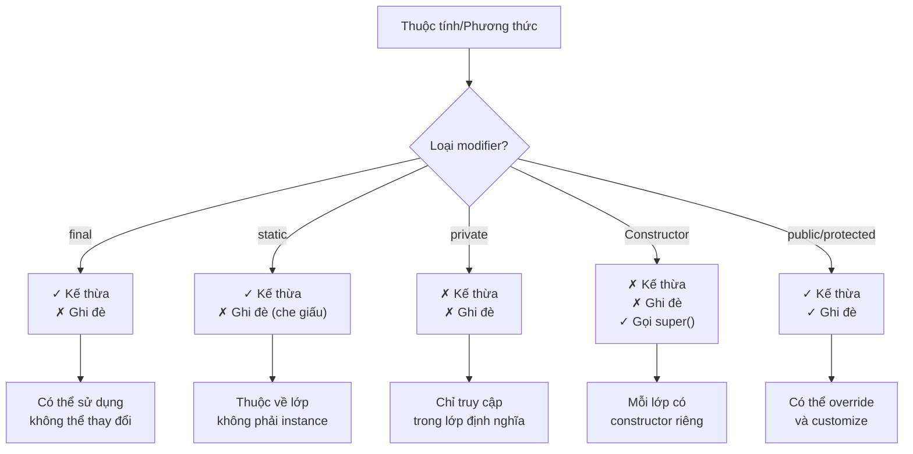

| Loại | Kế thừa (Inheritance) | Ghi đè (Overriding) |
| --- | --- | --- |
| Constructors | - Không được kế thừa.<br>- Gọi constructor của lớp cha bằng `super()`. | - Không thể ghi đè.<br>- Constructor của lớp con tách biệt với lớp cha. |
| Static methods | - Được kế thừa (nếu không `private`).<br>- Thuộc về lớp, không phải đối tượng. | - **Không thể ghi đè** (chỉ bị che giấu - hiding).<br>- Static method call được quyết định theo **kiểu tham chiếu** lúc biên dịch (không đa hình). |
| Final methods | - Được kế thừa (nếu không `private`).<br>- Có thể sử dụng mà không cần định nghĩa lại. | - Không thể ghi đè.<br>- `final` ngăn chặn việc ghi đè. |
| Private methods | - **Không được kế thừa** (JLS ghi rõ thành viên `private` không thể thừa kế).<br>- Chỉ truy cập trong lớp định nghĩa. | - Không thể ghi đè.<br>- Không thể truy cập từ lớp con. |

(*) Tóm lại:
- **Final**: Chỉ kế thừa, không ghi đè
- **Static**: Chỉ kế thừa, không ghi đè nhưng che giấu static lớp cha nếu định nghĩa lại ở lớp con
- **Private**: **Không kế thừa, không ghi đè** (private members không được thừa kế theo JLS)
- **Constructors**: Không kế thừa, không ghi đè, nhưng lớp con có thể gọi constructor của lớp cha thông qua `super()`
- **Trường (field)**: Không đa hình - truy cập field phụ thuộc **kiểu biên dịch** của tham chiếu, không phải đối tượng runtime

Tương đương với:
- Chỉ kế thừa với `static` và `final`, còn lại thì không kế thừa với `private`, `Constructors`
- Không ghi đè với tất cả `final`, `static`, `private`, `Constructors`. Ngay kể cả đối với `static` thì nếu có thuộc tính/phương thức ở `static` ở lớp con đặt giống với lớp cha thì là vẫn thuộc của lớp con và che giấu static của lớp cha. Tức là nếu lớp con kế thừa static thuộc tính và phương thức của lớp cha thì sẽ lấy của lớp cha, còn nếu viết lại thuộc tính và phương thức đó ở lớp con thì thuộc tính và phương thức của lớp cha sẽ bị `che giấu/ẩn đi` chứ đang không phải là đang ghi đè. Tóm lại là Ghi đè không bao giờ áp dụng cho các trường hợp là static

```java
class Parent {
    public void instanceMethod() {
        System.out.println("Phương thức instance của lớp cha.");
    }
}

class Child extends Parent {
    public void instanceMethod() {
        System.out.println("Phương thức instance của lớp con.");
    }
}

public class Main {
    public static void main(String[] args) {
        Parent parent = new Parent();
        Parent child = new Child();

        parent.instanceMethod(); // Gọi phương thức instance của lớp cha
        child.instanceMethod();  // Gọi phương thức instance của lớp con (ghi đè)
    }
}
```

`@Override` chỉ là một cách thông báo cho trình biên dịch rằng bạn đang cố tình ghi đè phương thức, và giúp phát hiện lỗi nếu phương thức của lớp con không thực sự ghi đè phương thức của lớp cha nên ngay cả khi không sử dụng `@Override`, Java vẫn hiểu rằng phương thức trong lớp con là một ghi đè phương thức trong lớp cha nếu nó có cùng tên

`@Override` không áp dụng cho static là vì phương thức và thuộc tính static trong Java không bị ghi đè, mà chỉ bị che giấu (hiding). Do đó, từ khóa @Override không thể được sử dụng cho các phương thức hoặc thuộc tính static. `@Override` chỉ có ý nghĩa đối với phương thức instance (non-static), nơi mà hành vi ghi đè có thể xảy ra.

```java
class Parent {
    // Static thuộc tính
    public static int staticVar = 10;

    // Static phương thức
    public static void staticMethod() {
        System.out.println("Phương thức static của lớp cha.");
    }

    // Final phương thức
    public final void finalMethod() {
        System.out.println("Phương thức final của lớp cha.");
    }

    // Private phương thức
    private void privateMethod() {
        System.out.println("Phương thức private của lớp cha.");
    }

    // Constructor
    public Parent() {
        System.out.println("Constructor của lớp cha được gọi.");
    }
}

class Child extends Parent {
    // Static thuộc tính giúp che giấu thuộc tính static của lớp cha
    public static int staticVar = 20;

    // Static phương thức giúp che giấu phương thức static của lớp cha
    public static void staticMethod() {
        System.out.println("Phương thức static của lớp con.");
    }

    // Không thể ghi đè final method
    // public void finalMethod() { ... } // Lỗi biên dịch

    // Constructor
    public Child() {
        super(); // Gọi constructor của lớp cha
        System.out.println("Constructor của lớp con được gọi.");
    }
}

public class Main {
    public static void main(String[] args) {
        // Truy cập phương thức và thuộc tính static thông qua lớp
        System.out.println("Parent.staticVar = " + Parent.staticVar); // Kết quả: 10
        System.out.println("Child.staticVar = " + Child.staticVar);   // Kết quả: 20
        
        Parent.staticMethod(); // Kết quả: Phương thức static của lớp cha.
        Child.staticMethod();  // Kết quả: Phương thức static của lớp con.

        // Khởi tạo đối tượng
        Child child = new Child(); // Gọi cả constructor của lớp cha và con

        // Gọi phương thức final (được kế thừa nhưng không ghi đè được)
        child.finalMethod(); // Kết quả: Phương thức final của lớp cha.
    }
}
```

#### Bẫy thường gặp trong Kế thừa và Ghi Đè

```java
// Bẫy 1: Gọi static qua biến thể hiện
class Parent {
    public static void staticMethod() {
        System.out.println("Parent static method");
    }
}

class Child extends Parent {
    public static void staticMethod() {
        System.out.println("Child static method");
    }
}

public class StaticTrap {
    public static void main(String[] args) {
        Parent p = new Child();
        p.staticMethod(); // Output: "Parent static method" - KHÔNG phải "Child static method"!
        
        // Lý do: Static method call được quyết định theo kiểu tham chiếu (Parent), 
        // không phải kiểu đối tượng runtime (Child)
    }
}
```

```java
// Bẫy 2: Nhầm "kế thừa" với "khả kiến"
class Parent {
    private void privateMethod() {
        System.out.println("Parent private method");
    }
    
    protected void testAccess() {
        privateMethod(); // OK
    }
}

class Child extends Parent {
    public void attemptAccess() {
        // privateMethod(); // Lỗi biên dịch: private method không được kế thừa!
        
        // Thậm chí định nghĩa cùng tên cũng không phải ghi đè:
        privateMethod(); // Đây là method khác hoàn toàn!
    }
    
    private void privateMethod() {
        System.out.println("Child private method - completely different method!");
    }
}
```

```java
// Bẫy 3: Override và ném ngoại lệ
class Parent {
    public void method() throws IOException {
        // some code
    }
}

class Child extends Parent {
    // SAI: Không thể throws checked exception rộng hơn
    // public void method() throws Exception { } // Lỗi biên dịch!
    
    // ĐÚNGG: Thể throws hẹp hơn hoặc không throws
    @Override
    public void method() throws FileNotFoundException {
        // FileNotFoundException là con của IOException
    }
    
    // Hoặc không throws gì cả:
    // @Override
    // public void method() { }
}
```

```java
// Bẫy 4: Trường (field) không đa hình
class Parent {
    public String message = "Parent message";
}

class Child extends Parent {
    public String message = "Child message";
}

public class FieldTrap {
    public static void main(String[] args) {
        Parent p = new Child();
        System.out.println(p.message); // Output: "Parent message" - KHÔNG phải "Child message"!
        
        Child c = (Child) p;
        System.out.println(c.message); // Output: "Child message"
        
        // Trường (field) không có đa hình như method!
    }
}
```

**Nguyên tắc quan trọng:**
- **Private members không được kế thừa** (theo JLS)
- **Static methods là "hiding", không phải overriding** và được resolve theo kiểu compile-time
- **Fields không đa hình** - truy cập phụ thuộc kiểu biên dịch
- **Override với checked exceptions** chỉ được hẹp hơn hoặc bằng parent method
```

#### 1.2. Kế thừa với `class final`

`Class final` không thể bị kế thừa (có thể bị nhầm lẫn sang thuộc tính/phương thức `final` có thể kế thừa)

```java
final class FinalClass {}

class SubClass extends FinalClass {
    // Lỗi: không thể kế thừa từ lớp final
}
```

#### 1.3. So sánh giữa quan hệ Is-A và Has-A

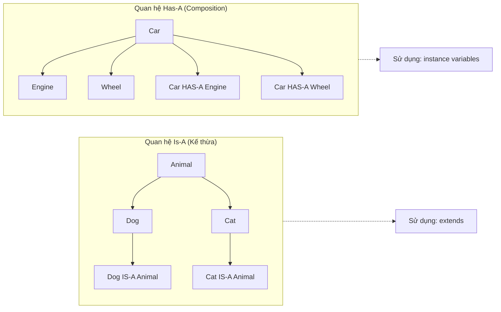

| Loại quan hệ | Định nghĩa | Ví dụ | Mục đích |
| --- | --- | --- | --- |
| Is-A | Thể hiện sự kế thừa giữa các lớp. Một lớp con kế thừa từ một lớp cha. | `class Dog extends Animal {}` | Sử dụng để thể hiện mối quan hệ kế thừa, nơi lớp con thừa hưởng các thuộc tính và phương thức của lớp cha. |
| Has-A | Thể hiện quan hệ thành phần giữa các lớp. Một lớp chứa một đối tượng của lớp khác. | `class Car { private Engine engine; }` | Sử dụng để thể hiện mối quan hệ thành phần, nơi một lớp có một hoặc nhiều đối tượng của lớp khác như là thành phần của nó. |

### 2. Phân biệt đa hình và ghi đè

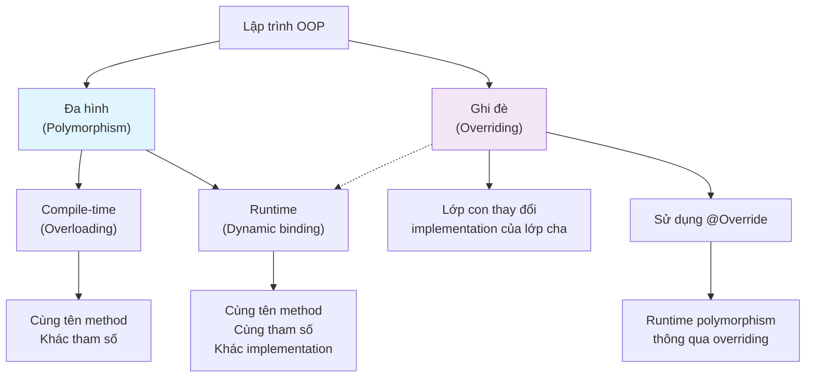

#### 1. Ghi đè (Overriding)
Ghi đè xảy ra khi một lớp con cung cấp cách triển khai lại cho một phương thức đã được định nghĩa trong lớp cha. Khi một phương thức trong lớp con có cùng tên, kiểu trả về và danh sách tham số giống hệt phương thức trong lớp cha, đó là ghi đè.

Mục đích: Ghi đè được dùng để thay thế hoặc mở rộng chức năng của phương thức trong lớp cha.

Điều kiện:
- Phải có quan hệ kế thừa giữa lớp cha và lớp con.
- Phương thức ghi đè phải có cùng tên, cùng kiểu trả về, và cùng tham số.

Kết quả: Khi phương thức được gọi trên đối tượng lớp con, phương thức của lớp con (đã ghi đè) sẽ được thực thi, thay vì phương thức của lớp cha.

#### 2. Đa hình (Polymorphism)
Đa hình là khả năng mà một phương thức có thể thực thi các hành vi khác nhau dựa trên đối tượng gọi phương thức. Đa hình giúp viết mã linh hoạt và có thể thực hiện trên các đối tượng có cùng kiểu nhưng có cách hành xử khác nhau.

Mục đích: Đa hình cho phép gọi cùng một phương thức trên các đối tượng khác nhau nhưng nhận được cách thực hiện khác nhau, tùy thuộc vào kiểu của đối tượng.

Có hai loại đa hình chính:
- Đa hình lúc biên dịch (compile-time polymorphism): Còn gọi là nạp chồng phương thức (method overloading), cho phép gọi nhiều phương thức cùng tên nhưng khác tham số.
- Đa hình lúc chạy (runtime polymorphism): Xảy ra khi ghi đè phương thức, tức là lớp con có thể thay đổi cách triển khai phương thức của lớp cha.

Đa hình lúc chạy chính là khi phương thức ghi đè được gọi trên đối tượng của các lớp khác nhau, với cùng tên phương thức nhưng kết quả khác nhau.

#### Bảng so sánh giữa `ghi đè` và `đa hình`

| Tiêu chí | Ghi đè (Overriding) | Đa hình (Polymorphism) |
| --- | --- | --- |
| Khái niệm | Lớp con thay đổi cách triển khai phương thức của lớp cha. | Một phương thức có thể có nhiều cách thực thi khác nhau dựa trên đối tượng. |
| Phạm vi | Chỉ áp dụng trong quan hệ kế thừa giữa lớp cha và lớp con. | Áp dụng rộng hơn, cả trong kế thừa và thông qua giao diện (interface). |
| Tên và tham số phương thức | Phương thức ghi đè phải có cùng tên và tham số giống hệt với phương thức trong lớp cha. | Cùng tên phương thức, nhưng có thể có các cách triển khai khác nhau ở các lớp khác nhau. |
| Điều kiện thực hiện | Phải có mối quan hệ kế thừa giữa lớp cha và lớp con. | Có thể có quan hệ kế thừa hoặc thông qua giao diện (interface). |
| Mục đích | Thay đổi, mở rộng hoặc bổ sung hành vi của phương thức lớp cha. | Cung cấp nhiều hành vi khác nhau cho cùng một phương thức khi thực hiện trên các đối tượng khác nhau. |
| Cách thực hiện | Lớp con viết lại (ghi đè) phương thức của lớp cha. | Thực hiện cùng một phương thức trên các đối tượng khác nhau, với hành vi cụ thể của từng đối tượng. |
| Loại đa hình | Một hình thức của đa hình lúc chạy (runtime polymorphism). | Gồm cả đa hình lúc biên dịch (compile-time) và lúc chạy (runtime). |
| Ví dụ | Lớp con `Dog` ghi đè phương thức `sound()` của lớp cha `Animal`. | Một mảng đối tượng kiểu `Animal` có cả `Dog` và `Cat`, gọi `sound()` sẽ nhận được hành vi khác nhau tùy đối tượng. |
| Kiểu trả về | Phải giống với kiểu trả về của phương thức trong lớp cha. | Kiểu trả về có thể khác nhau tùy cách triển khai phương thức ở mỗi lớp. |

Tóm lại:
- Ghi đè là một hình thức cụ thể của đa hình trong quan hệ kế thừa, nơi lớp con cung cấp triển khai cụ thể cho phương thức của lớp cha.
- Đa hình là khái niệm rộng hơn, bao gồm cả ghi đè và việc nhiều lớp có thể có các phương thức giống tên nhưng triển khai khác nhau, ví dụ thông qua giao diện (interface).

**Ghi đè:**
```java
class Animal {
    void sound() {
        System.out.println("Some generic animal sound");
    }
}

class Dog extends Animal {
    @Override
    void sound() {
        System.out.println("Bark");
    }
}

class Cat extends Animal {
    @Override
    void sound() {
        System.out.println("Meow");
    }
}

// Ghi đè: Dog và Cat ghi đè phương thức sound() từ lớp Animal.
```

**Đa hình:**
```java
Animal animal1 = new Dog();
Animal animal2 = new Cat();

animal1.sound();  // Output: "Bark"
animal2.sound();  // Output: "Meow"

// Đa hình: Cùng gọi phương thức sound() nhưng kết quả khác nhau, dựa trên kiểu đối tượng cụ thể.
```

**Tổng kết:**
- Ghi đè là một trường hợp cụ thể của đa hình, xảy ra trong quan hệ kế thừa. Khi lớp con ghi đè phương thức của lớp cha, đó là đa hình lúc chạy (runtime polymorphism).
- Đa hình là khái niệm tổng quát hơn, bao gồm cả đa hình lúc biên dịch (compile-time, như nạp chồng phương thức) và đa hình lúc chạy (runtime, như ghi đè phương thức).

### 3. Mối quan hệ giữa instance và kiểu dữ liệu

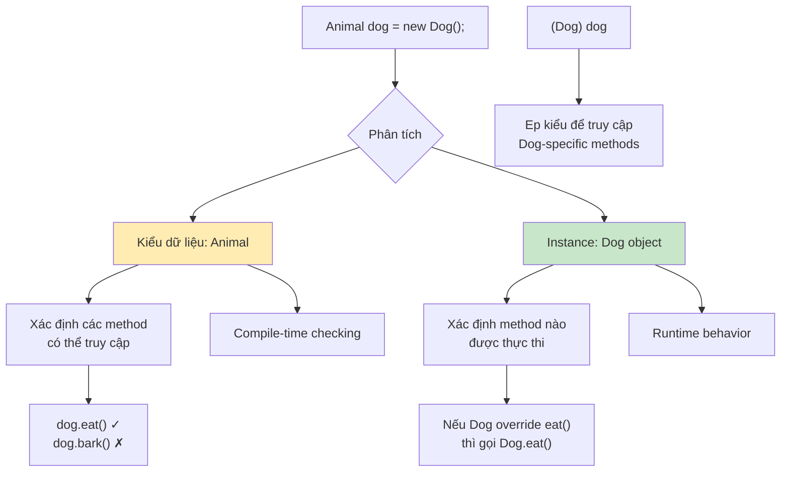

#### 3.1. Instance của 1 lớp:
Instance của một lớp là một đối tượng được tạo ra từ một lớp cụ thể và nó thuộc về lớp mà nó được khởi tạo, bất kể kiểu dữ liệu mà nó đang được tham chiếu.

Khi nói đến instance của một lớp là đang nói về đối tượng thực tế trong bộ nhớ và đối tượng đó luôn giữ các thuộc tính và hành vi của lớp mà nó được khởi tạo từ.

Instance của lớp quyết định đối tượng thực tế trong bộ nhớ và những phương thức hoặc thuộc tính mà đối tượng có thể thực thi (dù thông qua kiểu lớp cha).

Có thể sử dụng instanceof để kiểm tra instance của một lớp

Nếu một đối tượng là instance của một lớp con, nó cũng được coi là instance của tất cả các lớp cha của nó.

```java
class Animal {}

class Dog extends Animal {}

public class Main {
    public static void main(String[] args) {
        Animal animal = new Dog();  // Đối tượng của Dog
        
        if (animal instanceof Dog) { // true
            System.out.println("animal is an instance of Dog");
        }
        
        if (animal instanceof Animal) { // true
            System.out.println("animal is an instance of Animal");
        }
    }
}
```

#### 3.2. Kiểu dữ liệu:
Kiểu dữ liệu là cách mà bạn khai báo một biến để tham chiếu tới đối tượng đó. Kiểu dữ liệu xác định những gì bạn có thể truy cập và cách bạn có thể sử dụng đối tượng trong chương trình.

Trong Java, kiểu dữ liệu có thể là của lớp cha hoặc lớp con, nhưng kiểu dữ liệu này ảnh hưởng đến các thành phần (method, thuộc tính) nào bạn có thể truy cập mà không cần ép kiểu.

```java
class Animal {
    public void eat() {
        System.out.println("Animal is eating");
    }
}

class Dog extends Animal {
    public void bark() {
        System.out.println("Woof");
    }
}

public class Main {
    public static void main(String[] args) {
        Animal dog = new Dog(); // dog là một instance của lớp Dog, nhưng có kiểu dữ liệu là Animal

        dog.eat(); // Hợp lệ: eat() được khai báo trong lớp Animal
        // dog.bark(); // Lỗi biên dịch: bark() không được khai báo trong Animal

        Dog realDog = (Dog) dog; // Đúng vì bản chất thì dog là một instance của lớp Dog nên hoàn toàn ép kiểu được
        realDog.bark(); // Hợp lệ: realDog có kiểu Dog
    }
}
```

#### 3.3. Bảng so sánh `Instance của 1 lớp` và `Kiểu dữ liệu`

| Đặc điểm | Instance của một lớp | Kiểu dữ liệu |
| --- | --- | --- |
| Định nghĩa | Đối tượng cụ thể được tạo ra từ một lớp và tồn tại trong bộ nhớ. | Cách khai báo biến để tham chiếu đến một đối tượng. |
| Mối quan hệ với lớp | Luôn thuộc về lớp mà nó được khởi tạo, bất kể kiểu dữ liệu khai báo. | Có thể là của lớp cha hoặc lớp con, ảnh hưởng đến khả năng truy cập các thành phần. |
| Quyết định | Quyết định đối tượng thực tế trong bộ nhớ và các phương thức/thuộc tính đối tượng có thể thực thi. | Xác định những gì bạn có thể truy cập và cách bạn có thể sử dụng đối tượng. |
| Kiểm tra | Có thể kiểm tra bằng toán tử `instanceof`. | Không có toán tử kiểm tra trực tiếp. |
| Thừa kế | Nếu là instance của lớp con, cũng được coi là instance của tất cả các lớp cha. | Không có tính thừa kế trực tiếp. |
| Ví dụ 1 | `Person person = new Person();` (Ở đây, `person` là một instance của lớp `Person`) | `Person person;` (Ở đây, `Person` là kiểu dữ liệu của biến `person`) |
| Ví dụ 2 | `Animal animal = new Dog();` (Ở đây, `animal` là 1 instance của lớp `Dog` và cũng là 1 instance của lớp `Animal`) | `Animal animal;` (Ở đây, `Animal` là kiểu dữ liệu của biến `animal`) |

**Tóm tắt:**
- Instance là một đối tượng cụ thể, thực tế tồn tại trong bộ nhớ, mang các đặc điểm của lớp mà nó được tạo ra.
- Kiểu dữ liệu là một cách khai báo biến để tham chiếu đến một đối tượng, quyết định cách bạn có thể tương tác với đối tượng đó trong chương trình.

**Lưu ý quan trọng:** Mặc dù một instance luôn thuộc về lớp mà nó được khởi tạo, bạn có thể khai báo một biến với kiểu dữ liệu là lớp cha để tham chiếu đến instance của lớp con (đây là tính đa hình trong Java). Tuy nhiên, điều này sẽ giới hạn khả năng truy cập các thành phần của instance đó chỉ còn các thành phần được định nghĩa trong lớp cha, trừ khi bạn thực hiện ép kiểu.

```java
class Building {
    public void show() {
        System.out.println("This is a building.");
    }
}

class Barn extends Building {
    public void show() {
        System.out.println("This is a barn.");
    }

    public void storeHay() {
        System.out.println("Storing hay in the barn.");
    }
}

public class Main {
    public static void main(String[] args) {
        // build1 là 1 instance của lớp Building
        Building build1 = new Building(); 
        build1.show(); // Kết quả: "This is a building."

        // build2 là 1 instance của lớp Barn
        Building build2 = new Barn(); 
        build2.show(); // Kết quả: "This is a barn." (đa hình - phương thức của Barn được gọi)

        // Barn barn1 = (Barn) build1; / Lỗi ClassCastException sẽ xảy ra tại thời điểm chạy vì build1 là instance của class Building, không phải là 1 instance của lớp Barn
        try {
            Barn barn1 = (Barn) build1; // Lỗi ClassCastException sẽ xảy ra
        } catch (ClassCastException e) {
             System.out.println("Exception: build1 không thể ép kiểu thành Barn vì build1 là instance của Building.");
        }

        // Barn barn2 = (Barn) build2; // Đúng vì build2 là 1 instance của lớp Barn
        Barn barn2 = (Barn) build2;
        barn2.show(); // Kết quả: "This is a barn."
        barn2.storeHay(); // Kết quả: "Storing hay in the barn."

        // Barn barn3 = new Barn();
        Barn barn3 = new Barn(); // Tạo một instance của Barn

        // Building build3 = (Building) barn3; // Đúng vì ép từ kiểu con sang kiểu cha không cần ép kiểu tường minh
        Building build3 = barn3;
        build3.show(); // Kết quả: "This is a barn." (vì build3 thực sự là instance của Barn)

        // Object obj1 = (Object) build1;
        Object obj1 = build1; // Tất cả các đối tượng đều có thể được ép kiểu sang Object mà không cần ép kiểu tường minh
        System.out.println("obj1 is instance of Object: " + (obj1 instanceof Object)); // Kết quả: true
    }
}
```

### 4. Java Collection Framework

#### 4.1. Tổng quan về Collection Framework

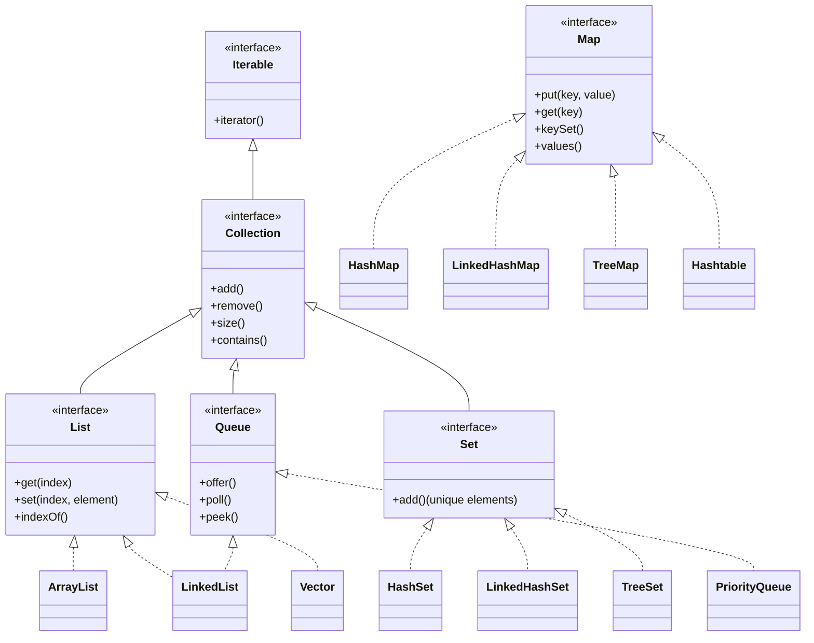

```
Java Collection Framework
├── Iterable
│   └── Collection
│       ├── List (Interface)
│       │   ├── ArrayList
│       │   ├── LinkedList
│       │   └── Vector
│       │       └── Stack
│       ├── Set (Interface)
│       │   ├── HashSet
│       │   ├── LinkedHashSet
│       │   └── TreeSet
│       ├── Queue (Interface)
│       │   ├── PriorityQueue
│       │   └── LinkedList (also implements Queue)
│       └── Deque (Interface)
│           ├── ArrayDeque
│           └── LinkedList (also implements Deque)
└── Map (Interface) (doesn't extend Collection)
    ├── HashMap
    ├── LinkedHashMap
    ├── TreeMap
    └── Hashtable
        └── Properties
```

#### 4.2. List Interface (ArrayList, LinkedList, Vector)

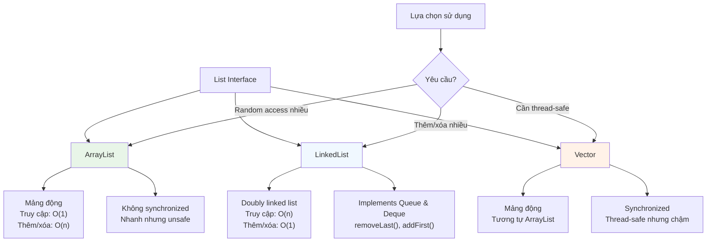

**List (Interface)** // Các implement từ List Interface (ArrayList, LinkedList, Vector) đều có chung các phương thức này:
- `add()`          // Thêm phần tử vào cuối danh sách
- `get()`          // Lấy phần tử theo chỉ số
- `set()`          // Cập nhật phần tử tại chỉ số cụ thể
- `remove()`       // Xóa phần tử theo chỉ số hoặc đối tượng
- `size()`         // Trả về số lượng phần tử trong danh sách
- `contains()`     // Kiểm tra xem danh sách có chứa phần tử chỉ định
- `indexOf()`      // Tìm vị trí của phần tử đầu tiên xuất hiện trong danh sách
- `clear()`        // Xóa tất cả các phần tử trong danh sách
- `isEmpty()`      // Kiểm tra xem danh sách có rỗng không
- `subList()`      // Trả về danh sách con từ vị trí chỉ định

| Đặc điểm | ArrayList | LinkedList | Vector |
| --- | --- | --- | --- |
| Cấu trúc dữ liệu | Mảng động | Danh sách liên kết | Mảng động |
| Truy cập phần tử | Nhanh (O(1)) | Chậm (O(n)) | Nhanh (O(1)) |
| Thêm/xóa phần tử ở giữa | Chậm (O(n)) | Nhanh (O(1)) | Chậm (O(n)) |
| Sử dụng bộ nhớ | Ít hơn | Nhiều hơn | Ít hơn |
| Đồng bộ (Synchronized) | Không | Không | Có |
| Thread-safe | Không | Không | Có |
| Thích hợp cho | Truy cập ngẫu nhiên | Thêm/xóa phần tử thường xuyên | Ứng dụng đa luồng cần thread-safe |

#### 4.2.1. Cách xóa phần tử cuối trong LinkedList

Để xóa phần tử cuối trong LinkedList, có hai cách chính:

1. Sử dụng phương thức `removeLast()`:
```java
LinkedList<String> list = new LinkedList<>();
list.add("A");
list.add("B");
list.add("C");
list.removeLast(); // Xóa phần tử cuối cùng ("C")
```

2. Sử dụng phương thức `remove()` với chỉ số:
```java
LinkedList<String> list = new LinkedList<>();
list.add("A");
list.add("B");
list.add("C");
if (!list.isEmpty()) {
    list.remove(list.size() - 1); // Xóa phần tử cuối cùng
}
```

Cách 1 (`removeLast()`) hiệu quả hơn vì LinkedList được triển khai dưới dạng danh sách liên kết đôi, nên việc truy cập vào phần tử cuối là O(1). `remove(size-1)` trong triển khai LinkedList của JDK cũng được tối ưu hóa - nó duyệt từ cuối lên nên trong trường hợp này cũng O(1), tuy nhiên nói chung các thao tác theo chỉ số trên LinkedList có độ phức tạp tuyến tính. Sử dụng `removeLast()` rõ ràng hơn về mặt ý định và an toàn hơn về hiệu suất.

#### 4.3. Set Interface (HashSet, LinkedHashSet, TreeSet)

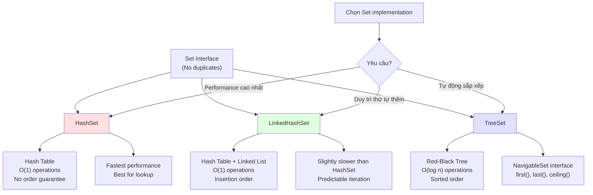

**Set (Interface)** // Các implement từ Set Interface (HashSet, LinkedHashSet, TreeSet) đều có chung các phương thức này:
- `add()`            // Thêm phần tử vào Set (không thêm nếu đã tồn tại)
- `remove()`         // Xóa phần tử khỏi Set
- `contains()`       // Kiểm tra xem phần tử có tồn tại trong Set không
- `size()`           // Trả về số lượng phần tử trong Set
- `isEmpty()`        // Kiểm tra xem Set có rỗng không
- `clear()`          // Xóa tất cả các phần tử trong Set
- `addAll()`         // Thêm tất cả phần tử từ Collection khác vào Set
- `removeAll()`      // Xóa các phần tử trong Set có trong Collection khác
- `retainAll()`      // Giữ lại các phần tử có trong cả Set và Collection khác
- `toArray()`        // Chuyển Set thành mảng

| Đặc điểm | HashSet | LinkedHashSet | TreeSet |
| --- | --- | --- | --- |
| Cấu trúc dữ liệu | Bảng băm (Hash Table) | Bảng băm + Danh sách liên kết doubly | Cây đỏ-đen (Red-Black Tree) |
| Thứ tự phần tử | Không đảm bảo thứ tự | Duy trì thứ tự thêm phần tử | Duy trì thứ tự tăng dần của phần tử |
| Độ phức tạp thêm/xóa/kiểm tra phần tử | O(1) (trung bình) | O(1) (trung bình) | O(log n) |
| Độ phức tạp duyệt (iteration) | O(n) | O(n) | O(n) |
| Sử dụng bộ nhớ | Ít hơn | Nhiều hơn (do lưu thêm thông tin về thứ tự) | Nhiều hơn (do cấu trúc cây phức tạp) |
| Thích hợp cho | Ứng dụng cần lưu trữ phần tử duy nhất, không quan tâm thứ tự | Ứng dụng cần duy trì thứ tự thêm phần tử | Ứng dụng cần duy trì thứ tự của phần tử |

```java
import java.util.HashSet;
import java.util.LinkedHashSet;
import java.util.TreeSet;

public class Main {
    public static void main(String[] args) {
        HashSet<String> hashSet = new HashSet<>();
        hashSet.add("B");
        hashSet.add("A");
        hashSet.add("C");
        System.out.println("HashSet: " + hashSet); // HashSet: [A, B, C] -> Thứ tự không được đảm bảo

        LinkedHashSet<String> linkedHashSet = new LinkedHashSet<>();
        linkedHashSet.add("B");
        linkedHashSet.add("A");
        linkedHashSet.add("C");
        System.out.println("LinkedHashSet: " + linkedHashSet); // LinkedHashSet: [B, A, C] -> Duy trì thứ tự thêm vào

        TreeSet<String> treeSet = new TreeSet<>();
        treeSet.add("B");
        treeSet.add("A");
        treeSet.add("C");
        System.out.println("TreeSet: " + treeSet); // TreeSet: [A, B, C] -> Duy trì thứ tự tự nhiên (alphabet)
    }
}
```

**Giải thích:**
- Tương tự như Map, Set cũng có ba lớp con phổ biến là `HashSet`, `LinkedHashSet`, và `TreeSet`.
- `HashSet` sử dụng `HashMap` để lưu trữ dữ liệu, do đó nó cũng cung cấp hiệu năng cao nhưng không đảm bảo thứ tự phần tử.
- `LinkedHashSet` kế thừa từ `HashSet` và sử dụng doubly-linked list để duy trì thứ tự thêm vào.
- `TreeSet` dựa trên `TreeMap` và lưu trữ các phần tử theo thứ tự được sắp xếp.

**Lựa chọn lớp con phù hợp:**
- Nếu bạn cần hiệu năng cao và không quan tâm đến thứ tự phần tử, hãy sử dụng `HashSet`.
- Nếu bạn cần duy trì thứ tự thêm vào, hãy sử dụng `LinkedHashSet`.
- Nếu bạn cần duy trì thứ tự được sắp xếp, hãy sử dụng `TreeSet`.

#### 4.4. Map Interface (HashMap, LinkedHashMap, TreeMap)

**Map (Interface)** // Các implement từ Map Interface (HashMap, LinkedHashMap, TreeMap) đều có chung các phương thức này:
- `put()`            // Thêm hoặc cập nhật cặp key-value
- `get()`            // Lấy giá trị dựa trên khóa
- `remove()`         // Xóa cặp key-value dựa trên khóa
- `containsKey()`    // Kiểm tra xem có khóa cụ thể trong map không
- `containsValue()`  // Kiểm tra xem có giá trị cụ thể trong map không
- `size()`           // Trả về số lượng cặp key-value trong map
- `isEmpty()`        // Kiểm tra xem map có rỗng không
- `clear()`          // Xóa tất cả các cặp key-value trong map
- `keySet()`         // Trả về tập hợp các khóa có trong map
- `values()`         // Trả về tập hợp các giá trị có trong map
- `entrySet()`       // Trả về tập hợp các cặp key-value dưới dạng Set

| Đặc điểm | HashMap | LinkedHashMap | TreeMap |
| --- | --- | --- | --- |
| Cấu trúc dữ liệu | Bảng băm (Hash Table) | Bảng băm + Danh sách liên kết doubly | Cây đỏ-đen (Red-Black Tree) |
| Thứ tự phần tử | Không đảm bảo thứ tự | Duy trì thứ tự thêm phần tử | Duy trì thứ tự tăng dần của key |
| Độ phức tạp truy cập (get/put) | O(1) (trung bình) | O(1) (trung bình) | O(log n) |
| Độ phức tạp duyệt (iteration) | O(n) | O(n) | O(n) |
| Sử dụng bộ nhớ | Ít hơn | Nhiều hơn (do lưu thêm thông tin về thứ tự) | Nhiều hơn (do cấu trúc cây phức tạp) |
| Thích hợp cho | Ứng dụng cần truy cập nhanh, không quan tâm thứ tự | Ứng dụng cần duy trì thứ tự thêm phần tử | Ứng dụng cần duy trì thứ tự của key |

```java
import java.util.HashMap;
import java.util.LinkedHashMap;
import java.util.TreeMap;

public class Main {
    public static void main(String[] args) {
        HashMap<String, Integer> hashMap = new HashMap<>();
        hashMap.put("B", 2);
        hashMap.put("A", 1);
        hashMap.put("C", 3);
        System.out.println("HashMap: " + hashMap); // HashMap: {A=1, B=2, C=3} -> Thứ tự không được đảm bảo

        LinkedHashMap<String, Integer> linkedHashMap = new LinkedHashMap<>();
        linkedHashMap.put("B", 2);
        linkedHashMap.put("A", 1);
        linkedHashMap.put("C", 3);
        System.out.println("LinkedHashMap: " + linkedHashMap); // LinkedHashMap: {B=2, A=1, C=3} -> Duy trì thứ tự thêm vào

        TreeMap<String, Integer> treeMap = new TreeMap<>();
        treeMap.put("B", 2);
        treeMap.put("A", 1);
        treeMap.put("C", 3);
        System.out.println("TreeMap: " + treeMap); // TreeMap: {A=1, B=2, C=3} -> Duy trì thứ tự tự nhiên (alphabet)
    }
}
```

#### 4.4.1. Cơ chế đồng bộ hóa của Map

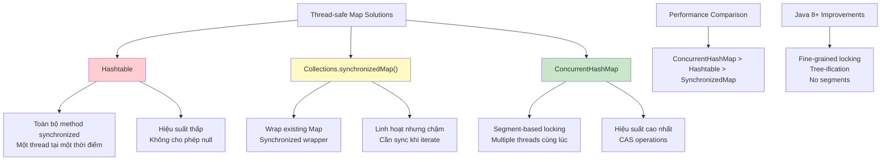

Trong Java, có nhiều cách để tạo Map đồng bộ (thread-safe):

1. **Hashtable**: Lớp cũ, tất cả các phương thức đều được đồng bộ hóa.
   ```java
   Map<String, Integer> hashtable = new Hashtable<>();
   ```
   - Ưu điểm: Đơn giản, thread-safe
   - Nhược điểm: Hiệu suất thấp vì đồng bộ hóa toàn bộ map, không cho phép giá trị null

2. **Collections.synchronizedMap()**: Chuyển đổi một Map không đồng bộ thành Map đồng bộ.
   ```java
   Map<String, Integer> synchronizedMap = Collections.synchronizedMap(new HashMap<>());
   ```
   - Ưu điểm: Linh hoạt, có thể sử dụng với bất kỳ Map nào
   - Nhược điểm: Vẫn đồng bộ hóa toàn bộ map, hiệu suất không cao

3. **ConcurrentHashMap**: Được thiết kế đặc biệt cho môi trường đa luồng.
   ```java
   ConcurrentHashMap<String, Integer> concurrentHashMap = new ConcurrentHashMap<>();
   ```
   - Ưu điểm: Hiệu suất cao, sử dụng CAS và khóa tinh trên từng bucket riêng lẻ (JDK 8+), không khóa toàn bộ map
   - Nhược điểm: Triển khai phức tạp hơn

**So sánh hiệu suất:**
- ConcurrentHashMap > Hashtable > SynchronizedMap
- **ConcurrentHashMap JDK 7 vs JDK 8+:**
  - **JDK 7**: Sử dụng segment-based locking (mặc định 16 segments)
  - **JDK 8+**: Không còn segment; sử dụng CAS + synchronized trên từng bin/bucket, tree-ification khi collision cao

**Ví dụ sử dụng ConcurrentHashMap:**
```java
import java.util.concurrent.ConcurrentHashMap;

public class ConcurrentMapExample {
    public static void main(String[] args) {
        ConcurrentHashMap<String, Integer> map = new ConcurrentHashMap<>();
        
        // Các thao tác an toàn với đa luồng
        map.put("A", 1);
        map.put("B", 2);
        
        // Đọc an toàn
        System.out.println(map.get("A"));
        
        // Cập nhật an toàn
        map.compute("A", (key, value) -> value != null ? value + 1 : 1);
    }
}
```

**Lưu ý quan trọng:**
- Khi sử dụng các phương thức duyệt (như keySet(), values(), entrySet()), cần sử dụng synchronized block nếu cần đảm bảo tính toàn vẹn:
  ```java
  synchronized (map) {
      for (Map.Entry<String, Integer> entry : map.entrySet()) {
          // Xử lý
      }
  }
  ```
- ConcurrentHashMap cung cấp các phương thức nguyên tử như `putIfAbsent()`, `compute()`, `merge()` giúp xử lý an toàn trong môi trường đa luồng.

### 4.6. Fail-fast Iterators và Đồng bộ hóa

**Fail-fast Iterators:**
Hầu hết các collection trong Java (ArrayList, HashMap, HashSet, v.v.) sử dụng fail-fast iterators. Khi cấu trúc collection thay đổi trong khi đang duyệt (ngoại trừ thông qua chính iterator đó), iterator sẽ ném `ConcurrentModificationException`.

```java
List<String> list = new ArrayList<>(Arrays.asList("A", "B", "C"));

// Lỗi: ConcurrentModificationException
try {
    for (String item : list) {
        if ("B".equals(item)) {
            list.remove(item); // Thay đổi cấu trúc trong khi duyệt
        }
    }
} catch (ConcurrentModificationException e) {
    System.out.println("ConcurrentModificationException occurred!");
}

// Đúng: Sử dụng Iterator.remove()
Iterator<String> iterator = list.iterator();
while (iterator.hasNext()) {
    String item = iterator.next();
    if ("B".equals(item)) {
        iterator.remove(); // An toàn
    }
}
```

**ConcurrentHashMap - Weakly Consistent:**
Khác với fail-fast, ConcurrentHashMap sử dụng weakly consistent iterators - không ném ConcurrentModificationException và có thể thấy một phần cập nhật trong quá trình duyệt.

#### Bẫy thường gặp trong Collections

```java
// Bẫy 1: subList() là "view" - thay đổi ảnh hưởng list gốc
List<String> original = new ArrayList<>(Arrays.asList("A", "B", "C", "D"));
List<String> subList = original.subList(1, 3); // ["B", "C"]

subList.add("X"); // Thay đổi subList
System.out.println(original); // ["A", "B", "C", "X", "D"] - List gốc bị thay đổi!

// An toàn: Tầo bản sao độc lập
List<String> safeCopy = new ArrayList<>(original.subList(1, 3));
safeCopy.add("Y"); // Không ảnh hưởng original
```

```java
// Bẫy 2: Arrays.asList() không thể thêm/xóa (kích thước cố định)
List<String> fixedList = Arrays.asList("A", "B", "C");
try {
    fixedList.add("D"); // UnsupportedOperationException!
} catch (UnsupportedOperationException e) {
    System.out.println("Cannot add to Arrays.asList()!");
}

// Đúng: Tạo ArrayList mutable
List<String> mutableList = new ArrayList<>(Arrays.asList("A", "B", "C"));
mutableList.add("D"); // OK
```

```java
// Bẫy 3: List.of() (Java 9+) bất biến
List<String> immutableList = List.of("A", "B", "C");
try {
    immutableList.add("D"); // UnsupportedOperationException!
} catch (UnsupportedOperationException e) {
    System.out.println("List.of() is immutable!");
}
```

```java
// Bẫy 4: HashMap cho phép null key & value, Hashtable không
Map<String, String> hashMap = new HashMap<>();
hashMap.put(null, "value"); // OK
hashMap.put("key", null);   // OK

Map<String, String> hashtable = new Hashtable<>();
try {
    hashtable.put(null, "value"); // NullPointerException!
} catch (NullPointerException e) {
    System.out.println("Hashtable doesn't allow null!");
}
```

```java
// Bẫy 5: Collectors.toMap với trùng key
List<String> items = Arrays.asList("apple", "banana", "apple");

try {
    Map<String, Integer> lengthMap = items.stream()
        .collect(Collectors.toMap(
            item -> item,
            item -> item.length()
        )); // IllegalStateException: Duplicate key!
} catch (IllegalStateException e) {
    System.out.println("Duplicate key error!");
}

// Đúng: Cung cấp merge function
Map<String, Integer> lengthMap = items.stream()
    .collect(Collectors.toMap(
        item -> item,
        item -> item.length(),
        (existing, replacement) -> existing // Giữ giá trị đầu tiên
    ));
```

#### Bảng so sánh `List`, `Set`, `Map`

Dưới đây là bảng so sánh với dấu `x` cho những phương thức không được hỗ trợ

| Thao tác       | List                           | Set                            | Map                      |
| -------------- | ------------------------------ | ------------------------------ | ------------------------ |
| Thêm 1 phần tử | `add(e)`                       | `add(e)`                       | `put(k,v)`               |
| Thêm nhiều     | `addAll(c)`                    | `addAll(c)`                    | `putAll(m)`              |
| Sửa            | `set(i,e)`                     | —                              | `put(k,v)`               |
| Xóa 1          | `remove(i or o)`               | `remove(o)`                    | `remove(k)`              |
| Xóa theo tập   | `removeAll(c)`                 | `removeAll(c)`                 | —                        |
| Giữ giao       | `retainAll(c)`                 | `retainAll(c)`                 | —                        |
| Truy cập       | `get(i)`                       | —                              | `get(k)`                 |
| Tìm chứa       | `contains(o)`/`containsAll(c)` | `contains(o)`/`containsAll(c)` | `containsKey/Value`      |
| Kích thước     | `size()`                       | `size()`                       | `size()`                 |
| Tập con        | `subList(...)`                 | `toArray()`                    | `entrySet/keySet/values` |

**Giải thích chi tiết:**
- **List**: Cho phép thêm, sửa, xóa và truy cập các phần tử theo chỉ số. Hỗ trợ các thao tác tập hợp như `addAll`, `removeAll`, `retainAll`. Có khái niệm về chỉ số (index).
- **Map**: Quản lý các cặp key-value và hỗ trợ các phương thức liên quan đến khóa và giá trị. Không hỗ trợ truy cập theo chỉ số và các thao tác tập hợp.
- **Set**: Cho phép thêm, xóa và kiểm tra phần tử duy nhất, không hỗ trợ truy cập trực tiếp qua chỉ số hay khóa. Hỗ trợ các thao tác tập hợp như `addAll`, `removeAll`, `retainAll`.

### 5. Phân biệt `String`, `StringBuilder`, và `StringBuffer`

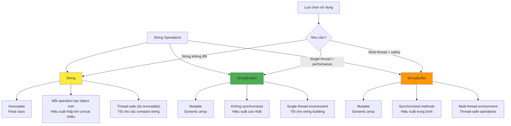

| Thuộc tính          | String                                                                                | StringBuffer                                            | StringBuilder                           |
| ------------------- | ------------------------------------------------------------------------------------- | ------------------------------------------------------- | --------------------------------------- |
| Tính chất           | **immutable**                                                                         | mutable, synchronized                                   | mutable, non-sync                       |
| Thread-safety       | An toàn do bất biến                                                                   | Có                                                      | Không                                   |
| Hiệu năng nối chuỗi | Thấp (tạo mới)                                                                        | Trung bình                                              | Cao                                     |
| Kế thừa / Interface | `extends Object`, **implements** `CharSequence`, `Comparable<String>`, `Serializable` | implements `CharSequence`, `Appendable`, `Serializable` | implements `CharSequence`, `Appendable` |

**Giải thích chi tiết:**

- **String**: 
  - Là lớp final, không thể kế thừa
  - Một khi được tạo, giá trị không thể thay đổi (immutable)
  - **String là UTF-16**: `length()` trả về số *char code unit* (16-bit), **không phải** số *Unicode code point*. Ký tự ngoài BMP (emoji, ký tự Đông Á mở rộng) có thể chiếm 2 `char`
  - **Toán tử `+`** được biên dịch dùng **`StringBuilder`** - do đó nối chuỗi trong vòng lặp lớn nên dùng `StringBuilder` thủ công để tránh tạo nhiều đối tượng
  - Khi thực hiện các phép nối chuỗi, một đối tượng String mới sẽ được tạo ra
  - Tốt cho các chuỗi không thay đổi nhiều
  - Ví dụ: `String str = "Hello" + " World";` tạo ra 3 đối tượng String

- **StringBuffer**:
  - Có thể thay đổi giá trị (mutable)
  - Tất cả các phương thức thay đổi nội dung đều được đồng bộ hóa (synchronized)
  - An toàn khi sử dụng trong môi trường đa luồng
  - Hiệu suất thấp hơn StringBuilder do phải xử lý đồng bộ hóa
  - Ví dụ: 
    ```java
    StringBuffer sb = new StringBuffer("Hello");
    sb.append(" World"); // Không tạo đối tượng mới
    ```

- **StringBuilder**:
  - Có thể thay đổi giá trị (mutable)
  - Không được đồng bộ hóa, không an toàn trong môi trường đa luồng
  - Hiệu suất cao hơn StringBuffer
  - Nên sử dụng khi không làm việc với đa luồng
  - Ví dụ:
    ```java
    StringBuilder sb = new StringBuilder("Hello");
    sb.append(" World"); // Không tạo đối tượng mới
    ```

**Khi nào nên sử dụng cái nào?**
- Sử dụng **String** khi:
  - Chuỗi không thay đổi
  - Không thực hiện nhiều thao tác nối chuỗi
  - Cần sử dụng như khóa trong Map

- Sử dụng **StringBuffer** khi:
  - Cần thay đổi chuỗi
  - Làm việc trong môi trường đa luồng
  - Cần đảm bảo thread safety

- Sử dụng **StringBuilder** khi:
  - Cần thay đổi chuỗi
  - Không làm việc trong môi trường đa luồng
  - Cần hiệu suất cao nhất

**Ví dụ so sánh hiệu suất:**
```java
public class StringPerformanceTest {
    public static void main(String[] args) {
        long startTime = System.currentTimeMillis();
        
        // Sử dụng String
        String str = "";
        for (int i = 0; i < 10000; i++) {
            str += "a";
        }
        System.out.println("String: " + (System.currentTimeMillis() - startTime) + "ms");
        
        // Sử dụng StringBuffer
        startTime = System.currentTimeMillis();
        StringBuffer sb = new StringBuffer();
        for (int i = 0; i < 10000; i++) {
            sb.append("a");
        }
        System.out.println("StringBuffer: " + (System.currentTimeMillis() - startTime) + "ms");
        
        // Sử dụng StringBuilder
        startTime = System.currentTimeMillis();
        StringBuilder sbl = new StringBuilder();
        for (int i = 0; i < 10000; i++) {
            sbl.append("a");
        }
        System.out.println("StringBuilder: " + (System.currentTimeMillis() - startTime) + "ms");
    }
}
```
Kết quả thường cho thấy StringBuilder nhanh nhất, tiếp theo là StringBuffer, và String chậm nhất khi thực hiện nhiều thao tác nối chuỗi.

#### Bẫy thường gặp với String và Unicode

```java
// Bẫy 1: Đếm "kí tự" bằng length() sẽ sai với emoji/ký tự ngoài BMP
String text = "😀😁😂"; // 3 emoji
System.out.println("length(): " + text.length()); // Output: 6 (KHÔNG phải 3!)
System.out.println("codePointCount(): " + text.codePointCount(0, text.length())); // Output: 3

// Cắt chuỗi có thể vỡ surrogate pair
String broken = text.substring(0, 1); // Chỉ lấy một nửa của emoji đầu tiên!
System.out.println("Broken: '" + broken + "'"); // Hiển thị ký tự lỗi

// Đúng: Sử dụng codePoints() cho xử lý Unicode chính xác
text.codePoints()
    .forEach(codePoint -> System.out.println(Character.toString(codePoint)));
```

```java
// Bẫy 2: So sánh String dùng == thay vì equals()
String str1 = new String("Hello");
String str2 = new String("Hello");
String str3 = "Hello";
String str4 = "Hello";

System.out.println(str1 == str2);    // false - khác địa chỉ
 System.out.println(str1.equals(str2)); // true - cùng nội dung
System.out.println(str3 == str4);    // true - string pool
```

```java
// Bẫy 3: Xử lý null với String
String nullString = null;
try {
    System.out.println(nullString.length()); // NullPointerException!
} catch (NullPointerException e) {
    System.out.println("NPE khi gọi method trên null!");
}

// An toàn hơn:
if (nullString != null && nullString.length() > 0) {
    // Xử lý
}

// Hoặc dùng Optional (Java 8+):
Optional.ofNullable(nullString)
    .filter(s -> !s.isEmpty())
    .ifPresent(s -> System.out.println("Length: " + s.length()));
```

```java
// Bẫy 4: String concatenation trong vòng lặp
// SAI - tạo nhiều đối tượng String
String result = "";
for (int i = 0; i < 1000; i++) {
    result += "item" + i; // Tạo mới StringBuilder mỗi lần!
}

// ĐÚNG - dùng StringBuilder
StringBuilder sb = new StringBuilder();
for (int i = 0; i < 1000; i++) {
    sb.append("item").append(i);
}
String result2 = sb.toString();
```

**Nguyên tắc quan trọng:**
- **`String.length()` trả về số `char` (code unit), không phải số ký tự thực tế**
- **Dùng `codePointCount()`, `codePoints()` cho xử lý Unicode chính xác**
- **Luôn dùng `equals()` để so sánh nội dung String**
- **Dùng `StringBuilder` cho việc nối chuỗi nhiều lần**

### 6. Lớp lồng nhau (Nested Class)

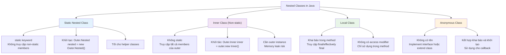

Trong Java, có 4 loại lớp lồng nhau:

#### 1. Static Nested Class
- Được khai báo với từ khóa `static`
- Không có tham chiếu ẩn đến instance của lớp bên ngoài
- Có thể được khởi tạo mà không cần instance của lớp bên ngoài
- Chỉ có thể truy cập các thành phần static của lớp bên ngoài

```java
public class OuterClass {
    private static String staticMessage = "Static Message";
    
    public static class StaticNestedClass {
        void display() {
            System.out.println(staticMessage);
            // Không thể truy cập non-static members của OuterClass
        }
    }
    
    public static void main(String[] args) {
        OuterClass.StaticNestedClass nested = new OuterClass.StaticNestedClass();
        nested.display();
    }
}
```

#### 2. Inner Class (Non-static Nested Class)
- Không có từ khóa `static`
- Có tham chiếu ẩn đến instance của lớp bên ngoài
- Phải được khởi tạo thông qua instance của lớp bên ngoài
- Có thể truy cập tất cả các thành phần của lớp bên ngoài

```java
public class OuterClass {
    private String message = "Hello from OuterClass";
    
    public class InnerClass {
        void display() {
            System.out.println(message); // Có thể truy cập thành phần private của OuterClass
        }
    }
    
    public static void main(String[] args) {
        OuterClass outer = new OuterClass();
        OuterClass.InnerClass inner = outer.new InnerClass();
        inner.display();
    }
}
```

#### 3. Local Class
- Được khai báo bên trong một phương thức
- Chỉ có thể truy cập các biến final hoặc effectively final của phương thức chứa nó
- Không có access modifier (public, private, v.v.)

```java
public class OuterClass {
    public void createLocalClass() {
        final String message = "Hello from LocalClass";
        
        class LocalClass {
            void display() {
                System.out.println(message);
            }
        }
        
        LocalClass local = new LocalClass();
        local.display();
    }
    
    public static void main(String[] args) {
        new OuterClass().createLocalClass();
    }
}
```

#### 4. Anonymous Class
- Lớp không tên, được khai báo và khởi tạo cùng một lúc
- Thường được sử dụng để ghi đè phương thức của lớp cha hoặc interface
- Chỉ có thể truy cập các biến final hoặc effectively final

```java
public class OuterClass {
    public void createAnonymousClass() {
        final String message = "Hello from AnonymousClass";
        
        // Anonymous class implementing Runnable
        Runnable runnable = new Runnable() {
            @Override
            public void run() {
                System.out.println(message);
            }
        };
        
        new Thread(runnable).start();
    }
    
    public static void main(String[] args) {
        new OuterClass().createAnonymousClass();
    }
}
```

#### Bảng so sánh các loại lớp lồng nhau

| Đặc điểm | Static Nested Class | Inner Class | Local Class | Anonymous Class |
| --- | --- | --- | --- | --- |
| Từ khóa static | Có | Không | Không áp dụng | Không áp dụng |
| Truy cập thành phần non-static của lớp bên ngoài | Không | Có | Có | Có |
| Khởi tạo mà không cần instance lớp bên ngoài | Có | Không | Không | Không |
| Được khai báo bên trong phương thức | Không | Không | Có | Có |
| Có tên | Có | Có | Có | Không |
| Mục đích chính | Tổ chức code, nhóm các lớp liên quan | Truy cập trực tiếp vào instance của lớp bên ngoài | Định nghĩa lớp cục bộ cho một phương thức | Triển khai nhanh interface hoặc lớp trừu tượng |

**Lưu ý quan trọng:**
- Inner class giữ một tham chiếu ẩn đến instance của lớp bên ngoài, có thể gây rò rỉ bộ nhớ nếu không cẩn thận
- Static nested class không giữ tham chiếu đến instance của lớp bên ngoài, thường được ưa chuộng hơn để tránh vấn đề rò rỉ bộ nhớ
- Local class và anonymous class thường được sử dụng cho các trường hợp đơn giản, ngắn gọn

---

## II. Các tính chất và phạm vi

### 7. Phạm vi kiểu dữ liệu trong Java

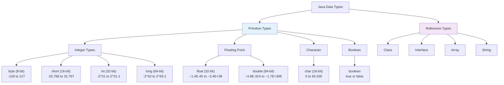

| Kiểu dữ liệu | Kích thước | Giá trị nhỏ nhất | Giá trị lớn nhất | Giá trị mặc định |
| --- | --- | --- | --- | --- |
| boolean | Kích thước không xác định (JLS) | false | true | false |
| byte | 8-bit | -128 | 127 | 0 |
| short | 16-bit | -32,768 | 32,767 | 0 |
| char | 16-bit | 0 | 65,535 (biểu diễn Unicode) | \u0000 |
| int | 32-bit | -2^31 (-2,147,483,648) | 2^31 - 1 (2,147,483,647) | 0 |
| float | 32-bit | ~1.4E-45 | ~3.4E+38 | 0.0F |
| long | 64-bit | -2^63 (-9,223,372,036,854,775,808) | 2^63 - 1 (9,223,372,036,854,775,807) | 0L |
| double | 64-bit | ~4.9E-324 | ~1.7E+308 | 0.0D |

---

> **Lưu ý quan trọng về `boolean`:**
> - Kích thước của `boolean` **không được quy định trong JLS** (Java Language Specification)
> - Triển khai thường dùng 1 byte trở lên, nhưng điều này không được đảm bảo theo tiêu chuẩn
> - `char` mặc định là ký tự NUL `'\u0000'`, **không** phải `null`
> - Giá trị mặc định `boolean` ở **trường** là `false`, nhưng **biến local** phải gán trước khi dùng

```java
public class DefaultValueExample {
    boolean b;    // false
    byte by;      // 0
    short s;      // 0
    char c;       // '\u0000'
    int i;        // 0
    float f;      // 0.0f
    double d;     // 0.0d
    long l;       // 0L
}
```

### 7.1. Phân biệt `Member Variable` và `Local Variable`

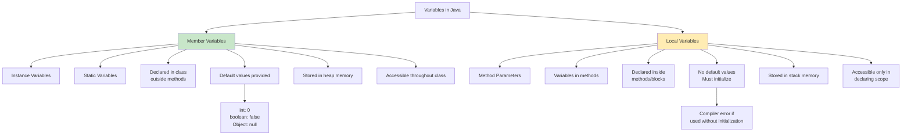

| Đặc điểm | Member Variable | Local Variable |
| --- | --- | --- |
| Vị trí khai báo | Trong lớp nhưng ngoài phương thức | Trong phương thức, constructor hoặc khối lệnh |
| Thời điểm khởi tạo | Khi đối tượng được tạo | Khi phương thức được gọi |
| Phạm vi | Toàn bộ lớp | Chỉ trong khối lệnh khai báo |
| Giá trị mặc định | Có giá trị mặc định (0, false, null) | Không có giá trị mặc định |
| Khởi tạo bắt buộc | Không cần khởi tạo trước khi sử dụng | Phải khởi tạo trước khi sử dụng |
| Bộ nhớ | Được lưu trong heap | Được lưu trong stack |
| Ví dụ | `private int age;` | `int count = 0;` |

**Giải thích chi tiết:**

**Biến thành viên (Member Variables):**
- Được khai báo trong lớp nhưng bên ngoài bất kỳ phương thức, constructor hoặc khối lệnh nào
- Có giá trị mặc định nếu không được khởi tạo:
  - Kiểu số nguyên (byte, short, int, long): Giá trị mặc định là 0
  - Kiểu số thực (float, double): Giá trị mặc định là 0.0
  - Kiểu ký tự (char): Giá trị mặc định là ký tự '\u0000' (null character)
  - Kiểu boolean: Giá trị mặc định là false
  - Kiểu tham chiếu (như String, Object): Giá trị mặc định là null

```java
public class Person {
    private int age;          // giá trị mặc định là 0
    private boolean isStudent;   // giá trị mặc định là false
    private String name;     // giá trị mặc định là null
    
    public void printDetails() {
        System.out.println("Age: " + age);
        System.out.println("Is Student: " + isStudent);
        System.out.println("Name: " + name);
    }
}
```

**Biến cục bộ (Local Variables):**
- Được khai báo bên trong phương thức, constructor hoặc khối lệnh
- Không có giá trị mặc định, phải được khởi tạo trước khi sử dụng
- Nếu cố gắng sử dụng mà chưa khởi tạo sẽ gây lỗi biên dịch

```java
public class Calculator {
    public int add(int a, int b) {
        int result = a + b; // Biến cục bộ, phải được khởi tạo
        return result;
    }
    
    public void print() {
        int value; // Khai báo biến cục bộ
        // System.out.println(value); // Lỗi biên dịch: variable might not have been initialized
        value = 10; // Khởi tạo trước khi sử dụng
        System.out.println(value); // Hợp lệ
    }
}
```

**Biến tĩnh (Static Variables):**
- Được khai báo với từ khóa `static`
- Thuộc về lớp, không thuộc về instance
- Có giá trị mặc định tương tự như member variables

```java
public class Counter {
    private static int totalCount = 0; // Biến tĩnh
    
    public Counter() {
        totalCount++;
    }
    
    public static int getTotalCount() {
        return totalCount;
    }
}
```

**Lưu ý quan trọng:**
- Biến cục bộ chỉ tồn tại trong thời gian thực thi phương thức/bloch lệnh
- Biến thành viên tồn tại suốt đời của đối tượng
- Biến tĩnh tồn tại suốt đời của chương trình
- Tên biến cục bộ có thể giống với tên biến thành viên, khi đó cần dùng `this` để truy cập biến thành viên

### 8. Thuộc tính và phương thức ngầm định trong Interface

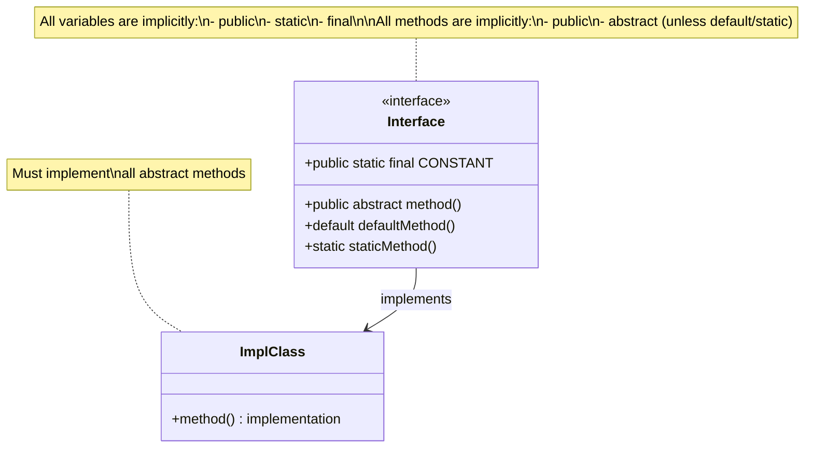

#### 8.1. Lý do thuộc tính trong interface là `public static final`

Các thuộc tính trong interface được mặc định là `public static final` vì:

- `public`: Các hằng số trong interface cần được truy cập từ bất kỳ lớp nào implement interface đó, cũng như từ các lớp khác.
- `static`: Các hằng số này thuộc về interface, chứ không thuộc về các instance của interface (interface không thể được khởi tạo).
- `final`: Các hằng số không được phép thay đổi giá trị sau khi được gán. Việc này đảm bảo tính nhất quán và tránh lỗi.

**Mệnh đề:** "Tất cả các biến là `static` và phương thức là `public` nếu interface được định nghĩa là `public`"
→ Đây là một mệnh đề sai.

**Giải thích:**
Trong Java, các thuộc tính (biến) trong `interface` luôn có các đặc tính:
- `public static final` (công khai, tĩnh, hằng số).

Các phương thức trong `interface` luôn có các đặc tính:
- `public abstract` (công khai và trừu tượng).

Điều này đúng bất kể `interface` được khai báo là `public` hay `private`. Ngay cả khi `interface` là `private`, các thuộc tính và phương thức trong đó vẫn tuân theo quy tắc này.

**Các cách viết sau là tương đương:**
```java
public interface MyInterface {
    // Thuộc tính 
    int MAX_VALUE = 100;
    public int MAX_VALUE = 100;
    final int MAX_VALUE = 100;
    static int MAX_VALUE = 100;
    public static final int MAX_VALUE = 100;
    public final static int MAX_VALUE = 100;
    static final int MAX_VALUE = 100;
    final static int MAX_VALUE = 100;
    
    // Phương thức
    void doSomething();
    public abstract void doSomething();
    public void doSomething();
    abstract void doSomething();
}
```

#### 8.2. Lý do phương thức trong interface là `public abstract`

Các phương thức trong interface được mặc định là `public abstract` vì việc này buộc các lớp implement interface phải cung cấp triển khai cụ thể cho các phương thức đó.

### 9. Phạm vi truy cập (Access Modifiers)

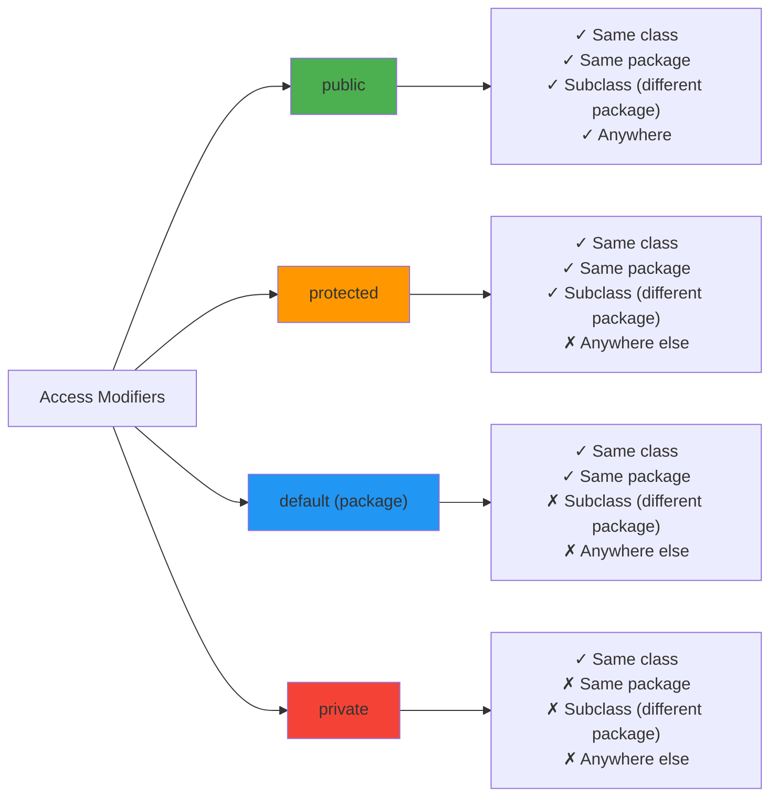

| Modifier | Truy cập trong cùng lớp | Truy cập trong cùng package | Truy cập từ lớp con (khác package) | Truy cập từ mọi nơi |
| --- | --- | --- | --- | --- |
| public | ✔ | ✔ | ✔ | ✔ |
| protected | ✔ | ✔ | ✔ | ✘ |
| (default) | ✔ | ✔ | ✘ | ✘ |
| private | ✔ | ✘ | ✘ | ✘ |

```java
public class MyClass {
    public int publicData = 1; // Truy cập từ mọi nơi
    protected int protectedData = 2; // Truy cập trong cùng package và lớp con
    int defaultData = 3; // Truy cập trong cùng package
    private int privateData = 4; // Truy cập chỉ trong lớp MyClass

    public void publicMethod() {} // Truy cập từ mọi nơi
    protected void protectedMethod() {} // Truy cập trong cùng package và lớp con
    void defaultMethod() {} // Truy cập trong cùng package
    private void privateMethod() {} // Truy cập chỉ trong lớp MyClass
}

class AnotherClass {
    // Trong cùng package
    public void accessData(MyClass obj) {
        System.out.println(obj.publicData); 
        System.out.println(obj.protectedData); 
        System.out.println(obj.defaultData); 
        // System.out.println(obj.privateData); // Lỗi: không truy cập được
    }
}

class SubClass extends MyClass {
    // Lớp con (khác package)
    public void accessData() {
        System.out.println(publicData);
        System.out.println(protectedData); 
        // System.out.println(defaultData); // Lỗi: không truy cập được
        // System.out.println(privateData); // Lỗi: không truy cập được
    }
}
```

---

## III. Lập trình đa luồng (Multithreading)

### 10. Đồng bộ hóa (Synchronization)

```mermaid
flowchart TD
    A["Synchronization in Java"] --> B["Synchronized Methods"]
    A --> C["Synchronized Blocks"]
    A --> D["Static Synchronization"]
    
    B --> B1["synchronized method() {...}"]
    B --> B2["Lock: this object"]
    B --> B3["Entire method protected"]
    
    C --> C1["synchronized(object) {...}"]
    C --> C2["Lock: specified object"]
    C --> C3["Only block protected"]
    
    D --> D1["synchronized static method()"]
    D --> D2["Lock: Class object"]
    D --> D3["Class-level locking"]
    
    E["Thread Safety Issues"] --> F["Race Condition"]
    E --> G["Data Inconsistency"]
    E --> H["Deadlock"]
    
    I["Solutions"] --> J["synchronized keyword"]
    I --> K["volatile keyword"]
    I --> L["Concurrent Collections"]
    I --> M["Atomic Classes"]
    
    style A fill:#e1f5fe
    style E fill:#ffebee
    style I fill:#e8f5e8
```

#### 10.1. Mục tiêu và cơ chế của Synchronization

**Mục tiêu:** Đảm bảo rằng chỉ có một luồng (thread) có thể thực thi một phương thức hoặc khối mã cụ thể tại một thời điểm trên một đối tượng hoặc lớp nhất định.

**Cơ chế:**
- Khi một luồng đang thực thi một đoạn mã được đồng bộ hóa (bằng `synchronized`), các luồng khác phải đợi cho đến khi luồng đó hoàn tất trước khi có thể vào đoạn mã này.
- `Synchronized` sử dụng khái niệm khóa (lock) để kiểm soát truy cập. Mỗi đối tượng và lớp trong Java đều có một khóa liên quan.

**Phân loại:** Có 3 loại đồng bộ hóa:

| Loại đồng bộ hóa | Code ví dụ | Phạm vi khóa | Giải thích |
| --- | --- | --- | --- |
| Synchronized Method | `synchronized void m1() { ... }` | Đối tượng hiện tại (`this`) | Toàn bộ phương thức `m1()` được đồng bộ hóa. Chỉ một luồng có thể thực thi `m1()` trên một đối tượng cụ thể tại một thời điểm. Các luồng khác muốn truy cập `m1()` trên cùng đối tượng đó sẽ phải đợi. |
| Synchronized Block | `void m1() { synchronized (this) { ... } }` | Đối tượng cụ thể được chỉ định (ví dụ: `this`) | Chỉ khối mã bên trong `synchronized` được đồng bộ hóa. Các luồng khác vẫn có thể truy cập các phần khác của phương thức `m1()` đồng thời. |
| Static Synchronization | `synchronized static void m1() { ... }` | Lớp (`Class`) | Toàn bộ phương thức `static` `m1()` được đồng bộ hóa trên toàn bộ lớp. Chỉ một luồng có thể thực thi `m1()` trên lớp đó tại một thời điểm, bất kể có bao nhiêu đối tượng của lớp tồn tại. |

#### 10.2. Synchronized Method

```java
class A {
    // Phương thức synchronized: chỉ một luồng có thể truy cập cùng lúc
    synchronized void m1() {
        System.out.println(Thread.currentThread().getName() + " đang thực thi m1.");

        // Giả lập việc phương thức chạy lâu
        try { Thread.sleep(1000); } catch (InterruptedException e) { e.printStackTrace(); } 

        System.out.println(Thread.currentThread().getName() + " hoàn thành m1.");
    }

    // Phương thức không synchronized: nhiều luồng có thể truy cập cùng lúc
    void m2() { 
        System.out.println(Thread.currentThread().getName() + " đang thực thi m2."); 
    } 
}

// Lớp ThreadWorker đại diện cho các luồng thực thi, kế thừa từ Thread
class ThreadWorker extends Thread {
    A obj; // Đối tượng mà các luồng sẽ thao tác
    String method; // Phương thức mà luồng sẽ gọi ("m1" hoặc "m2")

    ThreadWorker(A obj, String method) {
        this.obj = obj;
        this.method = method;
    }

    public void run() { 
        if (method.equals("m1")) { 
            obj.m1(); // Gọi m1() - chỉ một luồng có thể truy cập tại một thời điểm
        } else if (method.equals("m2")) {
            obj.m2(); // Gọi m2() - nhiều luồng có thể truy cập đồng thời
        }
    }
}

public class Main {
    public static void main(String[] args) {
        A obj = new A(); 

        ThreadWorker t0 = new ThreadWorker(obj, "m1");
        ThreadWorker t1 = new ThreadWorker(obj, "m1");
        ThreadWorker t2 = new ThreadWorker(obj, "m2");
        ThreadWorker t3 = new ThreadWorker(obj, "m2");

        t0.start();
        t1.start();
        t2.start();
        t3.start();
    }
}
```

**Kết quả dự kiến**

| Trường hợp | Thứ tự thực thi | Kết luận |
| --- | --- | --- |
| Trường hợp 1 | - Thread-0 thực thi m1()<br>- Thread-2 và Thread-3 thực thi m2() cùng lúc<br>- Thread-0 hoàn thành m1()<br>- Thread-1 bắt đầu thực thi m1() sau khi Thread-0 hoàn thành<br>- Thread-1 hoàn thành m1() | Thứ tự này phản ánh chính xác việc đồng bộ hóa của m1(), trong khi các luồng gọi m2() thực thi đồng thời. |
| Trường hợp 2 | - Thread-2 và Thread-3 thực thi m2() cùng lúc<br>- Thread-0 thực thi m1()<br>- Thread-0 hoàn thành m1()<br>- Thread-1 bắt đầu thực thi m1() sau khi Thread-0 hoàn thành<br>- Thread-1 hoàn thành m1() | Thứ tự khác nhưng vẫn đảm bảo việc đồng bộ hóa cho m1(). Kết quả này cũng hợp lệ trong lập trình đa luồng. |

#### 10.3. Synchronized Block

```java
class A {
    void m1() {
        // Khối synchronized: chỉ một luồng có thể truy cập cùng lúc
        synchronized (this) {
            System.out.println(Thread.currentThread().getName() + " đang thực thi khối synchronized trong m1.");

            try { Thread.sleep(1000); } catch (InterruptedException e) { e.printStackTrace(); }

            System.out.println(Thread.currentThread().getName() + " hoàn thành khối synchronized trong m1.");
        }
    }

    void m2() { 
        System.out.println(Thread.currentThread().getName() + " đang thực thi m2."); 
    } 
}

// ... (Lớp ThreadWorker và Main tương tự như phần 10.2)
```

**Kết quả dự kiến**

| Trường hợp | Thứ tự thực thi | Kết luận |
| --- | --- | --- |
| Trường hợp 1 | - Thread-0 thực thi khối synchronized trong m1()<br>- Thread-2 và Thread-3 thực thi m2() cùng lúc<br>- Thread-0 hoàn thành khối synchronized trong m1()<br>- Thread-1 bắt đầu thực thi khối synchronized trong m1() sau khi Thread-0 hoàn thành<br>- Thread-1 hoàn thành khối synchronized trong m1() | Thứ tự này phản ánh việc đồng bộ hóa của khối code trong m1(), trong khi các luồng gọi m2() thực thi đồng thời. Chỉ một luồng có thể truy cập khối synchronized tại một thời điểm. |
| Trường hợp 2 | - Thread-2 và Thread-3 thực thi m2() cùng lúc<br>- Thread-0 thực thi khối synchronized trong m1()<br>- Thread-0 hoàn thành khối synchronized trong m1()<br>- Thread-1 bắt đầu thực thi khối synchronized trong m1() sau khi Thread-0 hoàn thành<br>- Thread-1 hoàn thành khối synchronized trong m1() | Tương tự trường hợp 1, thứ tự thực thi có thể khác nhau, nhưng nguyên tắc đồng bộ hóa vẫn được đảm bảo. Chỉ một luồng được phép truy cập vào khối synchronized tại một thời điểm. |

#### 10.4. Static Synchronization

```java
class A {
    // Phương thức static synchronized: chỉ một luồng có thể truy cập cùng lúc trên toàn bộ lớp
    synchronized static void m1() {
        System.out.println(Thread.currentThread().getName() + " đang thực thi phương thức static synchronized m1.");

        try { Thread.sleep(1000); } catch (InterruptedException e) { e.printStackTrace(); }

        System.out.println(Thread.currentThread().getName() + " hoàn thành phương thức static synchronized m1.");
    }

    void m2() { 
        System.out.println(Thread.currentThread().getName() + " đang thực thi m2."); 
    }
}

// Lớp ThreadWorker đại diện cho các luồng thực thi, kế thừa từ Thread
class ThreadWorker extends Thread {
    A obj; // Đối tượng mà các luồng sẽ thao tác (không cần thiết cho phương thức static)
    String method; // Phương thức mà luồng sẽ gọi ("m1" hoặc "m2")

    ThreadWorker(A obj, String method) {
        this.obj = obj;
        this.method = method;
    }

    public void run() {
        if (method.equals("m1")) {
            A.m1(); // Gọi phương thức static m1() trực tiếp thông qua tên lớp
        } else if (method.equals("m2")) {
            obj.m2();
        }
    }
}

// ... (Lớp Main tương tự như phần 10.2)
```

**Kết quả dự kiến**

| Trường hợp | Thứ tự thực thi | Kết luận |
| --- | --- | --- |
| Trường hợp 1 | - Thread-0 thực thi m1()<br>- Thread-2 và Thread-3 thực thi m2() cùng lúc<br>- Thread-0 hoàn thành m1()<br>- Thread-1 bắt đầu thực thi m1() sau khi Thread-0 hoàn thành<br>- Thread-1 hoàn thành m1() | Thứ tự này phản ánh chính xác việc đồng bộ hóa của phương thức static m1(). Chỉ một luồng có thể truy cập m1() tại một thời điểm, bất kể nó được gọi từ đối tượng nào của lớp A. |
| Trường hợp 2 | - Thread-2 và Thread-3 thực thi m2() cùng lúc<br>- Thread-0 thực thi m1()<br>- Thread-0 hoàn thành m1()<br>- Thread-1 bắt đầu thực thi m1() sau khi Thread-0 hoàn thành<br>- Thread-1 hoàn thành m1() | Tương tự trường hợp 1, thứ tự thực thi có thể khác nhau, nhưng nguyên tắc đồng bộ hóa vẫn được đảm bảo cho phương thức static m1(). Việc nhiều luồng gọi m2() không ảnh hưởng đến việc đồng bộ hóa của m1(). |

#### 10.5. Đồng bộ hóa của `Collection` (`Map`, `Set`)

**1. Đồng bộ hóa Collection**

Java cung cấp hai cách chính để đồng bộ hóa Collection:

**a. Sử dụng Collections.synchronizedList/Set/Map:**
```java
List<String> syncList = Collections.synchronizedList(new ArrayList<>());
Set<String> syncSet = Collections.synchronizedSet(new HashSet<>());
Map<String, String> syncMap = Collections.synchronizedMap(new HashMap<>());
```

- Các phương thức của collection được bọc trong synchronized block
- Cần sử dụng synchronized block khi duyệt qua collection:
```java
synchronized (syncList) {
    Iterator<String> i = syncList.iterator();
    while (i.hasNext())
        foo(i.next());
}
```

**b. Sử dụng các lớp đồng bộ hóa có sẵn:**
- `Vector` và `Hashtable` (các lớp cũ, đã được thay thế bởi ArrayList và HashMap)
- `ConcurrentHashMap`, `CopyOnWriteArrayList`, `CopyOnWriteArraySet` (từ package java.util.concurrent)

**2. So sánh các cách đồng bộ hóa Collection**

| Loại Collection | Đồng bộ hóa truyền thống | Đồng bộ hóa hiệu suất cao |
| --- | --- | --- |
| List | `Collections.synchronizedList(new ArrayList<>)` | `CopyOnWriteArrayList` |
| Set | `Collections.synchronizedSet(new HashSet<>)` | `ConcurrentSkipListSet`, `CopyOnWriteArraySet` |
| Map | `Collections.synchronizedMap(new HashMap<>)`, `Hashtable` | `ConcurrentHashMap` |

**3. ConcurrentHashMap - Giải pháp đồng bộ hóa hiệu suất cao**

```java
ConcurrentHashMap<String, Integer> concurrentMap = new ConcurrentHashMap<>();

// Các phương thức an toàn với đa luồng
concurrentMap.put("key1", 1);
concurrentMap.get("key1");
concurrentMap.putIfAbsent("key2", 2);
concurrentMap.compute("key1", (k, v) -> v != null ? v + 1 : 1);
```

**Ưu điểm của ConcurrentHashMap:**
- Chia không gian khóa thành nhiều segment (mặc định 16)
- Mỗi segment có khóa riêng, cho phép nhiều luồng truy cập đồng thời
- Hiệu suất cao hơn Collections.synchronizedMap
- Cung cấp các phương thức nguyên tử như putIfAbsent, compute, merge

**4. CopyOnWriteArrayList - Giải pháp cho trường hợp đọc nhiều, ghi ít**

```java
CopyOnWriteArrayList<String> copyOnWriteList = new CopyOnWriteArrayList<>();
copyOnWriteList.add("A");
copyOnWriteList.add("B");

// Duyệt an toàn mà không cần synchronized
// CHÚ THÍCH: Chỉ dùng khi ĐỌC NHIỀU, GHI RẤT ÍT
// Lưu ý: Hiệu năng ghi kém hơn 10-100x so với ArrayList thông thường
for (String s : copyOnWriteList) {
    System.out.println(s);
}
```

**Đặc điểm:**
- Khi sửa đổi, tạo một bản sao của mảng cơ sở
- Đọc không cần khóa, rất nhanh
- Viết chậm do phải sao chép mảng
- Thích hợp cho trường hợp đọc nhiều, ghi ít

**5. Ví dụ so sánh hiệu suất**

```java
import java.util.*;
import java.util.concurrent.*;
import java.util.stream.IntStream;

public class ConcurrentCollectionPerformance {
    public static void main(String[] args) {
        int iterations = 100000;
        int threads = 10;
        
        // So sánh HashMap và ConcurrentHashMap
        testMapPerformance(new HashMap<>(), "HashMap", iterations, threads);
        testMapPerformance(new ConcurrentHashMap<>(), "ConcurrentHashMap", iterations, threads);
        
        // So sánh ArrayList và CopyOnWriteArrayList
        testListPerformance(new ArrayList<>(), "ArrayList", iterations, threads);
        testListPerformance(new CopyOnWriteArrayList<>(), "CopyOnWriteArrayList", iterations, threads);
    }
    
    private static void testMapPerformance(Map<String, Integer> map, String name, int iterations, int threads) {
        long startTime = System.currentTimeMillis();
        
        // Khởi tạo dữ liệu
        for (int i = 0; i < 1000; i++) {
            map.put("key" + i, i);
        }
        
        // Tạo và chạy các luồng
        List<Thread> threadList = new ArrayList<>();
        for (int t = 0; t < threads; t++) {
            Thread thread = new Thread(() -> {
                for (int i = 0; i < iterations; i++) {
                    String key = "key" + (i % 1000);
                    map.get(key);
                    map.put(key, i);
                }
            });
            threadList.add(thread);
            thread.start();
        }
        
        // Chờ tất cả luồng hoàn thành
        for (Thread thread : threadList) {
            try {
                thread.join();
            } catch (InterruptedException e) {
                e.printStackTrace();
            }
        }
        
        long duration = System.currentTimeMillis() - startTime;
        System.out.println(name + " took: " + duration + "ms");
    }
    
    private static void testListPerformance(List<String> list, String name, int iterations, int threads) {
        long startTime = System.currentTimeMillis();
        
        // Khởi tạo dữ liệu
        for (int i = 0; i < 1000; i++) {
            list.add("item" + i);
        }
        
        // Tạo và chạy các luồng
        List<Thread> threadList = new ArrayList<>();
        for (int t = 0; t < threads; t++) {
            Thread thread = new Thread(() -> {
                for (int i = 0; i < iterations; i++) {
                    int index = i % 1000;
                    list.get(index);
                    if (i % 100 == 0) {
                        list.set(index, "updated");
                    }
                }
            });
            threadList.add(thread);
            thread.start();
        }
        
        // Chờ tất cả luồng hoàn thành
        for (Thread thread : threadList) {
            try {
                thread.join();
            } catch (InterruptedException e) {
                e.printStackTrace();
            }
        }
        
        long duration = System.currentTimeMillis() - startTime;
        System.out.println(name + " took: " + duration + "ms");
    }
}
```

**Kết luận khi chọn Collection đồng bộ:**
- Sử dụng `ConcurrentHashMap` thay vì `synchronizedMap` cho hiệu suất tốt hơn
- Sử dụng `CopyOnWriteArrayList` khi có nhiều thao tác đọc và ít thao tác ghi
- Luôn sử dụng synchronized block khi duyệt qua các collection được đồng bộ hóa bằng Collections.synchronizedX
- Tránh sử dụng Vector và Hashtable trong code mới

### 11. Thread (Luồng)

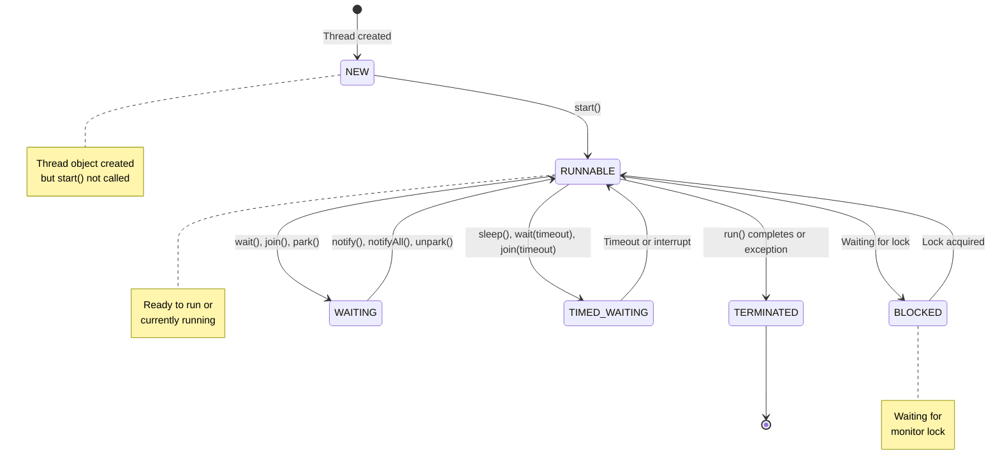

#### 11.1. Các trạng thái của `Thread`

Một luồng trong Java có thể ở một trong sáu trạng thái sau:

1. **NEW**: Luồng đã được tạo nhưng chưa bắt đầu chạy (chưa gọi phương thức `start()`)

2. **RUNNABLE**: Luồng đang chạy hoặc sẵn sàng chạy (đang chờ CPU)
   - Đang thực thi mã
   - Đang chờ được cấp CPU time

3. **BLOCKED**: Luồng đang chờ khóa monitor để vào một khối synchronized hoặc phương thức synchronized
   - Đang chờ giải phóng khóa để vào synchronized block/method
   - Không thể tiếp tục cho đến khi có được khóa

4. **WAITING**: Luồng đang chờ không xác định thời gian cho một hành động cụ thể
   - Chờ khi gọi `Object.wait()`
   - Chờ khi gọi `Thread.join()`
   - Chờ khi gọi `LockSupport.park()`

5. **TIMED_WAITING**: Luồng đang chờ trong một khoảng thời gian xác định
   - Chờ khi gọi `Thread.sleep(long millis)`
   - Chờ khi gọi `Object.wait(long timeout)`
   - Chờ khi gọi `Thread.join(long millis)`
   - Chờ khi gọi `LockSupport.parkNanos(long nanos)`

6. **TERMINATED**: Luồng đã kết thúc thực thi
   - Hoàn thành phương thức `run()`
   - Bị dừng do ngoại lệ không được xử lý

**Sơ đồ chuyển trạng thái:**

```
NEW
  │
  ▼
RUNNABLE ←──────────┐
  │                 │
  ├─→ BLOCKED       │
  │      │          │
  │      ▼          │
  │   RUNNABLE      │
  │                 │
  ├─→ WAITING       │
  │      │          │
  │      ▼          │
  │   RUNNABLE ─────┘
  │
  ▼
TERMINATED
```

**Ví dụ minh họa các trạng thái:**

```java
public class ThreadStatesExample {
    public static void main(String[] args) throws InterruptedException {
        Object lock = new Object();
        
        Thread t1 = new Thread(() -> {
            synchronized (lock) {
                try {
                    System.out.println("Thread t1: RUNNABLE (sau khi start)");
                    Thread.sleep(1000);
                    System.out.println("Thread t1: TIMED_WAITING (sau khi sleep)");
                    lock.wait();
                } catch (InterruptedException e) {
                    e.printStackTrace();
                }
            }
        });
        
        Thread t2 = new Thread(() -> {
            synchronized (lock) {
                System.out.println("Thread t2: RUNNABLE");
                try {
                    Thread.sleep(5000);
                } catch (InterruptedException e) {
                    e.printStackTrace();
                }
            }
        });
        
        System.out.println("Thread t1 state: " + t1.getState()); // NEW
        t1.start();
        Thread.sleep(100);
        System.out.println("Thread t1 state: " + t1.getState()); // RUNNABLE
        
        t2.start();
        Thread.sleep(100);
        System.out.println("Thread t1 state: " + t1.getState()); // WAITING
        System.out.println("Thread t2 state: " + t2.getState()); // BLOCKED
        
        Thread.sleep(2000);
        System.out.println("Thread t1 state: " + t1.getState()); // WAITING
        System.out.println("Thread t2 state: " + t2.getState()); // RUNNABLE
        
        synchronized (lock) {
            lock.notify();
        }
        
        t1.join();
        t2.join();
        System.out.println("Thread t1 state: " + t1.getState()); // TERMINATED
        System.out.println("Thread t2 state: " + t2.getState()); // TERMINATED
    }
}
```

**Lưu ý quan trọng:**
- Trạng thái RUNNABLE bao gồm cả khi luồng đang chạy và khi đang sẵn sàng chạy (chờ CPU)
- Trạng thái BLOCKED chỉ xảy ra khi chờ khóa monitor
- Trạng thái WAITING và TIMED_WAITING xảy ra khi luồng đang chờ một sự kiện cụ thể
- Không thể chuyển trực tiếp từ BLOCKED sang WAITING hoặc ngược lại
- **Exception xảy ra trong `run()`** sẽ không tạo chuyển đổi trực tiếp từ các trạng thái khác sang TERMINATED - thread chỉ kết thúc từ RUNNABLE

#### Happens-before và Java Memory Model (JMM)

**Happens-before relationship** là nguyên tắc quan trọng trong JMM để đảm bảo tính hiển thị (visibility) và thứ tự (ordering) của các thao tác:

```java
// volatile đảm bảo happens-before
class VolatileExample {
    private volatile boolean flag = false;
    private int data = 0;
    
    // Thread 1
    public void writer() {
        data = 42;        // (1) 
        flag = true;      // (2) ghi vào volatile
    }
    
    // Thread 2  
    public void reader() {
        if (flag) {       // (3) đọc từ volatile
            System.out.println(data); // (4) sẽ thấy giá trị 42
        }
    }
}
// Happens-before: (1) -> (2) -> (3) -> (4)
// Ghi vào volatile (2) happens-before mọi đọc volatile (3) sau đó
```

#### Bẫy thường gặp trong Đa luồng

```java
// Bẫy 1: Double-checked locking thiếu volatile
class Singleton {
    private static Singleton instance; // THIẾU volatile!
    
    public static Singleton getInstance() {
        if (instance == null) {
            synchronized (Singleton.class) {
                if (instance == null) {
                    instance = new Singleton(); // Có thể bị reordering!
                }
            }
        }
        return instance; // Có thể trả về đối tượng chưa khởi tạo hoàn chỉnh!
    }
}

// ĐÚNG:
class SafeSingleton {
    private static volatile SafeSingleton instance;
    
    public static SafeSingleton getInstance() {
        if (instance == null) {
            synchronized (SafeSingleton.class) {
                if (instance == null) {
                    instance = new SafeSingleton();
                }
            }
        }
        return instance;
    }
}
```

```java
// Bẫy 2: Nuốt InterruptedException
class BadInterruptHandling {
    public void run() {
        try {
            Thread.sleep(1000);
        } catch (InterruptedException e) {
            // SAI: Nuốt exception và không restore interrupt status
            System.out.println("Interrupted");
        }
    }
}

// ĐÚNG:
class GoodInterruptHandling {
    public void run() {
        try {
            Thread.sleep(1000);
        } catch (InterruptedException e) {
            Thread.currentThread().interrupt(); // Restore interrupt status
            System.out.println("Interrupted");
            return; // Hoặc throw exception lên
        }
    }
}
```

```java
// Bẫy 3: long/double không volatile có thể không atomic
class NonAtomicLongDouble {
    private long value = 0L;    // Có thể bị "tearing" trong đa luồng
    private double price = 0.0; // 64-bit, có thể đọc được giá trị lạ
    
    // Thread 1
    public void updateValue() {
        value = 0x1234567890ABCDEFL; // Có thể ghi từng nửa (32-bit)
    }
    
    // Thread 2  
    public long readValue() {
        return value; // Có thể đọc được nửa cũ + nửa mới!
    }
}

// ĐÚNG:
class AtomicLongDouble {
    private volatile long value = 0L;    // Đảm bảo atomic
    private volatile double price = 0.0;
    
    // Hoặc dùng AtomicLong
    private final AtomicLong atomicValue = new AtomicLong(0L);
}
```

```java
// Bẫy 4: Sử a đổi cấu trúc Collection trong khi duyệt
List<String> list = new ArrayList<>(Arrays.asList("A", "B", "C"));

// SAI: ConcurrentModificationException
for (String item : list) {
    if ("B".equals(item)) {
        list.remove(item); // Lỗi!
    }
}

// ĐÚNG: Dùng Iterator.remove()
Iterator<String> iterator = list.iterator();
while (iterator.hasNext()) {
    String item = iterator.next();
    if ("B".equals(item)) {
        iterator.remove(); // An toàn
    }
}
```

**Nguyên tắc quan trọng:**
- **`volatile` đảm bảo happens-before** giữa ghi và đọc
- **Luôn restore interrupt status** khi bắt `InterruptedException`
- **`long/double` không volatile có thể không atomic** (JLS §17.7)
- **Dùng Iterator.remove()** thay vì Collection.remove() khi duyệt

#### 11.2. Phân biệt `Concurrency` và `Multithreading`

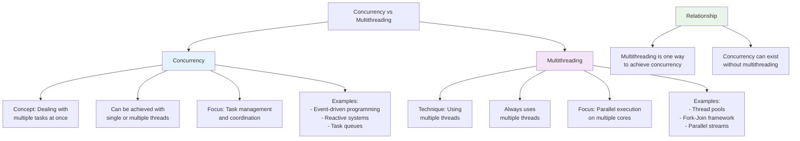

| Đặc điểm | Concurrency | Multithreading |
| --- | --- | --- |
| Định nghĩa | Khả năng xử lý nhiều tác vụ cùng lúc | Kỹ thuật thực thi nhiều luồng trên một CPU |
| Mục đích | Tối ưu hóa việc sử dụng tài nguyên, xử lý nhiều tác vụ | Cho phép chương trình thực hiện nhiều tác vụ đồng thời |
| Triển khai | Có thể thực hiện với một hoặc nhiều luồng | Luôn sử dụng nhiều luồng |
| Phạm vi | Rộng hơn, bao gồm multithreading | Là một phần của concurrency |
| Mô hình | Task-based | Thread-based |
| Ví dụ | Xử lý nhiều request trong ứng dụng web | Chạy đồng thời UI và xử lý backend |
| Đơn vị cơ bản | Task, Process | Thread |
| Quản lý | Thông qua ExecutorService, CompletableFuture | Thông qua Thread, Runnable |

**Giải thích chi tiết:**

**Concurrency (Đồng thời):**
- Là khái niệm rộng hơn, chỉ khả năng xử lý nhiều tác vụ cùng lúc
- Không nhất thiết phải thực thi song song, có thể luân phiên giữa các tác vụ
- Tập trung vào việc thiết kế hệ thống để xử lý nhiều tác vụ một cách hiệu quả
- Ví dụ: Một nhân viên phục vụ trong quán cà phê có thể nhận đơn, pha cà phê, thu tiền một cách luân phiên

**Multithreading (Đa luồng):**
- Là kỹ thuật cụ thể để đạt được concurrency
- Sử dụng nhiều luồng (threads) để thực thi nhiều phần của chương trình cùng lúc
- Mỗi luồng là một dòng thực thi riêng biệt
- Ví dụ: Nhiều nhân viên phục vụ trong quán cà phê, mỗi người làm một nhiệm vụ khác nhau cùng lúc

**Mối quan hệ:**
- Multithreading là một cách để đạt được concurrency
- Concurrency có thể đạt được mà không cần multithreading (ví dụ: event-driven programming)
- Multithreading không đảm bảo concurrency hiệu quả nếu không được thiết kế tốt

**Ví dụ minh họa:**

**Concurrency với một luồng (Single-threaded Concurrency):**
```java
CompletableFuture.supplyAsync(() -> {
    // Đọc file 1
    return readFile("file1.txt");
}).thenAccept(result -> {
    System.out.println("File 1 read");
    // Tiếp tục xử lý
});
```

**Multithreading trong Java:**
```java
class Task implements Runnable {
    private String name;
    
    public Task(String name) {
        this.name = name;
    }
    
    @Override
    public void run() {
        System.out.println(name + " started");
        try {
            Thread.sleep(1000);
        } catch (InterruptedException e) {
            e.printStackTrace();
        }
        System.out.println(name + " completed");
    }
}

public class MultithreadingExample {
    public static void main(String[] args) {
        Thread t1 = new Thread(new Task("Task 1"));
        Thread t2 = new Thread(new Task("Task 2"));
        
        t1.start();
        t2.start();
        
        try {
            t1.join();
            t2.join();
        } catch (InterruptedException e) {
            e.printStackTrace();
        }
        
        System.out.println("All tasks completed");
    }
}
```

**Khi nào nên sử dụng cái nào?**
- Sử dụng **Concurrency** khi:
  - Cần xử lý nhiều tác vụ mà không nhất thiết phải song song
  - Hệ thống có tài nguyên hạn chế
  - Cần đơn giản hóa thiết kế hệ thống

- Sử dụng **Multithreading** khi:
  - Cần tận dụng đa nhân CPU
  - Các tác vụ có thể thực thi độc lập
  - Hiệu suất là yếu tố quan trọng

**Lưu ý quan trọng:**
- Multithreading có thể dẫn đến các vấn đề như race condition, deadlock nếu không được quản lý tốt
- Concurrency model hiện đại (như Reactive Programming) thường dễ quản lý hơn multithreading truyền thống
- Java cung cấp nhiều công cụ để hỗ trợ cả concurrency và multithreading:
  - ExecutorService
  - CompletableFuture
  - Reactive Streams
  - Parallel Streams

---

## IV. File và I/O trong Java

### 12. File và I/O

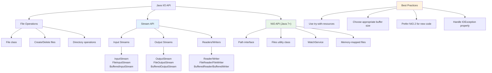

#### 12.1. Cơ bản về `File`, `InputStream`, `Reader`

**1. Lớp File**

Lớp `File` trong Java đại diện cho một đường dẫn đến file hoặc thư mục trên hệ thống tập tin.

```java
import java.io.File;

public class FileExample {
    public static void main(String[] args) {
        // Tạo đối tượng File
        File file = new File("example.txt");
        
        // Kiểm tra sự tồn tại
        System.out.println("File exists: " + file.exists());
        
        // Tạo file mới
        try {
            boolean created = file.createNewFile();
            System.out.println("File created: " + created);
        } catch (Exception e) {
            e.printStackTrace();
        }
        
        // Thông tin về file
        System.out.println("File name: " + file.getName());
        System.out.println("Absolute path: " + file.getAbsolutePath());
        System.out.println("Readable: " + file.canRead());
        System.out.println("Writable: " + file.canWrite());
        System.out.println("File size: " + file.length() + " bytes");
        
        // Tạo thư mục
        File dir = new File("new_directory");
        boolean dirCreated = dir.mkdir();
        System.out.println("Directory created: " + dirCreated);
        
        // Liệt kê các file trong thư mục
        File currentDir = new File(".");
        String[] files = currentDir.list();
        System.out.println("Files in current directory:");
        for (String f : files) {
            System.out.println(f);
        }
    }
}
```

**2. InputStream và các lớp con**

`InputStream` là lớp cơ sở cho tất cả các luồng đọc dữ liệu dạng byte.

- **FileInputStream**: Đọc dữ liệu từ file
- **ByteArrayInputStream**: Đọc dữ liệu từ mảng byte
- **BufferedInputStream**: Thêm bộ đệm cho luồng đọc
- **DataInputStream**: Đọc dữ liệu nguyên thủy (int, float, v.v.)
- **ObjectInputStream**: Đọc đối tượng được serial hóa

```java
import java.io.*;

public class InputStreamExample {
    public static void main(String[] args) {
        try (FileInputStream fis = new FileInputStream("example.txt")) {
            int content;
            while ((content = fis.read()) != -1) {
                System.out.print((char) content);
            }
        } catch (IOException e) {
            e.printStackTrace();
        }
        
        // Sử dụng BufferedInputStream cho hiệu suất tốt hơn
        try (FileInputStream fis = new FileInputStream("example.txt");
             BufferedInputStream bis = new BufferedInputStream(fis)) {
            byte[] buffer = new byte[1024];
            int bytesRead;
            while ((bytesRead = bis.read(buffer)) != -1) {
                System.out.write(buffer, 0, bytesRead);
            }
        } catch (IOException e) {
            e.printStackTrace();
        }
    }
}
```

**3. Reader và các lớp con**

`Reader` là lớp cơ sở cho tất cả các luồng đọc dữ liệu dạng ký tự (character).

- **FileReader**: Đọc ký tự từ file
- **BufferedReader**: Thêm bộ đệm và phương thức đọc dòng
- **InputStreamReader**: Chuyển đổi InputStream thành Reader
- **CharArrayReader**: Đọc từ mảng ký tự

```java
import java.io.*;

public class ReaderExample {
    public static void main(String[] args) {
        // Sử dụng FileReader cơ bản
        try (FileReader fr = new FileReader("example.txt")) {
            int character;
            while ((character = fr.read()) != -1) {
                System.out.print((char) character);
            }
        } catch (IOException e) {
            e.printStackTrace();
        }
        
        // Sử dụng BufferedReader để đọc từng dòng
        try (BufferedReader br = new BufferedReader(new FileReader("example.txt"))) {
            String line;
            while ((line = br.readLine()) != null) {
                System.out.println(line);
            }
        } catch (IOException e) {
            e.printStackTrace();
        }
    }
}
```

**4. So sánh InputStream và Reader**

| Đặc điểm | InputStream | Reader |
| --- | --- | --- |
| Dữ liệu | Byte (8-bit) | Ký tự (16-bit, Unicode) |
| Mục đích | Đọc dữ liệu nhị phân | Đọc văn bản |
| Encoding | Không xử lý encoding | Xử lý encoding (UTF-8, ASCII, v.v.) |
| Lớp cơ sở | java.io.InputStream | java.io.Reader |
| Phương thức đọc | read(), available() | read(), ready() |
| Lớp con phổ biến | FileInputStream, BufferedInputStream | FileReader, BufferedReader |
| Hiệu suất với văn bản | Thấp hơn | Cao hơn |

**5. NIO (New I/O) - Phiên bản cải tiến**

Từ Java 7, NIO.2 cung cấp API mạnh mẽ hơn cho thao tác file:

```java
import java.nio.file.*;
import java.io.IOException;
import java.util.List;

public class NIOExample {
    public static void main(String[] args) {
        Path path = Paths.get("example.txt");
        
        // Đọc toàn bộ nội dung file
        try {
            List<String> lines = Files.readAllLines(path);
            for (String line : lines) {
                System.out.println(line);
            }
        } catch (IOException e) {
            e.printStackTrace();
        }
        
        // Ghi file
        try {
            Files.write(path, "New content".getBytes());
        } catch (IOException e) {
            e.printStackTrace();
        }
        
        // Sao chép file
        try {
            Files.copy(path, Paths.get("example_copy.txt"), StandardCopyOption.REPLACE_EXISTING);
        } catch (IOException e) {
            e.printStackTrace();
        }
        
        // Di chuyển file
        try {
            Files.move(path, Paths.get("new_location/example.txt"), StandardCopyOption.REPLACE_EXISTING);
        } catch (IOException e) {
            e.printStackTrace();
        }
    }
}
```

#### 12.2. Sử dụng `Files.walk`

Phương thức `Files.walk()` được sử dụng để duyệt cây thư mục một cách đệ quy.

**1. Cơ bản về Files.walk**

```java
import java.io.IOException;
import java.nio.file.*;

public class FilesWalkExample {
    public static void main(String[] args) {
        Path startPath = Paths.get(".");
        
        try {
            // Duyệt tất cả các file và thư mục từ đường dẫn bắt đầu
            Files.walk(startPath)
                 .forEach(path -> System.out.println(path));
        } catch (IOException e) {
            e.printStackTrace();
        }
    }
}
```

**2. Giới hạn độ sâu của việc duyệt**

```java
import java.io.IOException;
import java.nio.file.*;

public class FilesWalkDepthExample {
    public static void main(String[] args) {
        Path startPath = Paths.get(".");
        
        try {
            // Chỉ duyệt 2 cấp độ thư mục
            Files.walk(startPath, 2)
                 .forEach(path -> System.out.println(path));
        } catch (IOException e) {
            e.printStackTrace();
        }
    }
}
```

**3. Lọc các file theo điều kiện**

```java
import java.io.IOException;
import java.nio.file.*;
import java.util.stream.*;

public class FilesWalkFilterExample {
    public static void main(String[] args) {
        Path startPath = Paths.get(".");
        
        try {
            // Chỉ hiển thị các file .java
            Files.walk(startPath)
                 .filter(path -> path.toString().endsWith(".java"))
                 .forEach(System.out::println);
        } catch (IOException e) {
            e.printStackTrace();
        }
    }
}
```

**4. Xử lý ngoại lệ khi duyệt**

```java
import java.io.IOException;
import java.nio.file.*;
import java.nio.file.attribute.*;

public class FilesWalkExceptionExample {
    public static void main(String[] args) {
        Path startPath = Paths.get(".");
        
        try {
            Files.walkFileTree(startPath, new SimpleFileVisitor<Path>() {
                @Override
                public FileVisitResult visitFile(Path file, BasicFileAttributes attrs) {
                    System.out.println("File: " + file);
                    return FileVisitResult.CONTINUE;
                }
                
                @Override
                public FileVisitResult preVisitDirectory(Path dir, BasicFileAttributes attrs) {
                    System.out.println("Directory: " + dir);
                    return FileVisitResult.CONTINUE;
                }
                
                @Override
                public FileVisitResult visitFileFailed(Path file, IOException exc) {
                    System.err.println("Failed to access: " + file + ", " + exc);
                    return FileVisitResult.CONTINUE;
                }
            });
        } catch (IOException e) {
            e.printStackTrace();
        }
    }
}
```

**5. So sánh Files.walk và Files.walkFileTree**

| Đặc điểm | Files.walk | Files.walkFileTree |
| --- | --- | --- |
| Kiểu trả về | Stream<Path> | Path (trả về đường dẫn gốc đã duyệt) |
| Cách sử dụng | Sử dụng với Stream API | Sử dụng với FileVisitor |
| Xử lý ngoại lệ | Ném IOException | Có thể xử lý ngoại lệ trong visitFileFailed |
| Linh hoạt | Ít linh hoạt hơn | Linh hoạt hơn |
| Hiệu suất | Tốt cho xử lý đơn giản | Tốt cho xử lý phức tạp |
| Ví dụ | `Files.walk(path).filter(...).forEach(...)` | `Files.walkFileTree(path, new SimpleFileVisitor<...>())` |

**6. Ví dụ thực tế: Tìm tất cả file lớn hơn 1MB**

```java
import java.io.IOException;
import java.nio.file.*;
import java.nio.file.attribute.*;

public class FindLargeFiles {
    public static void main(String[] args) {
        Path startPath = Paths.get(".");
        long minSize = 1024 * 1024; // 1MB
        
        try {
            Files.walkFileTree(startPath, new SimpleFileVisitor<Path>() {
                @Override
                public FileVisitResult visitFile(Path file, BasicFileAttributes attrs) {
                    if (attrs.isRegularFile() && attrs.size() > minSize) {
                        System.out.printf("Large file: %s (%d bytes)%n", 
                                file, attrs.size());
                    }
                    return FileVisitResult.CONTINUE;
                }
                
                @Override
                public FileVisitResult visitFileFailed(Path file, IOException exc) {
                    System.err.println("Error accessing file: " + file);
                    return FileVisitResult.CONTINUE;
                }
            });
        } catch (IOException e) {
            e.printStackTrace();
        }
    }
}
```

**7. Lưu ý quan trọng khi sử dụng Files.walk**

- Đảm bảo đóng Stream sau khi sử dụng (sử dụng try-with-resources)
- Xử lý ngoại lệ IO thích hợp
- Cẩn thận khi duyệt cây thư mục lớn để tránh tràn bộ nhớ
- Sử dụng độ sâu giới hạn (depth) khi không cần duyệt toàn bộ cây
- Luôn kiểm tra quyền truy cập file/thư mục

---

## V. Quản lý Exception (Ngoại lệ) trong Java

### 13. Xử lý Exception

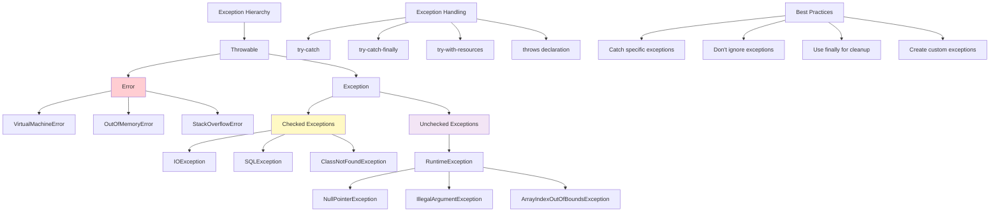

#### 13.1. Tổng quan về Exception và cơ chế xử lý

**1. Phân loại Exception trong Java**

Trong Java, Exception được phân thành 3 loại chính:

1. **Checked Exceptions** (Ngoại lệ kiểm tra):
   - Kế thừa từ lớp `Exception` nhưng không phải từ `RuntimeException`
   - Trình biên dịch yêu cầu phải xử lý hoặc khai báo với `throws`
   - Ví dụ: `IOException`, `SQLException`, `ClassNotFoundException`

2. **Unchecked Exceptions** (Ngoại lệ không kiểm tra):
   - Kế thừa từ `RuntimeException`
   - Không bắt buộc phải xử lý hoặc khai báo
   - Ví dụ: `NullPointerException`, `ArrayIndexOutOfBoundsException`, `IllegalArgumentException`

3. **Errors** (Lỗi hệ thống):
   - Kế thừa từ lớp `Error`
   - Đại diện cho các vấn đề nghiêm trọng mà ứng dụng thường không thể xử lý
   - Ví dụ: `OutOfMemoryError`, `StackOverflowError`, `NoClassDefFoundError`

**Sơ đồ phân cấp:**

```
Throwable
├── Error
│   ├── OutOfMemoryError
│   ├── StackOverflowError
│   └── ...
├── Exception
│   ├── RuntimeException
│   │   ├── NullPointerException
│   │   ├── ArrayIndexOutOfBoundsException
│   │   └── ...
│   ├── IOException
│   ├── SQLException
│   └── ...
```

**2. Cơ chế xử lý Exception**

Java cung cấp các cơ chế chính để xử lý exception:

**a. try-catch-finally**

```java
try {
    // Mã có thể ném exception
    int result = 10 / 0;
} catch (ArithmeticException e) {
    // Xử lý ArithmeticException
    System.out.println("Cannot divide by zero");
} catch (Exception e) {
    // Xử lý các exception khác
    System.out.println("An error occurred: " + e.getMessage());
} finally {
    // Luôn được thực thi, dù có exception hay không
    System.out.println("Cleanup code");
}
```

**b. try-with-resources (Java 7+)**

```java
try (BufferedReader br = new BufferedReader(
         new InputStreamReader(new FileInputStream("file.txt"), StandardCharsets.UTF_8))) {
    // Sử dụng resource
    String line = br.readLine();
    System.out.println(line);
} catch (IOException e) {
    e.printStackTrace();
}
// Resource tự động được đóng sau khối try
```

**c. throws**

```java
public void readFile(String fileName) throws IOException {
    FileInputStream fis = new FileInputStream(fileName);
    // Xử lý file
}
```

**3. Tạo và ném Exception tùy chỉnh**

```java
// Tạo exception tùy chỉnh
class InsufficientFundsException extends Exception {
    private double amount;
    
    public InsufficientFundsException(double amount) {
        this.amount = amount;
    }
    
    public double getAmount() {
        return amount;
    }
}

// Sử dụng exception tùy chỉnh
public class BankAccount {
    private double balance;
    
    public void withdraw(double amount) throws InsufficientFundsException {
        if (amount > balance) {
            throw new InsufficientFundsException(amount - balance);
        }
        balance -= amount;
    }
    
    public static void main(String[] args) {
        BankAccount account = new BankAccount();
        try {
            account.withdraw(1000.0);
        } catch (InsufficientFundsException e) {
            System.out.println("Insufficient funds: need $" + e.getAmount() + " more");
        }
    }
}
```

**4. Best Practices khi xử lý Exception**

- **Không bắt Exception chung (catch Exception e)** trừ khi thực sự cần thiết
- **Luôn ghi log exception** với thông tin đầy đủ
- **Đóng tài nguyên** trong khối finally hoặc sử dụng try-with-resources
- **Không để khối catch trống** (empty catch block)
- **Chuyển đổi exception** khi cần thiết để cung cấp ngữ cảnh phù hợp
- **Sử dụng finally cho cleanup**, không phải cho xử lý logic
- **Throw early, catch late**: Ném exception sớm nhất có thể, xử lý ở mức cao nhất có thể

**5. Ví dụ về xử lý Exception tốt**

```java
import java.io.*;
import java.sql.*;

public class GoodExceptionHandling {
    public static void main(String[] args) {
        // Xử lý từng loại exception cụ thể
        try {
            readFile("data.txt");
            connectToDatabase();
        } catch (FileNotFoundException e) {
            // Xử lý riêng cho FileNotFoundException
            System.err.println("File not found: " + e.getMessage());
            // Log chi tiết
            logError("FILE_ERROR", e);
        } catch (SQLException e) {
            // Xử lý riêng cho SQLException
            System.err.println("Database error: " + e.getMessage());
            logError("DB_ERROR", e);
        } catch (Exception e) {
            // Xử lý các exception còn lại
            System.err.println("Unexpected error: " + e.getMessage());
            logError("GENERAL_ERROR", e);
        } finally {
            // Cleanup
            System.out.println("Performing cleanup...");
        }
    }
    
    private static void readFile(String filename) throws FileNotFoundException {
        // Sử dụng try-with-resources để tự động đóng tài nguyên
        try (FileReader fr = new FileReader(filename);
             BufferedReader br = new BufferedReader(fr)) {
            String line;
            while ((line = br.readLine()) != null) {
                System.out.println(line);
            }
        } catch (IOException e) {
            // Chuyển đổi exception
            throw new FileNotFoundException("Error reading file: " + filename);
        }
    }
    
    private static void connectToDatabase() throws SQLException {
        // Kết nối cơ sở dữ liệu
        Connection conn = DriverManager.getConnection("jdbc:mysql://localhost:3306/mydb", "user", "password");
        // Xử lý cơ sở dữ liệu
    }
    
    private static void logError(String errorCode, Exception e) {
        // Ghi log với thông tin chi tiết
        System.err.println("[" + errorCode + "] " + e.getMessage());
        e.printStackTrace();
        // Có thể ghi vào file log hoặc hệ thống giám sát
    }
}
```

#### 13.2. Xử lý Exception trong trường hợp kế thừa (`extends`)

**1. Quy tắc override phương thức với exception**

Khi ghi đè (override) một phương thức có khai báo exception, có các quy tắc sau:

1. **Phương thức ghi đè không được khai báo throws checked exception rộng hơn** phương thức gốc
   - Có thể khai báo throws checked exception hẹp hơn hoặc không throws
   - Có thể khai báo throws unchecked exception dù phương thức gốc không throws

2. **Phương thức ghi đè có thể loại bỏ hoàn toàn throws** của phương thức gốc

**2. Ví dụ minh họa**

```java
// Lớp cha
class Parent {
    // throws IOException (checked exception)
    void readFile() throws IOException {
        // Đọc file
    }
    
    // throws SQLException (checked exception)
    void connectToDB() throws SQLException {
        // Kết nối cơ sở dữ liệu
    }
    
    // Không throws exception
    void process() {
        // Xử lý
    }
}

// Lớp con đúng theo quy tắc
class ChildCorrect extends Parent {
    // ĐÚNG: Loại bỏ throws IOException
    @Override
    void readFile() {
        // Đọc file
    }
    
    // ĐÚNG: throws exception hẹp hơn (con của SQLException)
    @Override
    void connectToDB() throws MySQLSyntaxErrorException {
        // Kết nối cơ sở dữ liệu MySQL
    }
    
    // ĐÚNG: throws unchecked exception dù phương thức gốc không throws
    @Override
    void process() {
        if (Math.random() > 0.5) {
            throw new NullPointerException();
        }
    }
}

// Lớp con sai theo quy tắc
class ChildIncorrect extends Parent {
    // SAI: throws checked exception rộng hơn (Exception là cha của IOException)
    @Override
    void readFile() throws Exception {
        // Đọc file
    }
    
    // SAI: throws checked exception không liên quan
    @Override
    void connectToDB() throws IOException {
        // Kết nối cơ sở dữ liệu
    }
    
    // ĐÚNG: Không throws nhưng ném unchecked exception
    @Override
    void process() {
        throw new IllegalArgumentException();
    }
}
```

**3. Bảng tóm tắt quy tắc override với exception**

| Trường hợp | Phương thức gốc | Phương thức ghi đè | Hợp lệ? | Lý do |
| --- | --- | --- | --- | --- |
| 1 | throws IOException | (không throws) | ✔ | Hẹp hơn |
| 2 | throws IOException | throws FileNotFoundException | ✔ | FileNotFoundException là con của IOException |
| 3 | throws IOException | throws Exception | ✘ | Exception là cha của IOException |
| 4 | throws IOException | throws SQLException | ✘ | SQLException không liên quan đến IOException |
| 5 | (không throws) | throws NullPointerException | ✔ | NullPointerException là unchecked exception |
| 6 | throws IOException | throws NullPointerException | ✔ | Có thể thêm unchecked exception |
| 7 | throws SQLException | throws MySQLSyntaxErrorException | ✔ | MySQLSyntaxErrorException là con của SQLException |

**4. Ví dụ thực tế với interface**

```java
// Interface
interface FileProcessor {
    void processFile(String filename) throws IOException;
}

// Implement interface
class TextFileProcessor implements FileProcessor {
    // Hợp lệ: Loại bỏ throws
    @Override
    public void processFile(String filename) {
        // Xử lý file văn bản
    }
}

class BinaryFileProcessor implements FileProcessor {
    // Hợp lệ: throws exception hẹp hơn
    @Override
    public void processFile(String filename) throws FileNotFoundException {
        // Xử lý file nhị phân
    }
}

class InvalidFileProcessor implements FileProcessor {
    // KHÔNG HỢP LỆ: throws exception rộng hơn
    @Override
    public void processFile(String filename) throws Exception {
        // Xử lý file
    }
}
```

**5. Best Practices khi làm việc với exception trong kế thừa**

- **Thiết kế interface và lớp cha với exception cụ thể**, tránh dùng Exception chung
- **Khi ghi đè, hãy giữ nguyên hoặc thu hẹp exception** được khai báo
- **Cung cấp tài liệu rõ ràng** về các exception có thể xảy ra
- **Sử dụng custom exception** để tạo hệ thống exception có cấu trúc
- **Tránh thay đổi hành vi exception** khi ghi đè phương thức

**6. Ví dụ về custom exception hierarchy**

```java
// Exception gốc cho ứng dụng
class ApplicationException extends Exception {
    public ApplicationException(String message) {
        super(message);
    }
}

// Exception cho xử lý file
class FileProcessingException extends ApplicationException {
    public FileProcessingException(String message) {
        super(message);
    }
}

class InvalidFileFormatException extends FileProcessingException {
    public InvalidFileFormatException(String message) {
        super(message);
    }
}

// Lớp xử lý file
class FileHandler {
    public void processFile(String filename) throws FileProcessingException {
        // Kiểm tra định dạng file
        if (!isValidFormat(filename)) {
            throw new InvalidFileFormatException("Invalid file format");
        }
        // Xử lý file
    }
    
    private boolean isValidFormat(String filename) {
        return filename.endsWith(".txt");
    }
}

// Lớp con
class TextFileHandler extends FileHandler {
    @Override
    public void processFile(String filename) {
        // Không throws FileProcessingException nhưng xử lý riêng
        try {
            super.processFile(filename);
        } catch (FileProcessingException e) {
            // Xử lý exception
            System.err.println("Error processing file: " + e.getMessage());
        }
    }
}
```

---

## VI. Các khái niệm nâng cao trong Java

### 14. Hibernate Annotations

```mermaid
flowchart TD
    A["Hibernate Annotations"] --> B["Entity Mapping"]
    A --> C["Relationship Mapping"]
    A --> D["Advanced Features"]
    
    B --> B1["@Entity"]
    B --> B2["@Table"]
    B --> B3["@Id"]
    B --> B4["@GeneratedValue"]
    B --> B5["@Column"]
    
    C --> C1["@OneToOne"]
    C --> C2["@OneToMany"]
    C --> C3["@ManyToOne"]
    C --> C4["@ManyToMany"]
    C --> C5["@JoinColumn"]
    C --> C6["@JoinTable"]
    
    D --> D1["@Transient"]
    D --> D2["@Temporal"]
    D --> D3["@Lob"]
    D --> D4["@Embeddable/@Embedded"]
    D --> D5["@OrderBy"]
    
    E["Fetch Types"] --> E1["FetchType.LAZY"]
    E --> E2["FetchType.EAGER"]
    
    F["Cascade Types"] --> F1["CascadeType.PERSIST"]
    F --> F2["CascadeType.MERGE"]
    F --> F3["CascadeType.REMOVE"]
    F --> F4["CascadeType.ALL"]
    
    style B fill:#e3f2fd
    style C fill:#f3e5f5
    style D fill:#e8f5e8
```

#### 14.1. Các loại annotation trong Hibernate

**1. Entity Mapping Annotations**

| Annotation | Mô tả | Ví dụ |
| --- | --- | --- |
| `@Entity` | Đánh dấu một class là entity | `@Entity public class User { ... }` |
| `@Table` | Chỉ định tên bảng trong database | `@Table(name = "users")` |
| `@Id` | Đánh dấu trường là khóa chính | `@Id private Long id;` |
| `@GeneratedValue` | Chỉ định chiến lược tạo giá trị cho khóa chính | `@GeneratedValue(strategy = GenerationType.IDENTITY)` |
| `@Column` | Chỉ định mapping cho cột | `@Column(name = "username", length = 50, nullable = false)` |

**2. Relationship Annotations**

| Annotation | Mô tả | Ví dụ |
| --- | --- | --- |
| `@OneToOne` | Mối quan hệ một-một | `@OneToOne(mappedBy = "user")` |
| `@OneToMany` | Mối quan hệ một-nhiều | `@OneToMany(cascade = CascadeType.ALL, mappedBy = "user")` |
| `@ManyToOne` | Mối quan hệ nhiều-một | `@ManyToOne(fetch = FetchType.LAZY)` |
| `@ManyToMany` | Mối quan hệ nhiều-nhiều | `@ManyToMany(fetch = FetchType.EAGER)` |
| `@JoinColumn` | Chỉ định cột tham chiếu | `@JoinColumn(name = "user_id")` |
| `@JoinTable` | Chỉ định bảng trung gian cho @ManyToMany | `@JoinTable(name = "user_role", joinColumns = @JoinColumn(name = "user_id"), inverseJoinColumns = @JoinColumn(name = "role_id"))` |

**3. Fetch và Cascade Types**

**Mặc định FetchType (JPA)**:
| Annotation | Default FetchType | Khuyến nghị |
| --- | --- | --- |
| `@OneToMany` | **LAZY** | Giữ LAZY, dùng join fetch khi cần |
| `@ManyToMany` | **LAZY** | Giữ LAZY, dùng join fetch khi cần |
| `@OneToOne` | **EAGER** | Nên đặt LAZY và điều chỉnh động |
| `@ManyToOne` | **EAGER** | Có thể để EAGER hoặc đặt LAZY |

**⚠️ Hibernate khuyến nghị đánh dấu LAZY và điều chỉnh eager "động" khi cần (join fetch).**

**LazyInitializationException**:
Xảy ra khi truy cập lazy-loaded property ngoài Hibernate session:

```java
@Entity
public class User {
    @OneToMany(fetch = FetchType.LAZY)
    private List<Order> orders; // Lazy loading
}

// Service method
public void problematicCode() {
    User user = userRepository.findById(1L);
    // Session đóng ở đây
    
    // ❌ LazyInitializationException!
    System.out.println(user.getOrders().size()); 
}

// ✅ Giải pháp 1: Fetch trong session
public void solution1() {
    User user = userRepository.findById(1L);
    user.getOrders().size(); // Force loading trong session
}

// ✅ Giải pháp 2: JOIN FETCH
@Query("SELECT u FROM User u JOIN FETCH u.orders WHERE u.id = :id")
User findByIdWithOrders(@Param("id") Long id);

// ✅ Giải pháp 3: @Transactional
@Transactional
public void solution3() {
    User user = userRepository.findById(1L);
    user.getOrders().size(); // Session vẫn mở
}
```

| Annotation | Mô tả | Ví dụ |
| --- | --- | --- |
| `FetchType.LAZY` | Tải dữ liệu khi cần thiết | `@OneToMany(fetch = FetchType.LAZY)` |
| `FetchType.EAGER` | Tải dữ liệu ngay lập tức | `@ManyToOne(fetch = FetchType.EAGER)` |
| `CascadeType.PERSIST` | Cascade persist operation | `cascade = CascadeType.PERSIST` |
| `CascadeType.MERGE` | Cascade merge operation | `cascade = CascadeType.MERGE` |
| `CascadeType.REMOVE` | Cascade remove operation | `cascade = CascadeType.REMOVE` |
| `CascadeType.REFRESH` | Cascade refresh operation | `cascade = CascadeType.REFRESH` |
| `CascadeType.DETACH` | Cascade detach operation | `cascade = CascadeType.DETACH` |
| `CascadeType.ALL` | Tất cả các operation trên | `cascade = CascadeType.ALL` |

**4. Ví dụ đầy đủ về Entity**

```java
@Entity
@Table(name = "users")
public class User {
    @Id
    @GeneratedValue(strategy = GenerationType.IDENTITY)
    private Long id;
    
    @Column(name = "username", length = 50, nullable = false, unique = true)
    private String username;
    
    @Column(name = "email", length = 100, nullable = false)
    private String email;
    
    @Column(name = "password", length = 100, nullable = false)
    private String password;
    
    @Column(name = "created_at", nullable = false)
    private LocalDateTime createdAt;
    
    @OneToOne(mappedBy = "user", cascade = CascadeType.ALL)
    private UserProfile profile;
    
    @OneToMany(cascade = CascadeType.ALL, mappedBy = "user")
    private List<Order> orders = new ArrayList<>();
    
    @ManyToMany(fetch = FetchType.EAGER)
    @JoinTable(name = "user_role",
               joinColumns = @JoinColumn(name = "user_id"),
               inverseJoinColumns = @JoinColumn(name = "role_id"))
    private Set<Role> roles = new HashSet<>();
    
    // Constructors, getters, setters
}
```

**5. Các annotation nâng cao**

| Annotation | Mô tả | Ví dụ |
| --- | --- | --- |
| `@Transient` | Đánh dấu trường không được lưu vào database | `@Transient private String tempData;` |
| `@Temporal` | Chỉ định kiểu thời gian cho Date/Calendar | `@Temporal(TemporalType.TIMESTAMP) private Date createdAt;` |
| `@Lob` | Đánh dấu trường lưu trữ dữ liệu lớn | `@Lob private String bio;` |
| `@OrderBy` | Chỉ định thứ tự sắp xếp cho collection | `@OrderBy("orderDate DESC") private List<Order> orders;` |
| `@ElementCollection` | Mapping cho collection các giá trị đơn giản | `@ElementCollection private Set<String> tags;` |
| `@Embeddable` / `@Embedded` | Embed một object vào entity | `@Embeddable public class Address { ... }` |

**6. Best Practices khi sử dụng Hibernate Annotations**

- **Sử dụng tên bảng và cột có ý nghĩa**, tuân theo quy ước của database
- **Chỉ định fetch type phù hợp** với ngữ cảnh sử dụng
- **Sử dụng cascade type cẩn thận** để tránh xóa không mong muốn
- **Đặt tên cho các quan hệ rõ ràng** với thuộc tính `mappedBy`
- **Sử dụng Lombok** để giảm boilerplate code cho getters/setters
- **Tối ưu hóa các truy vấn** với fetch join khi cần thiết
- **Tránh N+1 query problem** bằng cách sử dụng batch fetching

**7. Ví dụ về giải quyết N+1 query problem**

```java
// Entity
@Entity
public class Department {
    @Id
    private Long id;
    
    private String name;
    
    // Sử dụng batch fetching để tránh N+1 problem
    @OneToMany(fetch = FetchType.LAZY)
    @BatchSize(size = 20)
    private List<Employee> employees;
}

// Repository
public interface DepartmentRepository extends JpaRepository<Department, Long> {
    // Sử dụng fetch join để tải employees cùng với department
    @Query("SELECT d FROM Department d LEFT JOIN FETCH d.employees WHERE d.id = :id")
    Department findByIdWithEmployees(@Param("id") Long id);
}
```

#### Bẫy thường gặp với JPA/Hibernate

```java
// Bẫy 1: N+1 Query Problem
@Entity
public class User {
    @OneToMany(fetch = FetchType.LAZY)
    private List<Order> orders;
}

// SAI: Gây N+1 queries
List<User> users = userRepository.findAll(); // 1 query
for (User user : users) {
    System.out.println(user.getOrders().size()); // +N queries!
}

// ĐÚNG: Dùng JOIN FETCH
@Query("SELECT DISTINCT u FROM User u LEFT JOIN FETCH u.orders")
List<User> findAllWithOrders();

// Hoặc batch fetch
@BatchSize(size = 10)
@OneToMany(fetch = FetchType.LAZY)
private List<Order> orders;
```

```java
// Bẫy 2: Lạm dụng cascade và orphanRemoval
@Entity
public class User {
    // SAI: cascade = ALL có thể gây xóa không mong muốn
    @OneToMany(cascade = CascadeType.ALL, orphanRemoval = true)
    private List<Order> orders;
}

// Khi remove user, tất cả orders cũng bị xóa!
user.getOrders().clear(); // Xóa tất cả orders!

// ĐÚNG: Chỉ dùng cascade khi thực sự cần
@OneToMany(cascade = {CascadeType.PERSIST, CascadeType.MERGE})
private List<Order> orders;
```

```java
// Bẫy 3: equals/hashCode cho entity sai cách
@Entity
public class BadEntity {
    @Id
    @GeneratedValue
    private Long id; // id được sinh sau khi persist!
    
    // SAI: Dựa trên id có thể null
    @Override
    public boolean equals(Object o) {
        if (this == o) return true;
        if (!(o instanceof BadEntity)) return false;
        return Objects.equals(id, ((BadEntity) o).id); // id có thể null!
    }
    
    @Override
    public int hashCode() {
        return Objects.hash(id); // Thay đổi sau khi persist!
    }
}

// ĐÚNG: Dùng business key
@Entity
public class GoodEntity {
    @Id
    @GeneratedValue
    private Long id;
    
    @Column(unique = true)
    private String code; // Business key
    
    @Override
    public boolean equals(Object o) {
        if (this == o) return true;
        if (!(o instanceof GoodEntity)) return false;
        return Objects.equals(code, ((GoodEntity) o).code);
    }
    
    @Override
    public int hashCode() {
        return Objects.hash(code); // Không thay đổi
    }
}
```

```java
// Bẫy 4: Truy cập lazy property ngoài session
public class OrderService {
    @Autowired
    private OrderRepository orderRepository;
    
    public void processOrder(Long orderId) {
        Order order = orderRepository.findById(orderId);
        // Session đóng ở đây
        
        // Lỗi như đã trình bày ở trên
        sendEmailToUser(order.getUser().getEmail()); // LazyInitializationException!
    }
    
    // ĐÚNG: Fetch trong session
    @Transactional
    public void processOrderCorrect(Long orderId) {
        Order order = orderRepository.findById(orderId);
        String email = order.getUser().getEmail(); // OK trong @Transactional
        sendEmailToUser(email);
    }
}
```

```java
// Bẫy 5: Không hiểu EntityManager lifecycle
public class BadService {
    @PersistenceContext
    private EntityManager em;
    
    public void badMethod() {
        User user = new User("john");
        em.persist(user); // User trong persistence context
        
        user.setName("jane"); // Thay đổi được track
        
        // Không cần em.merge(user)! Hibernate tự động detect changes
        em.merge(user); // Thừa! Dirty checking đã tự động làm
    }
}
```

**Nguyên tắc quan trọng:**
- **@OneToMany/@ManyToMany mặc định LAZY**; **@OneToOne/@ManyToOne mặc định EAGER**
- **Nên đặt tất cả thành LAZY** và dùng JOIN FETCH khi cần
- **Tránh CascadeType.ALL** trừ khi thực sự muốn cascade mọi thao tác
- **Dùng business key cho equals/hashCode**, không dùng generated ID
- **Luôn access lazy properties trong session** hoặc dùng @Transactional

### 15. Date and Time API

```mermaid
flowchart TD
    A["java.time API (Java 8+)"] --> B["Date/Time Classes"]
    A --> C["Duration/Period"]
    A --> D["Formatting"]
    
    B --> B1["LocalDate<br>(Date only)"]
    B --> B2["LocalTime<br>(Time only)"]
    B --> B3["LocalDateTime<br>(Date + Time)"]
    B --> B4["ZonedDateTime<br>(Date + Time + Zone)"]
    B --> B5["Instant<br>(Timestamp)"]
    
    C --> C1["Duration<br>(Time-based amount)"]
    C --> C2["Period<br>(Date-based amount)"]
    
    D --> D1["DateTimeFormatter"]
    D --> D2["Predefined formats"]
    D --> D3["Custom patterns"]
    
    E["Key Benefits"] --> E1["Immutable"]
    E --> E2["Thread-safe"]
    E --> E3["Clear API"]
    E --> E4["Better timezone support"]
    
    F["Old API (Deprecated)"] --> F1["java.util.Date"]
    F --> F2["java.util.Calendar"]
    F --> F3["SimpleDateFormat"]
    
    G["Conversion"] --> G1["Date ↔ Instant"]
    G --> G2["Calendar ↔ ZonedDateTime"]
    
    style A fill:#e8f5e8
    style E fill:#e3f2fd
    style F fill:#ffcdd2
```

**1. Giới thiệu về java.time API**

Java 8 giới thiệu API mới `java.time` để thay thế cho các lớp Date và Calendar cũ, với các ưu điểm:
- Không thay đổi được (immutable)
- An toàn với đa luồng
- API rõ ràng và dễ sử dụng
- Hỗ trợ timezone tốt hơn
- Xử lý ngày tháng chính xác hơn

**2. Các lớp chính trong Date and Time API**

| Lớp | Mô tả | Ví dụ |
| --- | --- | --- |
| `LocalDate` | Chỉ ngày (năm, tháng, ngày) | `LocalDate.now()` |
| `LocalTime` | Chỉ thời gian (giờ, phút, giây) | `LocalTime.now()` |
| `LocalDateTime` | Ngày và thời gian (**không có timezone** - mơ hồ khi DST) | `LocalDateTime.now()` |
| `ZonedDateTime` | Ngày và thời gian với timezone (**khuyến nghị cho thời điểm tuyệt đối**) | `ZonedDateTime.now()` |
| `Instant` | Thời điểm trên timeline (epoch-based, **tốt nhất cho timestamp**) | `Instant.now()` |
| `Duration` | Khoảng thời gian tính bằng giây và nano giây | `Duration.between(start, end)` |
| `Period` | Khoảng thời gian tính bằng năm, tháng, ngày | `Period.between(startDate, endDate)` |
| `DateTimeFormatter` | Định dạng và parse ngày giờ | `DateTimeFormatter.ISO_LOCAL_DATE` |

**3. Ví dụ sử dụng các lớp cơ bản**

```java
import java.time.*;
import java.time.format.DateTimeFormatter;

public class DateTimeExamples {
    public static void main(String[] args) {
        // LocalDate - Chỉ ngày
        LocalDate today = LocalDate.now();
        System.out.println("Today: " + today);
        System.out.println("Year: " + today.getYear());
        System.out.println("Month: " + today.getMonth());
        System.out.println("Day of month: " + today.getDayOfMonth());
        System.out.println("Day of week: " + today.getDayOfWeek());
        
        // Thêm/xóa ngày
        LocalDate tomorrow = today.plusDays(1);
        LocalDate yesterday = today.minusDays(1);
        
        // LocalTime - Chỉ thời gian
        LocalTime now = LocalTime.now();
        System.out.println("\nCurrent time: " + now);
        System.out.println("Hour: " + now.getHour());
        System.out.println("Minute: " + now.getMinute());
        System.out.println("Second: " + now.getSecond());
        
        // Thêm/xóa thời gian
        LocalTime later = now.plusHours(2);
        LocalTime earlier = now.minusMinutes(30);
        
        // LocalDateTime - Ngày và thời gian
        LocalDateTime current = LocalDateTime.now();
        System.out.println("\nCurrent date and time: " + current);
        
        // ZonedDateTime - Ngày và thời gian với timezone
        ZonedDateTime utc = ZonedDateTime.now(ZoneId.of("UTC"));
        ZonedDateTime paris = ZonedDateTime.now(ZoneId.of("Europe/Paris"));
        ZonedDateTime newYork = ZonedDateTime.now(ZoneId.of("America/New_York"));
        System.out.println("\nUTC: " + utc);
        System.out.println("Paris: " + paris);
        System.out.println("New York: " + newYork);
        
        // Instant - Thời điểm trên timeline
        Instant instant = Instant.now();
        System.out.println("\nInstant: " + instant);
        
        // Duration - Khoảng thời gian
        Duration duration = Duration.between(now, later);
        System.out.println("\nDuration in hours: " + duration.toHours());
        System.out.println("Duration in minutes: " + duration.toMinutes());
        
        // Period - Khoảng thời gian theo ngày/tháng/năm
        Period period = Period.between(today, tomorrow);
        System.out.println("\nPeriod in days: " + period.getDays());
        
        // Định dạng ngày giờ
        DateTimeFormatter formatter = DateTimeFormatter.ofPattern("dd/MM/yyyy HH:mm:ss");
        String formattedDate = current.format(formatter);
        System.out.println("\nFormatted date: " + formattedDate);
        
        // Parse chuỗi thành ngày giờ
        String dateStr = "25/12/2023 10:30:00";
        LocalDateTime parsedDate = LocalDateTime.parse(dateStr, formatter);
        System.out.println("Parsed date: " + parsedDate);
    }
}
```

**4. So sánh java.time với Date và Calendar cũ**

| Đặc điểm | java.time (Java 8+) | Date/Calendar (Java 7-) |
| --- | --- | --- |
| Tính bất biến | Immutable (an toàn đa luồng) | Mutable (không an toàn đa luồng) |
| Thiết kế API | Logic và nhất quán | Thiếu nhất quán, phức tạp |
| Xử lý timezone | Được hỗ trợ tốt | Khó sử dụng |
| Hiệu suất | Tốt hơn | Kém hơn |
| Định dạng | Sử dụng DateTimeFormatter | Sử dụng SimpleDateFormat (không thread-safe) |
| Tính toán ngày tháng | Dễ dàng với plus/minus | Phức tạp với add/roll |
| Đơn vị thời gian | Rõ ràng (Duration, Period) | Không rõ ràng |
| Khởi tạo | Đơn giản, rõ ràng | Phức tạp |

**5. Chuyển đổi giữa java.time và Date cũ**

```java
import java.time.*;
import java.util.Date;

public class DateTimeConversion {
    // Chuyển từ Date sang java.time
    public static void convertFromDate() {
        Date date = new Date();
        
        // Date -> Instant
        Instant instant = date.toInstant();
        
        // Instant -> LocalDateTime (UTC)
        LocalDateTime utcDateTime = LocalDateTime.ofInstant(instant, ZoneId.of("UTC"));
        
        // Instant -> LocalDateTime (theo timezone cụ thể)
        LocalDateTime localDateTime = LocalDateTime.ofInstant(instant, ZoneId.systemDefault());
        
        // Instant -> ZonedDateTime
        ZonedDateTime zonedDateTime = ZonedDateTime.ofInstant(instant, ZoneId.systemDefault());
    }
    
    // Chuyển từ java.time sang Date
    public static void convertToDate() {
        LocalDateTime localDateTime = LocalDateTime.now();
        
        // LocalDateTime -> Instant
        Instant instant = localDateTime.atZone(ZoneId.systemDefault()).toInstant();
        
        // Instant -> Date
        Date date = Date.from(instant);
    }
    
    // Chuyển từ Calendar sang java.time
    public static void convertFromCalendar() {
        java.util.Calendar calendar = java.util.Calendar.getInstance();
        
        // Calendar -> Instant
        Instant instant = calendar.toInstant();
        
        // Calendar -> ZonedDateTime
        ZonedDateTime zonedDateTime = ZonedDateTime.ofInstant(instant, calendar.getTimeZone().toZoneId());
    }
    
    // Chuyển từ java.time sang Calendar
    public static void convertToCalendar() {
        ZonedDateTime zonedDateTime = ZonedDateTime.now();
        
        // ZonedDateTime -> Calendar
        java.util.Calendar calendar = java.util.Calendar.getInstance();
        calendar.setTimeInMillis(zonedDateTime.toInstant().toEpochMilli());
    }
}
```

**6. Best Practices khi sử dụng Date and Time API**

- **Sử dụng LocalDate/LocalTime/LocalDateTime** khi không cần timezone
- **Sử dụng ZonedDateTime** khi làm việc với múi giờ cụ thể
- **Sử dụng Instant** khi cần lưu trữ thời điểm trên timeline
- **Tránh sử dụng Date và Calendar cũ** trong code mới
- **Luôn chỉ định timezone rõ ràng** khi cần thiết
- **Sử dụng DateTimeFormatter** để định dạng và parse
- **Không sử dụng chuỗi cố định** cho định dạng ngày giờ (nên dùng hằng số)
- **Sử dụng Period cho khoảng thời gian theo ngày/tháng/năm**, Duration cho khoảng thời gian theo giờ/phút/giây

**7. Ví dụ thực tế: Tính toán ngày làm việc**

```java
import java.time.*;
import java.time.temporal.*;

public class BusinessDayCalculator {
    // Kiểm tra ngày có phải là ngày làm việc không
    public static boolean isBusinessDay(LocalDate date) {
        DayOfWeek dayOfWeek = date.getDayOfWeek();
        return !(dayOfWeek == DayOfWeek.SATURDAY || dayOfWeek == DayOfWeek.SUNDAY);
    }
    
    // Tính ngày làm việc tiếp theo
    public static LocalDate nextBusinessDay(LocalDate date) {
        LocalDate nextDay = date.plusDays(1);
        while (!isBusinessDay(nextDay)) {
            nextDay = nextDay.plusDays(1);
        }
        return nextDay;
    }
    
    // Tính ngày làm việc trước đó
    public static LocalDate previousBusinessDay(LocalDate date) {
        LocalDate prevDay = date.minusDays(1);
        while (!isBusinessDay(prevDay)) {
            prevDay = prevDay.minusDays(1);
        }
        return prevDay;
    }
    
    // Tính số ngày làm việc giữa hai ngày
    public static long businessDaysBetween(LocalDate startDate, LocalDate endDate) {
        LocalDate currentDate = startDate;
        long businessDays = 0;
        
        while (currentDate.isBefore(endDate)) {
            if (isBusinessDay(currentDate)) {
                businessDays++;
            }
            currentDate = currentDate.plusDays(1);
        }
        
        return businessDays;
    }
    
    // Sử dụng TemporalAdjuster để tính ngày làm việc
    public static TemporalAdjuster nextBusinessDayAdjuster() {
        return temporal -> {
            LocalDate date = LocalDate.from(temporal);
            do {
                date = date.plusDays(1);
            } while (!isBusinessDay(date));
            return temporal.with(date);
        };
    }
    
    public static void main(String[] args) {
        LocalDate today = LocalDate.now();
        System.out.println("Today: " + today);
        System.out.println("Next business day: " + nextBusinessDay(today));
        System.out.println("Previous business day: " + previousBusinessDay(today));
        
        // Sờ dụng TemporalAdjuster
        LocalDate nextBusiness = today.with(nextBusinessDayAdjuster());
        System.out.println("Next business day (using adjuster): " + nextBusiness);
    }
}
```

#### Bẫy thường gặp với Date & Time API

```java
// Bẫy 1: LocalDateTime không có timezone - mơ hồ khi DST
class DateTimeTrap {
    public void problematicMethod() {
        // SAI: LocalDateTime không biết về timezone/DST!
        LocalDateTime meeting = LocalDateTime.of(2023, 3, 26, 2, 30); // 2:30 AM
        
        // Vào ngày chuyển DST ở Eu châu, 2:30 AM có thể không tồn tại!
        // LocalDateTime sẽ "giả vờ" rằng nó hợp lệ
        
        // Khi chuyển sang ZonedDateTime:
        ZoneId paris = ZoneId.of("Europe/Paris");
        try {
            ZonedDateTime parisTime = meeting.atZone(paris);
            // Exception hoặc thời gian không mong muốn!
        } catch (DateTimeException e) {
            System.out.println("Time does not exist due to DST!");
        }
    }
    
    // ĐÚNG: Dùng ZonedDateTime cho thời điểm tuyệt đối
    public void correctMethod() {
        ZoneId paris = ZoneId.of("Europe/Paris");
        
        // Tạo thời điểm an toàn
        ZonedDateTime meeting = ZonedDateTime.of(
            2023, 3, 26, 3, 30, 0, 0, paris
        ); // 3:30 AM - sau khi DST
        
        // Hoặc dùng Instant cho timestamp
        Instant timestamp = Instant.now();
        ZonedDateTime parisTime = timestamp.atZone(paris);
    }
}
```

```java
// Bẫy 2: Dùng ZoneId.systemDefault() rồi serialize sang máy khác
class TimezoneTrap {
    public void problematicSerialization() {
        // SAI: Timezone phụ thuộc vào máy chủ
        ZonedDateTime localTime = ZonedDateTime.now(ZoneId.systemDefault());
        
        // Khi serialize và gửi đến server khác timezone -> lỗi time!
        String serialized = localTime.toString();
        // Server khác deserialize với timezone khác -> sai thời gian!
    }
    
    // ĐÚNG: Luôn dùng UTC cho storage/network
    public void correctSerialization() {
        Instant utcTime = Instant.now(); // UTC timestamp
        
        // Convert to local timezone khi hiển thị
        ZoneId userZone = ZoneId.of("America/New_York");
        ZonedDateTime localDisplay = utcTime.atZone(userZone);
        
        // Serialize Instant (UTC) - an toàn cho mọi máy
        String serialized = utcTime.toString();
    }
}
```

```java
// Bẫy 3: So sánh thời gian bằng millis khi không cùng offset
class ComparisonTrap {
    public void problematicComparison() {
        ZonedDateTime ny = ZonedDateTime.of(
            2023, 6, 15, 14, 0, 0, 0, 
            ZoneId.of("America/New_York")
        );
        
        ZonedDateTime london = ZonedDateTime.of(
            2023, 6, 15, 19, 0, 0, 0, 
            ZoneId.of("Europe/London")
        );
        
        // SAI: So sánh trực tiếp có thể gây nhầm lẫn
        if (ny.getHour() == london.getHour()) {
            // Điều này sai! 14h NY != 19h London nhưng cùng thời điểm thực tế
        }
    }
    
    // ĐÚNG: Chuyển về cùng mốc thời gian để so sánh
    public void correctComparison() {
        ZonedDateTime ny = ZonedDateTime.of(
            2023, 6, 15, 14, 0, 0, 0, 
            ZoneId.of("America/New_York")
        );
        
        ZonedDateTime london = ZonedDateTime.of(
            2023, 6, 15, 19, 0, 0, 0, 
            ZoneId.of("Europe/London")
        );
        
        // So sánh Instant (UTC)
        if (ny.toInstant().equals(london.toInstant())) {
            System.out.println("Same moment in time!");
        }
        
        // Hoặc so sánh với cùng timezone
        ZonedDateTime londonInNY = london.withZoneSameInstant(ny.getZone());
        if (ny.isEqual(londonInNY)) {
            System.out.println("Same time!");
        }
    }
}
```

```java
// Bẫy 4: Xử lý Legacy Date API sai cách
class LegacyDateTrap {
    public void problematicLegacyHandling() {
        // SAI: Date là mutable!
        Date date = new Date();
        modifyDate(date);
        System.out.println(date); // Đã bị thay đổi!
        
        // SAI: SimpleDateFormat không thread-safe
        SimpleDateFormat sdf = new SimpleDateFormat("yyyy-MM-dd");
        // Dùng chung sdf trong nhiều thread -> race condition!
    }
    
    private void modifyDate(Date date) {
        date.setTime(System.currentTimeMillis() + 86400000); // +1 day
    }
    
    // ĐÚNG: Chuyển sang java.time
    public void correctModernHandling() {
        LocalDate date = LocalDate.now();
        LocalDate modifiedDate = modifyDateCorrect(date);
        System.out.println("Original: " + date);
        System.out.println("Modified: " + modifiedDate);
        
        // DateTimeFormatter là thread-safe
        DateTimeFormatter formatter = DateTimeFormatter.ofPattern("yyyy-MM-dd");
        String formatted = date.format(formatter);
    }
    
    private LocalDate modifyDateCorrect(LocalDate date) {
        return date.plusDays(1); // Immutable - trả về instance mới
    }
    
    // Conversion giữa old và new API
    public void conversionExamples() {
        // Date -> Instant -> ZonedDateTime
        Date legacyDate = new Date();
        Instant instant = legacyDate.toInstant();
        ZonedDateTime zdt = instant.atZone(ZoneId.systemDefault());
        
        // ZonedDateTime -> Date
        Date backToLegacy = Date.from(zdt.toInstant());
    }
}
```

**Nguyên tắc quan trọng:**
- **`LocalDateTime` không có múi giờ** - mơ hồ khi DST, dùng `ZonedDateTime` cho thời điểm tuyệt đối
- **Dùng `Instant` cho timestamp** và storage - luôn UTC
- **Tránh `ZoneId.systemDefault()`** khi serialize/network - dùng timezone rõ ràng
- **So sánh thời gian qua `Instant`** hoặc cùng timezone
- **`java.time` là immutable và thread-safe**, `java.util.Date` thì không

### 16. Stream API và Java Reflection

```mermaid
flowchart TD
    A["Stream API"] --> B["Source"]
    A --> C["Intermediate Operations"]
    A --> D["Terminal Operations"]
    
    B --> B1["Collections"]
    B --> B2["Arrays"]
    B --> B3["I/O channels"]
    
    C --> C1["filter()"]
    C --> C2["map()"]
    C --> C3["sorted()"]
    C --> C4["distinct()"]
    C --> C5["limit()"]
    
    D --> D1["forEach()"]
    D --> D2["collect()"]
    D --> D3["reduce()"]
    D --> D4["count()"]
    D --> D5["findFirst()"]
    
    E["Java Reflection"] --> F["Core Classes"]
    E --> G["Use Cases"]
    E --> H["Considerations"]
    
    F --> F1["Class"]
    F --> F2["Method"]
    F --> F3["Field"]
    F --> F4["Constructor"]
    
    G --> G1["Frameworks (Spring, Hibernate)"]
    G --> G2["Testing libraries"]
    G --> G3["Serialization"]
    G --> G4["Dynamic proxies"]
    
    H --> H1["Performance overhead"]
    H --> H2["Security concerns"]
    H --> H3["Breaks encapsulation"]
    
    style A fill:#e3f2fd
    style E fill:#f3e5f5
```

#### 16.1. Tổng quan về `Stream API`

**1. Giới thiệu về Stream API**

Stream API được giới thiệu trong Java 8, cung cấp một cách mới để xử lý tập hợp dữ liệu theo phong cách functional programming.

**Đặc điểm chính:**
- Không thay đổi nguồn dữ liệu gốc
- Có thể xử lý tuần tự hoặc song song
- Hỗ trợ lazy evaluation (đánh giá lười)
- Có thể kết hợp nhiều thao tác với nhau
- Tích hợp với lambda expressions

**2. Các thành phần chính của Stream API**

- **Source**: Nguồn dữ liệu (Collection, Array, I/O channel, v.v.)
- **Intermediate operations**: Các thao tác trung gian (filter, map, sorted, v.v.)
- **Terminal operations**: Các thao tác kết thúc (forEach, collect, reduce, v.v.)

**3. Ví dụ cơ bản**

```java
import java.util.*;
import java.util.stream.*;

public class StreamBasicExamples {
    public static void main(String[] args) {
        List<String> names = Arrays.asList("John", "Jane", "Adam", "Eve", "Michael");
        
        // Filter và forEach
        System.out.println("Names starting with J:");
        names.stream()
             .filter(name -> name.startsWith("J"))
             .forEach(System.out::println);
             
        // Map và collect
        List<String> upperCaseNames = names.stream()
                                          .map(String::toUpperCase)
                                          .collect(Collectors.toList());
        System.out.println("\nUpper case names: " + upperCaseNames);
        
        // Sorted
        List<String> sortedNames = names.stream()
                                       .sorted()
                                       .collect(Collectors.toList());
        System.out.println("\nSorted names: " + sortedNames);
        
        // Chaining operations
        long count = names.stream()
                          .filter(name -> name.length() > 3)
                          .map(String::toUpperCase)
                          .sorted()
                          .count();
        System.out.println("\nCount of names with length > 3: " + count);
    }
}
```

**4. Intermediate Operations (Thao tác trung gian)**

| Operation | Mô tả | Ví dụ |
| --- | --- | --- |
| `filter(Predicate)` | Lọc các phần tử dựa trên điều kiện | `stream.filter(x -> x > 5)` |
| `map(Function)` | Chuyển đổi mỗi phần tử | `stream.map(String::toUpperCase)` |
| `flatMap(Function)` | Chuyển đổi và làm phẳng stream | `stream.flatMap(list -> list.stream())` |
| `distinct()` | Loại bỏ phần tử trùng lặp | `stream.distinct()` |
| `sorted()` | Sắp xếp các phần tử | `stream.sorted()` |
| `sorted(Comparator)` | Sắp xếp với comparator tùy chỉnh | `stream.sorted(Comparator.reverseOrder())` |
| `peek(Consumer)` | Thực hiện hành động trên mỗi phần tử | `stream.peek(System.out::println)` |
| `limit(long)` | Giới hạn số phần tử | `stream.limit(5)` |
| `skip(long)` | Bỏ qua số phần tử | `stream.skip(2)` |

**5. Terminal Operations (Thao tác kết thúc)**

| Operation | Mô tả | Ví dụ |
| --- | --- | --- |
| `forEach(Consumer)` | Thực hiện hành động trên mỗi phần tử | `stream.forEach(System.out::println)` |
| `toArray()` | Chuyển thành mảng | `stream.toArray()` |
| `reduce(BinaryOperator)` | Kết hợp các phần tử thành một giá trị | `stream.reduce((a, b) -> a + b)` |
| `collect(Collector)` | Thu thập kết quả vào collection | `stream.collect(Collectors.toList())` |
| `min(Comparator)` | Tìm giá trị nhỏ nhất | `stream.min(Comparator.naturalOrder())` |
| `max(Comparator)` | Tìm giá trị lớn nhất | `stream.max(Comparator.naturalOrder())` |
| `count()` | Đếm số phần tử | `stream.count()` |
| `anyMatch(Predicate)` | Kiểm tra có phần tử nào thỏa mãn | `stream.anyMatch(x -> x > 5)` |
| `allMatch(Predicate)` | Kiểm tra tất cả phần tử thỏa mãn | `stream.allMatch(x -> x > 0)` |
| `noneMatch(Predicate)` | Kiểm tra không có phần tử nào thỏa mãn | `stream.noneMatch(x -> x < 0)` |
| `findFirst()` | Lấy phần tử đầu tiên | `stream.findFirst()` |
| `findAny()` | Lấy bất kỳ phần tử nào | `stream.findAny()` |

**6. Collectors - Thu thập kết quả**

```java
import java.util.*;
import java.util.stream.*;
import java.util.function.Function;
import static java.util.stream.Collectors.*;

public class StreamCollectorsExamples {
    public static void main(String[] args) {
        List<String> names = Arrays.asList("John", "Jane", "Adam", "Eve", "Michael", "Emma");
        
        // Collect vào List
        List<String> list = names.stream()
                                .filter(n -> n.length() > 3)
                                .collect(Collectors.toList());
        
        // Collect vào Set
        Set<String> set = names.stream()
                              .filter(n -> n.length() > 3)
                              .collect(Collectors.toSet());
        
        // Collect vào Map
        Map<String, Integer> map = names.stream()
                                       .collect(Collectors.toMap(
                                           Function.identity(), 
                                           String::length
                                       ));
        
        // Grouping by
        Map<Integer, List<String>> groupedByLength = names.stream()
                                                        .collect(groupingBy(String::length));
        
        // Partitioning by
        Map<Boolean, List<String>> partitionedByLength = names.stream()
                                                            .collect(partitioningBy(n -> n.length() > 3));
        
        // Summarizing
        IntSummaryStatistics stats = names.stream()
                                         .collect(summarizingInt(String::length));
        System.out.println("Count: " + stats.getCount());
        System.out.println("Average: " + stats.getAverage());
        System.out.println("Max: " + stats.getMax());
        
        // Joining
        String joined = names.stream()
                            .collect(joining(", ", "Names: ", "."));
        
        // Collecting andThen
        List<String> upper = names.stream()
            .collect(Collectors.collectingAndThen(
                Collectors.toList(),
                list -> list.stream()
                            .map(String::toUpperCase)
                            .collect(Collectors.toList())
            ));
    }
}
```

**7. Parallel Streams - Xử lý song song**

```java
import java.util.*;
import java.util.stream.*;

public class ParallelStreamExample {
    public static void main(String[] args) {
        List<Integer> numbers = new ArrayList<>();
        for (int i = 0; i < 1000000; i++) {
            numbers.add(i);
        }
        
        // Sequential stream
        long startSeq = System.currentTimeMillis();
        int sumSeq = numbers.stream()
                           .mapToInt(Integer::intValue)
                           .sum();
        long timeSeq = System.currentTimeMillis() - startSeq;
        System.out.println("Sequential sum: " + sumSeq + " took " + timeSeq + "ms");
        
        // Parallel stream
        long startPar = System.currentTimeMillis();
        int sumPar = numbers.parallelStream()
                           .mapToInt(Integer::intValue)
                           .sum();
        long timePar = System.currentTimeMillis() - startPar;
        System.out.println("Parallel sum: " + sumPar + " took " + timePar + "ms");
        
        // Khi nào nên sử dụng parallel stream:
        // - Dữ liệu đủ lớn (thường > 10,000 phần tử)
        // - Thao tác đủ phức tạp để bù đắp chi phí tạo luồng
        // - Dữ liệu có thể chia nhỏ mà không ảnh hưởng kết quả
        // - Không có phụ thuộc thứ tự giữa các phần tử
        // - Không có thao tác I/O trong stream
        
        // Khi nào không nên sử dụng:
        // - Dữ liệu nhỏ
        // - Các thao tác đơn giản
        // - Cần thứ tự cụ thể
        // - Có side effects
    }
}
```

**8. Best Practices khi sử dụng Stream API**

- **Sử dụng stream khi xử lý tập hợp dữ liệu**
- **Tránh sử dụng stream cho các thao tác đơn giản**
- **Không sử dụng stream để thay đổi trạng thái bên ngoài**
- **Sử dụng method references khi có thể (`String::toUpperCase`)**
- **Chú ý hiệu suất với parallel stream**
- **Tránh lạm dụng chaining quá nhiều operations**
- **Sử dụng Optional cẩn thận với findFirst/findAny**
- **Không sử dụng stream để thay thế vòng lặp đơn giản**

#### Bẫy thường gặp với Stream API

```java
// Bẫy 1: Stream dùng một lần - đã vận hành hoặc đóng
class StreamReuseTrap {
    public void problematicReuse() {
        Stream<String> stream = Stream.of("a", "b", "c");
        
        long count1 = stream.count(); // OK - terminal operation
        
        try {
            long count2 = stream.count(); // IllegalStateException!
        } catch (IllegalStateException e) {
            System.out.println("Stream already operated upon or closed!");
        }
    }
    
    // ĐÚNG: Tạo stream mới hoặc dùng Supplier
    public void correctApproach() {
        Supplier<Stream<String>> streamSupplier = () -> Stream.of("a", "b", "c");
        
        long count1 = streamSupplier.get().count();
        long count2 = streamSupplier.get().count(); // OK
    }
}
```

```java
// Bẫy 2: Side-effect trong map/filter - hành vi khó lường
class SideEffectTrap {
    private List<String> sideEffectList = new ArrayList<>();
    
    public void problematicSideEffect() {
        List<String> items = Arrays.asList("a", "b", "c", "d");
        
        // SAI: Side-effect trong map
        List<String> result = items.stream()
            .map(item -> {
                sideEffectList.add(item); // Side-effect!
                return item.toUpperCase();
            })
            .filter(item -> item.length() > 0)
            .collect(Collectors.toList());
        
        // Với parallel stream, thứ tự và thread safety không đảm bảo!
    }
    
    // ĐÚNG: Dùng collect hoặc forEach cho side-effects
    public void correctApproach() {
        List<String> items = Arrays.asList("a", "b", "c", "d");
        
        // Chứa các phần tử gốc
        List<String> collected = items.stream()
            .collect(Collectors.toList());
        
        // Transform riêng
        List<String> transformed = items.stream()
            .map(String::toUpperCase)
            .collect(Collectors.toList());
        
        // Side-effect an toàn
        items.stream()
            .forEach(sideEffectList::add);
    }
}
```

```java
// Bẫy 3: Parallel stream với nguồn không phù hợp
class ParallelStreamTrap {
    public void problematicParallel() {
        // SAI: Parallel stream với LinkedList (không splittable tốt)
        LinkedList<Integer> linkedList = new LinkedList<>();
        for (int i = 0; i < 1000000; i++) {
            linkedList.add(i);
        }
        
        // Chậm hơn sequential!
        long parallelSum = linkedList.parallelStream()
            .mapToLong(Integer::longValue)
            .sum();
        
        // SAI: Parallel với I/O operations
        List<String> urls = Arrays.asList("url1", "url2", "url3");
        urls.parallelStream()
            .map(this::fetchDataFromUrl) // I/O blocking -> không hiệu quả
            .collect(Collectors.toList());
    }
    
    // ĐÚNG: Dùng parallel cho các tác vụ CPU-intensive
    public void correctParallelUsage() {
        // Tốt cho ArrayList và các thao tác CPU-intensive
        List<Integer> arrayList = new ArrayList<>();
        for (int i = 0; i < 1000000; i++) {
            arrayList.add(i);
        }
        
        long parallelSum = arrayList.parallelStream()
            .filter(n -> n % 2 == 0)
            .mapToLong(Integer::longValue)
            .sum();
        
        // Cho I/O: dùng CompletableFuture hoặc Reactive Streams
        List<CompletableFuture<String>> futures = 
            Arrays.asList("url1", "url2", "url3")
                .stream()
                .map(url -> CompletableFuture.supplyAsync(() -> fetchDataFromUrl(url)))
                .collect(Collectors.toList());
    }
    
    private String fetchDataFromUrl(String url) {
        // Simulate I/O
        try { Thread.sleep(100); } catch (InterruptedException e) {}
        return "data from " + url;
    }
}
```

```java
// Bẫy 4: Autoboxing trong stream gây chi phí ẩn
class AutoboxingTrap {
    public void problematicAutoboxing() {
        List<Integer> numbers = Arrays.asList(1, 2, 3, 4, 5);
        
        // SAI: Nhiều autoboxing/unboxing
        int sum = numbers.stream()
            .filter(n -> n > 2)    // unboxing
            .map(n -> n * 2)       // unboxing -> boxing
            .reduce(0, Integer::sum); // unboxing
    }
    
    // ĐÚNG: Dùng specialized streams
    public void correctApproach() {
        List<Integer> numbers = Arrays.asList(1, 2, 3, 4, 5);
        
        // Hiệu quả hơn: dùng IntStream
        int sum = numbers.stream()
            .mapToInt(Integer::intValue) // Chuyển về IntStream
            .filter(n -> n > 2)
            .map(n -> n * 2)
            .sum();
        
        // Hoặc bắt đầu với primitive stream
        int sum2 = IntStream.rangeClosed(1, 5)
            .filter(n -> n > 2)
            .map(n -> n * 2)
            .sum();
    }
}
```

```java
// Bẫy 5: Sử dụng state mutable trong reduce/collect song song
class MutableStateTrap {
    public void problematicMutableState() {
        List<String> items = Arrays.asList("a", "b", "c", "d");
        
        // SAI: Mutable state trong parallel stream
        StringBuilder sb = new StringBuilder();
        items.parallelStream()
            .forEach(item -> sb.append(item)); // Race condition!
        
        // SAI: Reduce với mutable accumulator
        StringBuilder result = items.parallelStream()
            .reduce(new StringBuilder(),
                    (acc, item) -> acc.append(item), // Không thread-safe!
                    (acc1, acc2) -> acc1.append(acc2));
    }
    
    // ĐÚNG: Dùng immutable operations
    public void correctApproach() {
        List<String> items = Arrays.asList("a", "b", "c", "d");
        
        // Dùng joining collector
        String result1 = items.parallelStream()
            .collect(Collectors.joining());
        
        // Hoặc reduce với String (immutable)
        String result2 = items.parallelStream()
            .reduce("", String::concat);
        
        // Dùng collect với thread-safe collector
        String result3 = items.parallelStream()
            .collect(Collector.of(
                StringBuilder::new,
                StringBuilder::append,
                StringBuilder::append,
                StringBuilder::toString
            ));
    }
}
```

**Nguyên tắc quan trọng:**
- **Stream dùng một lần** - đã vận hành hoặc đóng không dùng lại được
- **Tránh side-effects trong map/filter** - dùng forEach cho side-effects
- **Parallel stream chỉ tốt cho CPU-intensive tasks** và data structures splittable
- **Dùng specialized streams** (IntStream, LongStream) để tránh autoboxing
- **Không dùng mutable state trong parallel streams** - dùng thread-safe collectors

#### 16.2. Java Reflection

**1. Giới thiệu về Java Reflection**

Java Reflection là API cho phép chương trình kiểm tra và thay đổi cấu trúc và hành vi của các class, method, field tại thời điểm chạy.

**Ưu điểm:**
- Linh hoạt, có thể làm việc với các class không biết trước
- Hỗ trợ framework và thư viện mạnh mẽ
- Cho phép tạo proxy, DI containers, ORM frameworks

**Nhược điểm:**
- Hiệu suất thấp hơn so với code bình thường
- Có thể phá vỡ encapsulation
- Không an toàn nếu sử dụng không cẩn thận
- Khó debug và maintain

**2. Các lớp chính trong Reflection API**

- `Class`: Đại diện cho một class hoặc interface
- `Method`: Đại diện cho một phương thức
- `Field`: Đại diện cho một trường (field)
- `Constructor`: Đại diện cho một constructor
- `Modifier`: Cung cấp thông tin về access modifier

**3. Ví dụ cơ bản**

```java
import java.lang.reflect.*;

public class ReflectionBasicExamples {
    public static void main(String[] args) throws Exception {
        // Lấy Class object
        Class<?> clazz = Class.forName("java.util.ArrayList");
        
        // Lấy thông tin class
        System.out.println("Class name: " + clazz.getName());
        System.out.println("Simple name: " + clazz.getSimpleName());
        System.out.println("Package: " + clazz.getPackage());
        System.out.println("Superclass: " + clazz.getSuperclass());
        
        // Lấy danh sách các method
        Method[] methods = clazz.getDeclaredMethods();
        System.out.println("\nMethods:");
        for (Method method : methods) {
            System.out.println("- " + method.getName());
        }
        
        // Lấy danh sách các field
        Field[] fields = clazz.getDeclaredFields();
        System.out.println("\nFields:");
        for (Field field : fields) {
            System.out.println("- " + field.getName());
        }
        
        // Lấy danh sách các constructor
        Constructor<?>[] constructors = clazz.getConstructors();
        System.out.println("\nConstructors:");
        for (Constructor<?> constructor : constructors) {
            System.out.println("- " + constructor);
        }
        
        // Tạo instance mới
        Object instance = clazz.newInstance();
        
        // Gọi method thông qua reflection
        Method addMethod = clazz.getMethod("add", Object.class);
        addMethod.invoke(instance, "Hello");
        addMethod.invoke(instance, "World");
        
        // Truy cập field private
        Field sizeField = clazz.getDeclaredField("size");
        sizeField.setAccessible(true); // Bỏ qua kiểm tra access
        int size = (int) sizeField.get(instance);
        System.out.println("\nSize: " + size);
    }
}
```

**4. Truy cập và thay đổi field private**

```java
import java.lang.reflect.Field;

class Person {
    private String name;
    private int age;
    
    public Person(String name, int age) {
        this.name = name;
        this.age = age;
    }
    
    @Override
    public String toString() {
        return "Person{name='" + name + "', age=" + age + "}";
    }
}

public class ReflectionPrivateFieldExample {
    public static void main(String[] args) throws Exception {
        Person person = new Person("John", 30);
        System.out.println("Before: " + person);
        
        // Truy cập field private
        Field nameField = Person.class.getDeclaredField("name");
        Field ageField = Person.class.getDeclaredField("age");
        
        // Cho phép truy cập field private
        nameField.setAccessible(true);
        ageField.setAccessible(true);
        
        // Đọc giá trị field
        String name = (String) nameField.get(person);
        int age = (int) ageField.get(person);
        System.out.println("Name: " + name);
        System.out.println("Age: " + age);
        
        // Thay đổi giá trị field
        nameField.set(person, "Jane");
        ageField.set(person, 25);
        
        System.out.println("After: " + person);
    }
}
```

**5. Gọi method private**

```java
import java.lang.reflect.Method;

class Calculator {
    private int add(int a, int b) {
        return a + b;
    }
    
    private String formatResult(int result) {
        return "Result: " + result;
    }
}

public class ReflectionPrivateMethodExample {
    public static void main(String[] args) throws Exception {
        Calculator calculator = new Calculator();
        
        // Lấy method private
        Method addMethod = Calculator.class.getDeclaredMethod("add", int.class, int.class);
        Method formatMethod = Calculator.class.getDeclaredMethod("formatResult", int.class);
        
        // Cho phép truy cập method private
        addMethod.setAccessible(true);
        formatMethod.setAccessible(true);
        
        // Gọi method và lấy kết quả
        int sum = (int) addMethod.invoke(calculator, 5, 7);
        String formatted = (String) formatMethod.invoke(calculator, sum);
        
        System.out.println(formatted); // Output: Result: 12
    }
}
```

**6. Tạo instance với constructor có tham số**

```java
import java.lang.reflect.Constructor;

class Product {
    private String name;
    private double price;
    
    public Product(String name, double price) {
        this.name = name;
        this.price = price;
    }
    
    @Override
    public String toString() {
        return "Product{name='" + name + "', price=" + price + "}";
    }
}

public class ReflectionConstructorExample {
    public static void main(String[] args) throws Exception {
        // Lấy constructor với tham số
        Constructor<Product> constructor = Product.class
            .getConstructor(String.class, double.class);
        
        // Tạo instance mới
        Product product = constructor.newInstance("Laptop", 999.99);
        System.out.println(product);
        
        // Lấy tất cả constructors
        Constructor<?>[] constructors = Product.class.getConstructors();
        System.out.println("\nAll constructors:");
        for (Constructor<?> c : constructors) {
            System.out.println(c);
        }
    }
}
```

**7. Best Practices khi sử dụng Reflection**

- **Tránh sử dụng reflection khi không cần thiết** - chỉ dùng khi thực sự cần
- **Cache các đối tượng reflection** (Method, Field, Constructor) để tăng hiệu suất
- **Xử lý exception cẩn thận** - reflection ném nhiều loại exception
- **Cân nhắc hiệu suất** - reflection chậm hơn method call bình thường
- **Không sử dụng reflection để phá vỡ encapsulation** không cần thiết
- **Sử dụng SecurityManager** nếu cần hạn chế quyền truy cập
- **Document rõ ràng** khi sử dụng reflection trong code

**8. Ứng dụng thực tế của Reflection**

- Frameworks như Spring (Dependency Injection)
- ORM frameworks như Hibernate
- Unit testing frameworks như JUnit
- Serialization/deserialization libraries
- Proxy pattern implementation
- Plugin systems
- Dynamic class loading

**9. Ví dụ thực tế: Dependency Injection đơn giản**

```java
import java.lang.reflect.*;
import java.util.*;

// Annotation để đánh dấu field cần inject
@interface Inject {}

// Lớp service
class EmailService {
    public void sendEmail(String to, String message) {
        System.out.println("Sending email to " + to + ": " + message);
    }
}

// Lớp client
class NotificationService {
    @Inject
    private EmailService emailService;
    
    public void notifyUser(String userId, String message) {
        emailService.sendEmail(userId + "@example.com", message);
    }
}

// Simple DI Container
class SimpleContainer {
    private Map<Class<?>, Object> instances = new HashMap<>();
    
    public SimpleContainer() {
        // Đăng ký các instance
        instances.put(EmailService.class, new EmailService());
    }
    
    public <T> T getInstance(Class<T> clazz) throws Exception {
        T instance = (T) clazz.newInstance();
        
        // Inject các dependency
        for (Field field : clazz.getDeclaredFields()) {
            if (field.isAnnotationPresent(Inject.class)) {
                field.setAccessible(true);
                Object dependency = instances.get(field.getType());
                if (dependency != null) {
                    field.set(instance, dependency);
                }
            }
        }
        
        return instance;
    }
}

public class ReflectionDIExample {
    public static void main(String[] args) throws Exception {
        SimpleContainer container = new SimpleContainer();
        NotificationService service = container.getInstance(NotificationService.class);
        service.notifyUser("john", "Your account has been created");
    }
}
```

### 17. Regular Expressions (Biểu thức chính quy)

```mermaid
flowchart TD
    A["Regular Expressions"] --> B["Basic Components"]
    A --> C["Character Classes"]
    A --> D["Quantifiers"]
    A --> E["Anchors"]
    
    B --> B1[". (any character)"]
    B --> B2["\d (digit)"]
    B --> B3["\w (word character)"]
    B --> B4["\s (whitespace)"]
    
    C --> C1["[abc] (any of a,b,c)"]
    C --> C2["[^abc] (not a,b,c)"]
    C --> C3["[a-z] (range)"]
    C --> C4["[A-Z0-9] (multiple ranges)"]
    
    D --> D1["* (0 or more)"]
    D --> D2["+ (1 or more)"]
    D --> D3["? (0 or 1)"]
    D --> D4["{n} (exactly n)"]
    D --> D5["{n,m} (n to m)"]
    
    E --> E1["^ (start of string)"]
    E --> E2["$ (end of string)"]
    E --> E3["\b (word boundary)"]
    
    F["Java Regex Classes"] --> F1["Pattern"]
    F --> F2["Matcher"]
    F --> F3["String methods"]
    
    G["Common Use Cases"] --> G1["Email validation"]
    G --> G2["Phone number"]
    G --> G3["Password strength"]
    G --> G4["Data extraction"]
    G --> G5["Input sanitization"]
    
    style A fill:#e1f5fe
    style F fill:#e8f5e8
    style G fill:#fff3e0
```

**1. Giới thiệu về Regular Expressions**

Biểu thức chính quy (Regular Expressions - regex) là một chuỗi ký tự định nghĩa mẫu tìm kiếm, được sử dụng để tìm kiếm, thay thế hoặc phân tích chuỗi.

**Ứng dụng:**
- Xác thực đầu vào (email, số điện thoại, v.v.)
- Tìm kiếm và thay thế trong văn bản
- Phân tích cú pháp (parsing)
- Tách dữ liệu từ chuỗi

**2. Các thành phần cơ bản của regex**

- **Ký tự thông thường**: a, b, c, 1, 2, 3
- **Ký tự đặc biệt**: . ^ $ * + ? { } [ ] \ | ( )
- **Character classes**: [abc], [^abc], [a-z], \d, \w, \s
- **Quantifiers**: *, +, ?, {n}, {n,}, {n,m}
- **Anchors**: ^, $, \b
- **Groups và capturing**: ( ), (?: ), (?<name> )

**3. Các pattern thường dùng**

| Pattern | Mô tả | Ví dụ khớp |
| --- | --- | --- |
| `\d` | Ký tự số (0-9) | "1", "2", "3" |
| `\D` | Không phải ký tự số | "a", "B", "@" |
| `\w` | Ký tự chữ số hoặc gạch dưới (a-z, A-Z, 0-9, _) | "a", "Z", "5", "_" |
| `\W` | Không phải ký tự chữ số hoặc gạch dưới | "@", "$", " " |
| `\s` | Khoảng trắng (space, tab, newline) | " ", "\t", "\n" |
| `\S` | Không phải khoảng trắng | "a", "1", "@" |
| `.` | Bất kỳ ký tự nào (trừ newline) | "a", "1", "$" |
| `^` | Bắt đầu chuỗi | "^Hello" khớp "Hello world" |
| `$` | Kết thúc chuỗi | "world$" khớp "Hello world" |
| `\b` | Biên từ | "\bword\b" khớp "a word here" |
| `\B` | Không phải biên từ | "\Bword\B" khớp "keyword" |
| `*` | 0 hoặc nhiều lần | "a*" khớp "", "a", "aa" |
| `+` | 1 hoặc nhiều lần | "a+" khớp "a", "aa" |
| `?` | 0 hoặc 1 lần | "a?" khớp "", "a" |
| `{n}` | Đúng n lần | "a{3}" khớp "aaa" |
| `{n,}` | Ít nhất n lần | "a{2,}" khớp "aa", "aaa" |
| `{n,m}` | Từ n đến m lần | "a{2,4}" khớp "aa", "aaa", "aaaa" |
| `[abc]` | Một trong các ký tự a, b, c | "a", "b", "c" |
| `[^abc]` | Không phải a, b, c | "d", "1", "$" |
| `[a-z]` | Ký tự thường từ a đến z | "a", "m", "z" |
| `[A-Z]` | Ký tự hoa từ A đến Z | "A", "M", "Z" |
| `[0-9]` | Số từ 0 đến 9 | "0", "5", "9" |

**4. Ví dụ cơ bản**

```java
import java.util.regex.*;

public class RegexBasicExamples {
    public static void main(String[] args) {
        // Kiểm tra chuỗi khớp pattern
        System.out.println("1. Simple match:");
        System.out.println("a".matches("a")); // true
        System.out.println("abc".matches("abc")); // true
        System.out.println("ab".matches("abc")); // false
        
        // Sử dụng ký tự đặc biệt
        System.out.println("\n2. Special characters:");
        System.out.println("a".matches(".")); // true (bất kỳ ký tự nào)
        System.out.println("1".matches("\\d")); // true (ký tự số)
        System.out.println("a".matches("\\D")); // true (không phải số)
        System.out.println(" ".matches("\\s")); // true (khoảng trắng)
        
        // Quantifiers
        System.out.println("\n3. Quantifiers:");
        System.out.println("".matches("a*")); // true (0 hoặc nhiều 'a')
        System.out.println("a".matches("a*")); // true
        System.out.println("aaa".matches("a*")); // true
        System.out.println("a".matches("a+")); // true (1 hoặc nhiều 'a')
        System.out.println("".matches("a+")); // false
        System.out.println("a".matches("a?")); // true (0 hoặc 1 'a')
        System.out.println("aa".matches("a?")); // false
        
        // Character classes
        System.out.println("\n4. Character classes:");
        System.out.println("a".matches("[abc]")); // true (một trong a,b,c)
        System.out.println("d".matches("[abc]")); // false
        System.out.println("a".matches("[^abc]")); // false (không phải a,b,c)
        System.out.println("d".matches("[^abc]")); // true
        System.out.println("a".matches("[a-z]")); // true (chữ thường)
        System.out.println("A".matches("[a-z]")); // false
        System.out.println("A".matches("[A-Z]")); // true (chữ hoa)
        
        // Anchors
        System.out.println("\n5. Anchors:");
        System.out.println("hello".matches("^h")); // false (phải khớp toàn bộ)
        System.out.println("hello".matches("^hello$")); // true
        System.out.println("hello world".matches("^hello")); // false (phải khớp toàn bộ chuỗi)
        System.out.println("hello world".matches("^hello.*"); // true
        System.out.println("hello world".matches("world$")); // false
        System.out.println("hello world".matches(".*world$")); // true (kết thúc bằng world)
    }
}
```

**5. Sử dụng Pattern và Matcher**

```java
import java.util.regex.*;

public class RegexPatternMatcher {
    public static void main(String[] args) {
        String text = "Contact us at support@example.com or sales@company.co.uk";
        
        // Tạo pattern cho email
        Pattern emailPattern = Pattern.compile("[a-zA-Z0-9._%+-]+@[a-zA-Z0-9.-]+\\.[a-zA-Z]{2,}");
        
        // Tạo matcher
        Matcher matcher = emailPattern.matcher(text);
        
        // Tìm tất cả các email
        System.out.println("Found emails:");
        while (matcher.find()) {
            System.out.println("- " + matcher.group());
            System.out.println("  Start: " + matcher.start() + ", End: " + matcher.end());
        }
        
        // Ví dụ về thay thế
        String replaced = text.replaceAll("[a-zA-Z0-9._%+-]+@", "****@");
        System.out.println("\nAfter replacement: " + replaced);
        
        // Ví dụ về split
        String[] parts = text.split("@");
        System.out.println("\nSplit result:");
        for (String part : parts) {
            System.out.println("- " + part);
        }
        
        // Ví dụ về validating
        String email = "user@example.com";
        boolean isValid = email.matches("[a-zA-Z0-9._%+-]+@[a-zA-Z0-9.-]+\\.[a-zA-Z]{2,}");
        System.out.println("\nIs valid email: " + isValid);
    }
}
```

**6. Các pattern thông dụng trong thực tế**

```java
import java.util.regex.*;

public class CommonRegexPatterns {
    public static void main(String[] args) {
        // Email validation
        String emailRegex = "^[a-zA-Z0-9_!#$%&'*+/=?`{|}~^.-]+@[a-zA-Z0-9.-]+$";
        System.out.println("Email validation:");
        System.out.println("test@example.com: " + "test@example.com".matches(emailRegex));
        System.out.println("invalid-email: " + "invalid-email".matches(emailRegex));
        
        // Phone number (simple)
        String phoneRegex = "^\\+?[0-9. ()-]{7,25}$";
        System.out.println("\nPhone number validation:");
        System.out.println("+1 (123) 456-7890: " + "+1 (123) 456-7890".matches(phoneRegex));
        System.out.println("1234567: " + "1234567".matches(phoneRegex));
        
        // Password strength (at least 8 chars, 1 uppercase, 1 lowercase, 1 digit)
        String passwordRegex = "^(?=.*[0-9])(?=.*[a-z])(?=.*[A-Z])(?=\\S+$).{8,}$";
        System.out.println("\nPassword validation:");
        System.out.println("Password123: " + "Password123".matches(passwordRegex));
        System.out.println("weak: " + "weak".matches(passwordRegex));
        
        // Date (YYYY-MM-DD)
        String dateRegex = "^\\d{4}-(0[1-9]|1[0-2])-(0[1-9]|[12][0-9]|3[01])$";
        System.out.println("\nDate validation:");
        System.out.println("2023-12-25: " + "2023-12-25".matches(dateRegex));
        System.out.println("2023-13-01: " + "2023-13-01".matches(dateRegex));
        
        // URL
        String urlRegex = "^(https?://)?([\\da-z.-]+)\\.([a-z.]{2,6})([/\\w .-]*)*/?$";
        System.out.println("\nURL validation:");
        System.out.println("https://example.com: " + "https://example.com".matches(urlRegex));
        System.out.println("invalid-url: " + "invalid-url".matches(urlRegex));
        
        // HTML tag
        String htmlTagRegex = "<[a-zA-Z0-9]+.*?>.*?</[a-zA-Z0-9]+>|<[a-zA-Z0-9]+.*?/>";
        System.out.println("\nHTML tag validation:");
        System.out.println("<div>Hello</div>: " + "<div>Hello</div>".matches(htmlTagRegex));
        System.out.println(": " + "".matches(htmlTagRegex));
    }
}
```

**7. Best Practices khi sử dụng Regular Expressions**

- **Sử dụng regex khi cần thiết**, tránh lạm dụng vì có thể làm code khó đọc và hiệu suất thấp
- **Test kỹ regex** với nhiều trường hợp đầu vào khác nhau
- **Sử dụng Pattern.compile()** để cache pattern nếu sử dụng nhiều lần
- **Tránh catastrophic backtracking** với các pattern phức tạp
- **Document regex** rõ ràng vì chúng thường khó hiểu
- **Sử dụng các thư viện hỗ trợ** cho các pattern phổ biến (ví dụ: URL validation)

**8. Ví dụ thực tế: Xác thực email**

```java
import java.util.regex.*;

public class EmailValidator {
    // Pattern cho email hợp lệ
    // Cách 1
    private static final String EMAIL_REGEX = 
    "^[a-zA-Z0-9_!#$%&'*+/=?`{|}~^.-]+@[a-zA-Z0-9.-]+(?:\\.[a-zA-Z0-9-]+)*$";

    // Cách 2: Sử dụng thư viện Apache Commons Validator
    // EmailValidator validator = EmailValidator.getInstance();
    // boolean isValid = validator.isValid(email);
    
    private static final Pattern pattern = Pattern.compile(EMAIL_REGEX);
    
    public static boolean isValidEmail(String email) {
        if (email == null) {
            return false;
        }
        
        // Kiểm tra độ dài
        if (email.length() > 254) {
            return false;
        }
        
        // Tách local part và domain
        String[] parts = email.split("@");
        if (parts.length != 2) {
            return false;
        }
        
        // Kiểm tra local part (phần trước @)
        String localPart = parts[0];
        if (localPart.length() > 64) {
            return false;
        }
        
        // Kiểm tra domain (phần sau @)
        String domain = parts[1];
        String[] domainParts = domain.split("\\.");
        if (domainParts.length < 2) {
            return false;
        }
        
        // Kiểm tra regex
        Matcher matcher = pattern.matcher(email);
        return matcher.matches();
    }
    
    public static void main(String[] args) {
        String[] testEmails = {
            "user@example.com",
            "user.name+tag+sorting@example.com",
            "user@sub.example.com",
            "user@123.123.123.123",
            "user@[IPv6:2001:db8::1]",
            "plainaddress", // Invalid
            "@no-local-part.com", // Invalid
            "no-at.example.com", // Invalid
            "user@.invalid.com", // Invalid
            "user@com", // Invalid
            "user@localserver" // Invalid
        };
        
        for (String email : testEmails) {
            System.out.println(email + " is " + (isValidEmail(email) ? "valid" : "invalid"));
        }
    }
}
```

**9. Lưu ý quan trọng về hiệu suất**

- Regex có thể gây ra **catastrophic backtracking** với các pattern phức tạp
- Nên **compile pattern một lần** và sử dụng lại nếu có thể
- Tránh sử dụng regex cho các chuỗi rất dài
- Xem xét sử dụng phương pháp khác nếu regex quá phức tạp

```java
// Tốt: Compile pattern một lần và sử dụng lại
Pattern emailPattern = Pattern.compile(EMAIL_REGEX);
Matcher matcher = emailPattern.matcher(email);
boolean isValid = matcher.matches();

// Xấu: Compile pattern mỗi lần sử dụng
boolean isValid = email.matches(EMAIL_REGEX);
```

### **Bẫy thường gặp (Common Pitfalls) với Regular Expressions**

#### **Bẫy 1: Catastrophic Backtracking**

**Vấn đề:** Các pattern có nested quantifiers có thể gây ra exponential time complexity.

```java
public class CatastrophicBacktrackingExample {
    public static void main(String[] args) {
        // ❌ NGUY HIỂM: Pattern này có thể gây catastrophic backtracking
        String dangerousPattern = "(a+)+b";
        String input = "aaaaaaaaaaaaaaaaaaaaaaaaaaac"; // Không có 'b' ở cuối
        
        long startTime = System.currentTimeMillis();
        boolean result = input.matches(dangerousPattern);
        long endTime = System.currentTimeMillis();
        
        System.out.println("Result: " + result);
        System.out.println("Time taken: " + (endTime - startTime) + "ms");
        // Có thể mất hàng giây hoặc hàng phút!
        
        // ❌ Các pattern nguy hiểm khác:
        // "(a|a)*b"     - ambiguous alternatives
        // "(a*)*b"      - nested quantifiers
        // "(a+a+)+b"    - overlapping quantifiers
        // "(.*a){x}.*b" - exponential combinations
        
        // ✅ GIẢI PHÁP 1: Sử dụng possessive quantifiers
        String safePattern1 = "a++b"; // possessive quantifier
        System.out.println("Safe pattern 1: " + input.matches(safePattern1));
        
        // ✅ GIẢI PHÁP 2: Sử dụng atomic groups
        String safePattern2 = "(?>a+)b"; // atomic group
        System.out.println("Safe pattern 2: " + input.matches(safePattern2));
        
        // ✅ GIẢI PHÁP 3: Viết lại pattern đơn giản hơn
        String safePattern3 = "a+b";
        System.out.println("Safe pattern 3: " + input.matches(safePattern3));
    }
}
```

#### **Bẫy 2: Possessive Quantifiers và Atomic Groups**

**Vấn đề:** Không hiểu sự khác biệt giữa greedy, reluctant, và possessive quantifiers.

```java
public class QuantifierTypesExample {
    public static void main(String[] args) {
        String text = "aaab";
        
        System.out.println("Text: " + text);
        
        // Greedy quantifier (mặc định)
        Pattern greedyPattern = Pattern.compile("a+b");
        Matcher greedyMatcher = greedyPattern.matcher(text);
        if (greedyMatcher.find()) {
            System.out.println("Greedy a+b: " + greedyMatcher.group()); // "aaab"
        }
        
        // Reluctant quantifier (lazy)
        Pattern reluctantPattern = Pattern.compile("a+?b");
        Matcher reluctantMatcher = reluctantPattern.matcher(text);
        if (reluctantMatcher.find()) {
            System.out.println("Reluctant a+?b: " + reluctantMatcher.group()); // "aaab"
        }
        
        // ✅ Possessive quantifier (không backtrack)
        Pattern possessivePattern = Pattern.compile("a++b");
        Matcher possessiveMatcher = possessivePattern.matcher(text);
        if (possessiveMatcher.find()) {
            System.out.println("Possessive a++b: " + possessiveMatcher.group()); // "aaab"
        }
        
        // ❌ Ví dụ possessive quantifier THẤT BẠI
        String failText = "aaab";
        Pattern failPattern = Pattern.compile("a++ab"); // a++ sẽ lấy tất cả 'a', không còn cho 'a' cuối
        Matcher failMatcher = failPattern.matcher(failText);
        System.out.println("Possessive a++ab matches: " + failMatcher.find()); // false
        
        // ✅ So sánh với greedy
        Pattern greedyPattern2 = Pattern.compile("a+ab");
        Matcher greedyMatcher2 = greedyPattern2.matcher(failText);
        System.out.println("Greedy a+ab matches: " + greedyMatcher2.find()); // true
        
        demonstrateAtomicGroups();
    }
    
    private static void demonstrateAtomicGroups() {
        System.out.println("\n=== ATOMIC GROUPS ===");
        String text = "abcc";
        
        // ❌ Thông thường: có backtracking
        Pattern normalPattern = Pattern.compile("(ab|abc)c");
        Matcher normalMatcher = normalPattern.matcher(text);
        System.out.println("Normal (ab|abc)c: " + normalMatcher.find()); // true
        
        // ✅ Atomic group: KHÔNG backtracking
        Pattern atomicPattern = Pattern.compile("(?>ab|abc)c");
        Matcher atomicMatcher = atomicPattern.matcher(text);
        System.out.println("Atomic (?>ab|abc)c: " + atomicMatcher.find()); // false
        // Giải thích: "abc" được chọn trước, nhưng không còn 'c' để match
        
        // ✅ Thứ tự quan trọng trong atomic groups
        Pattern atomicPattern2 = Pattern.compile("(?>abc|ab)c");
        Matcher atomicMatcher2 = atomicPattern2.matcher(text);
        System.out.println("Atomic (?>abc|ab)c: " + atomicMatcher2.find()); // true
    }
}
```

#### **Bẫy 3: Lookahead và Lookbehind Assertions**

```java
public class LookaroundExample {
    public static void main(String[] args) {
        String text = "password123";
        
        // ✅ Positive lookahead: (?=...)
        // Kiểm tra password có ít nhất 1 số
        Pattern hasDigit = Pattern.compile("(?=.*\\d).+");
        System.out.println("Has digit: " + hasDigit.matcher(text).matches()); // true
        
        // ✅ Negative lookahead: (?!...)
        // Kiểm tra không bắt đầu bằng số
        Pattern notStartWithDigit = Pattern.compile("(?!\\d).+");
        System.out.println("Not start with digit: " + notStartWithDigit.matcher(text).matches()); // true
        
        // ✅ Positive lookbehind: (?<=...)
        String text2 = "The price is $100";
        Pattern afterDollar = Pattern.compile("(?<=\\$)\\d+");
        Matcher matcher = afterDollar.matcher(text2);
        if (matcher.find()) {
            System.out.println("Price: " + matcher.group()); // "100"
        }
        
        // ✅ Negative lookbehind: (?<!...)
        String text3 = "file.txt and note.txt but not .hidden";
        Pattern notAfterDot = Pattern.compile("(?<!\\.)[a-z]+");
        Matcher matcher2 = notAfterDot.matcher(text3);
        while (matcher2.find()) {
            System.out.println("Word not after dot: " + matcher2.group());
        }
        
        // ❌ BẪY: Lookbehind phải có độ dài cố định
        // Pattern invalidLookbehind = Pattern.compile("(?<=a+)b"); // COMPILE ERROR
        
        // ✅ Workaround cho variable-length lookbehind
        demonstrateComplexPassword();
    }
    
    private static void demonstrateComplexPassword() {
        System.out.println("\n=== COMPLEX PASSWORD VALIDATION ===");
        
        // ✅ Password phải có: 8+ ký tự, 1 chữ hoa, 1 chữ thường, 1 số, 1 ký tự đặc biệt
        String passwordPattern = "^(?=.*[a-z])(?=.*[A-Z])(?=.*\\d)(?=.*[@$!%*?&])[A-Za-z\\d@$!%*?&]{8,}$";
        Pattern pattern = Pattern.compile(passwordPattern);
        
        String[] passwords = {
            "Password123!",  // ✅ valid
            "password123!", // ❌ không có chữ hoa
            "PASSWORD123!", // ❌ không có chữ thường
            "Password!",    // ❌ không có số
            "Password123",  // ❌ không có ký tự đặc biệt
            "Pass123!",     // ❌ quá ngắn
        };
        
        for (String pwd : passwords) {
            boolean isValid = pattern.matcher(pwd).matches();
            System.out.println(pwd + " -> " + (isValid ? "✅ Valid" : "❌ Invalid"));
        }
    }
}
```

#### **Bẫy 4: Unicode và Character Classes**

```java
public class UnicodeRegexExample {
    public static void main(String[] args) {
        // ❌ BẪY: \w chỉ match ASCII word characters
        String text = "café";
        Pattern asciiWord = Pattern.compile("\\w+");
        Matcher matcher1 = asciiWord.matcher(text);
        if (matcher1.find()) {
            System.out.println("ASCII \\w+: " + matcher1.group()); // "caf" (thiếu é)
        }
        
        // ✅ GIẢI PHÁP: Sử dụng Unicode property
        Pattern unicodeWord = Pattern.compile("\\p{L}+"); // \p{L} = Unicode letters
        Matcher matcher2 = unicodeWord.matcher(text);
        if (matcher2.find()) {
            System.out.println("Unicode \\p{L}+: " + matcher2.group()); // "café"
        }
        
        // ✅ Các Unicode properties hữu ích
        demonstrateUnicodeProperties();
    }
    
    private static void demonstrateUnicodeProperties() {
        System.out.println("\n=== UNICODE PROPERTIES ===");
        
        String[] texts = {"ABC", "abc", "123", "café", "中文", "🚀", "   "};
        
        Pattern[] patterns = {
            Pattern.compile("\\p{Lu}"),    // Uppercase letters
            Pattern.compile("\\p{Ll}"),    // Lowercase letters  
            Pattern.compile("\\p{L}"),     // All letters
            Pattern.compile("\\p{Nd}"),    // Decimal digits
            Pattern.compile("\\p{P}"),     // Punctuation
            Pattern.compile("\\p{S}"),     // Symbols
            Pattern.compile("\\p{Z}"),     // Separators (spaces)
        };
        
        String[] descriptions = {
            "Uppercase", "Lowercase", "Letters", "Digits", 
            "Punctuation", "Symbols", "Spaces"
        };
        
        for (String text : texts) {
            System.out.print("\"" + text + "\": ");
            for (int i = 0; i < patterns.length; i++) {
                if (patterns[i].matcher(text).find()) {
                    System.out.print(descriptions[i] + " ");
                }
            }
            System.out.println();
        }
    }
}
```

#### **Bẫy 5: Flags và Mode Modifiers**

```java
public class RegexFlagsExample {
    public static void main(String[] args) {
        String text = "Hello\nWorld\nJava";
        
        // ❌ BẪY: . không match newline mặc định
        Pattern defaultPattern = Pattern.compile("Hello.*Java");
        System.out.println("Default .: " + defaultPattern.matcher(text).find()); // false
        
        // ✅ GIẢI PHÁP: Sử dụng DOTALL flag
        Pattern dotallPattern = Pattern.compile("Hello.*Java", Pattern.DOTALL);
        System.out.println("DOTALL .: " + dotallPattern.matcher(text).find()); // true
        
        // ✅ Inline modifier
        Pattern inlinePattern = Pattern.compile("(?s)Hello.*Java");
        System.out.println("Inline (?s): " + inlinePattern.matcher(text).find()); // true
        
        // ❌ BẪY: ^ và $ với multiline
        String multilineText = "start\nmiddle\nend";
        Pattern singleLinePattern = Pattern.compile("^middle$");
        System.out.println("Single line ^middle$: " + singleLinePattern.matcher(multilineText).find()); // false
        
        // ✅ GIẢI PHÁP: MULTILINE flag
        Pattern multilinePattern = Pattern.compile("^middle$", Pattern.MULTILINE);
        System.out.println("Multiline ^middle$: " + multilinePattern.matcher(multilineText).find()); // true
        
        demonstrateAllFlags();
    }
    
    private static void demonstrateAllFlags() {
        System.out.println("\n=== ALL REGEX FLAGS ===");
        
        // Pattern.CASE_INSENSITIVE hoặc (?i)
        Pattern caseInsensitive = Pattern.compile("(?i)hello");
        System.out.println("Case insensitive: " + caseInsensitive.matcher("HELLO").matches()); // true
        
        // Pattern.MULTILINE hoặc (?m)
        String text = "line1\nline2";
        Pattern multiline = Pattern.compile("(?m)^line2$");
        System.out.println("Multiline: " + multiline.matcher(text).find()); // true
        
        // Pattern.DOTALL hoặc (?s)
        Pattern dotall = Pattern.compile("(?s)line1.*line2");
        System.out.println("Dotall: " + dotall.matcher(text).matches()); // true
        
        // Pattern.COMMENTS hoặc (?x) - cho phép comment và whitespace
        Pattern commented = Pattern.compile("(?x)" +
            "\\d{3}    # 3 digits for area code\n" +
            "-        # dash\n" +
            "\\d{4}    # 4 digits for number");
        System.out.println("Commented: " + commented.matcher("123-4567").matches()); // true
        
        // Pattern.UNICODE_CASE hoặc (?u)
        Pattern unicodeCase = Pattern.compile("(?iu)café");
        System.out.println("Unicode case: " + unicodeCase.matcher("CAFÉ").matches()); // true
    }
}
```

#### **Bẫy 6: Performance và Memory Issues**

```java
import java.util.regex.*;
import java.util.concurrent.TimeUnit;

public class RegexPerformanceExample {
    private static final String EMAIL_REGEX = "[a-zA-Z0-9._%+-]+@[a-zA-Z0-9.-]+\\.[a-zA-Z]{2,}";
    
    public static void main(String[] args) {
        demonstratePatternCaching();
        demonstrateTimeoutProtection();
        demonstrateMemoryUsage();
    }
    
    private static void demonstratePatternCaching() {
        System.out.println("=== PATTERN CACHING ===");
        
        String[] emails = {
            "user1@example.com", "user2@test.org", "user3@domain.net"
        };
        
        // ❌ XẤU: Compile pattern mỗi lần
        long startTime = System.nanoTime();
        for (String email : emails) {
            for (int i = 0; i < 1000; i++) {
                email.matches(EMAIL_REGEX); // Compile pattern mỗi lần!
            }
        }
        long badTime = System.nanoTime() - startTime;
        
        // ✅ TỐT: Cache compiled pattern
        Pattern cachedPattern = Pattern.compile(EMAIL_REGEX);
        startTime = System.nanoTime();
        for (String email : emails) {
            for (int i = 0; i < 1000; i++) {
                cachedPattern.matcher(email).matches();
            }
        }
        long goodTime = System.nanoTime() - startTime;
        
        System.out.println("Without caching: " + TimeUnit.NANOSECONDS.toMillis(badTime) + "ms");
        System.out.println("With caching: " + TimeUnit.NANOSECONDS.toMillis(goodTime) + "ms");
        System.out.println("Improvement: " + (badTime / goodTime) + "x faster");
    }
    
    private static void demonstrateTimeoutProtection() {
        System.out.println("\n=== TIMEOUT PROTECTION ===");
        
        // ❌ Pattern nguy hiểm có thể gây hang
        String dangerousPattern = "(a+)+b";
        String input = "aaaaaaaaaaaaaaaaaaaac"; // Không có 'b'
        
        // ✅ Implement timeout protection
        class RegexTask implements Runnable {
            private volatile boolean completed = false;
            private volatile boolean result = false;
            
            @Override
            public void run() {
                try {
                    result = input.matches(dangerousPattern);
                    completed = true;
                } catch (Exception e) {
                    completed = true;
                }
            }
            
            public boolean isCompleted() { return completed; }
            public boolean getResult() { return result; }
        }
        
        RegexTask task = new RegexTask();
        Thread thread = new Thread(task);
        thread.setDaemon(true);
        
        long startTime = System.currentTimeMillis();
        thread.start();
        
        // Chờ tối đa 1 giây
        try {
            thread.join(1000);
        } catch (InterruptedException e) {
            Thread.currentThread().interrupt();
        }
        
        if (task.isCompleted()) {
            System.out.println("Regex completed: " + task.getResult());
        } else {
            System.out.println("Regex timed out after 1 second - prevented hang!");
            thread.interrupt();
        }
    }
    
    private static void demonstrateMemoryUsage() {
        System.out.println("\n=== MEMORY USAGE ===");
        
        // ❌ Tạo quá nhiều Pattern objects
        Runtime runtime = Runtime.getRuntime();
        long beforeMemory = runtime.totalMemory() - runtime.freeMemory();
        
        // Tạo 10000 patterns (không nên làm thế này!)
        Pattern[] patterns = new Pattern[10000];
        for (int i = 0; i < patterns.length; i++) {
            patterns[i] = Pattern.compile("pattern" + i);
        }
        
        long afterMemory = runtime.totalMemory() - runtime.freeMemory();
        System.out.println("Memory used for 10000 patterns: " + 
            (afterMemory - beforeMemory) / 1024 + " KB");
        
        // ✅ Sử dụng pattern cache hoặc giới hạn số lượng
        System.out.println("Recommendation: Use PatternCache or limit pattern creation");
    }
}
```

#### **Bẫy 7: Thread Safety**

```java
import java.util.regex.*;
import java.util.concurrent.*;

public class RegexThreadSafetyExample {
    private static final Pattern SHARED_PATTERN = Pattern.compile("\\d+");
    
    public static void main(String[] args) throws InterruptedException {
        demonstratePatternThreadSafety();
        demonstrateMatcherThreadUnsafety();
    }
    
    private static void demonstratePatternThreadSafety() {
        System.out.println("=== PATTERN THREAD SAFETY ===");
        
        // ✅ Pattern objects là thread-safe
        ExecutorService executor = Executors.newFixedThreadPool(10);
        CountDownLatch latch = new CountDownLatch(10);
        
        for (int i = 0; i < 10; i++) {
            final int threadId = i;
            executor.submit(() -> {
                try {
                    // An toàn khi chia sẻ Pattern giữa các threads
                    String input = "Thread " + threadId + " has 123 numbers";
                    Matcher matcher = SHARED_PATTERN.matcher(input);
                    if (matcher.find()) {
                        System.out.println("Thread " + threadId + " found: " + matcher.group());
                    }
                } finally {
                    latch.countDown();
                }
            });
        }
        
        try {
            latch.await();
        } catch (InterruptedException e) {
            Thread.currentThread().interrupt();
        }
        
        executor.shutdown();
    }
    
    private static void demonstrateMatcherThreadUnsafety() {
        System.out.println("\n=== MATCHER THREAD UNSAFETY ===");
        
        // ❌ NGUY HIỂM: Chia sẻ Matcher giữa các threads
        Matcher sharedMatcher = SHARED_PATTERN.matcher("");
        ExecutorService executor = Executors.newFixedThreadPool(5);
        CountDownLatch latch = new CountDownLatch(5);
        
        for (int i = 0; i < 5; i++) {
            final int threadId = i;
            executor.submit(() -> {
                try {
                    // ❌ Race condition: multiple threads modify cùng Matcher
                    String input = "Data" + threadId + "123";
                    sharedMatcher.reset(input); // NOT THREAD SAFE!
                    
                    if (sharedMatcher.find()) {
                        // Kết quả có thể bị lẫn lộn giữa các threads
                        System.out.println("Unsafe - Thread " + threadId + 
                            " found: " + sharedMatcher.group());
                    }
                } catch (Exception e) {
                    System.out.println("Thread " + threadId + " error: " + e.getMessage());
                } finally {
                    latch.countDown();
                }
            });
        }
        
        try {
            latch.await();
        } catch (InterruptedException e) {
            Thread.currentThread().interrupt();
        }
        
        executor.shutdown();
        
        System.out.println("\n✅ GIẢI PHÁP: Mỗi thread tạo Matcher riêng");
        demonstrateSafeMatcherUsage();
    }
    
    private static void demonstrateSafeMatcherUsage() {
        ExecutorService executor = Executors.newFixedThreadPool(5);
        CountDownLatch latch = new CountDownLatch(5);
        
        for (int i = 0; i < 5; i++) {
            final int threadId = i;
            executor.submit(() -> {
                try {
                    // ✅ AN TOÀN: Mỗi thread có Matcher riêng
                    String input = "Data" + threadId + "456";
                    Matcher matcher = SHARED_PATTERN.matcher(input); // Thread-local
                    
                    if (matcher.find()) {
                        System.out.println("Safe - Thread " + threadId + 
                            " found: " + matcher.group());
                    }
                } finally {
                    latch.countDown();
                }
            });
        }
        
        try {
            latch.await();
        } catch (InterruptedException e) {
            Thread.currentThread().interrupt();
        }
        
        executor.shutdown();
    }
}
```

#### **Tóm tắt Best Practices cho Regular Expressions**

1. **Hiệu suất:**
   - Cache compiled Pattern objects
   - Tránh nested quantifiers gây catastrophic backtracking
   - Sử dụng possessive quantifiers và atomic groups khi cần
   - Implement timeout cho regex phức tạp

2. **Thread Safety:**
   - Pattern objects là thread-safe, có thể chia sẻ
   - Matcher objects KHÔNG thread-safe, mỗi thread cần instance riêng
   - Sử dụng ThreadLocal cho Matcher nếu cần tối ưu performance

3. **Unicode Support:**
   - Sử dụng Unicode properties (\p{L}, \p{N}) thay vì ASCII classes
   - Cẩn thận với case-insensitive matching cho Unicode

4. **Debugging và Testing:**
   - Test regex với nhiều edge cases
   - Sử dụng regex debugger tools
   - Document regex phức tạp với comments
   - Validate performance với large inputs

---

## VII. Các khái niệm bổ sung quan trọng

### 18. Generics và Type Safety

```mermaid
flowchart TD
    A["Generics in Java"] --> B["Generic Classes"]
    A --> C["Generic Methods"]
    A --> D["Wildcards"]
    A --> E["Bounded Types"]
    
    B --> B1["List&lt;T&gt;"]
    B --> B2["Map&lt;K,V&gt;"]
    B --> B3["Custom&lt;T&gt;"]
    
    C --> C1["&lt;T&gt; T method(T param)"]
    C --> C2["&lt;T extends Number&gt; void method(T param)"]
    
    D --> D1["? (unbounded)"]
    D --> D2["? extends T (upper bound)"]
    D --> D3["? super T (lower bound)"]
    
    E --> E1["&lt;T extends Number&gt;"]
    E --> E2["&lt;T implements Comparable&gt;"]
    E --> E3["&lt;T extends Class &amp; Interface&gt;"]
    
    F["Benefits"] --> F1["Compile-time type checking"]
    F --> F2["Eliminates casting"]
    F --> F3["Better code readability"]
    F --> F4["Type-safe collections"]
    
    G["Type Erasure"] --> G1["Runtime type information lost"]
    G --> G2["Backward compatibility"]
    G --> G3["Bridge methods created"]
    
    H["PECS Principle"] --> H1["Producer Extends"]
    H --> H2["Consumer Super"]
    
    style A fill:#e3f2fd
    style F fill:#e8f5e8
    style G fill:#ffecb3
```

#### 18.1. Tổng quan về Generics

**Generics** được giới thiệu từ Java 5 để cung cấp type safety tại compile-time và loại bỏ việc ép kiểu không cần thiết.

**Ưu điểm:**
- Type safety tại compile-time
- Loại bỏ explicit casting
- Code rõ ràng và dễ đọc hơn
- Hiệu suất tốt hơn

```java
// Trước Java 5 (Raw Types)
List list = new ArrayList();
list.add("Hello");
String str = (String) list.get(0); // Cần ép kiểu

// Với Generics (Java 5+)
List<String> list = new ArrayList<String>();
list.add("Hello");
String str = list.get(0); // Không cần ép kiểu
```

#### 18.2. Bounded Type Parameters

```java
// Upper bound
class NumberProcessor<T extends Number> {
    public double processNumber(T number) {
        return number.doubleValue();
    }
}

// Multiple bounds
class Processor<T extends Number & Comparable<T>> {
    public T max(T a, T b) {
        return a.compareTo(b) > 0 ? a : b;
    }
}

// Lower bound (wildcards)
List<? super Integer> list = new ArrayList<Number>();
```

#### 18.3. Generic Methods và Wildcards

```java
public class GenericUtils {
    // Generic method
    public static <T> void swap(T[] array, int i, int j) {
        T temp = array[i];
        array[i] = array[j];
        array[j] = temp;
    }
    
    // Wildcard với upper bound
    public static double sumOfList(List<? extends Number> list) {
        double sum = 0.0;
        for (Number num : list) {
            sum += num.doubleValue();
        }
        return sum;
    }
    
    // Wildcard với lower bound
    public static void addNumbers(List<? super Integer> list) {
        list.add(1);
        list.add(2);
        list.add(3);
    }
}
```

#### Bẫy thường gặp với Generics

```java
// Bẫy 1: Type erasure - không tạo được new T[] hoặc instanceof với type parameter
class TypeErasureTrap<T> {
    public void problematicMethods() {
        // SAI: Không thể tạo mảng generic
        // T[] array = new T[10]; // Compile error!
        
        // SAI: Không thể dùng instanceof với type parameter
        // if (obj instanceof T) { } // Compile error!
        
        // SAI: Không thể tạo instance của T
        // T instance = new T(); // Compile error!
    }
    
    // ĐÚNG: Giải pháp cho type erasure
    private final Class<T> clazz;
    
    public TypeErasureTrap(Class<T> clazz) {
        this.clazz = clazz;
    }
    
    @SuppressWarnings("unchecked")
    public T[] createArray(int size) {
        return (T[]) Array.newInstance(clazz, size);
    }
    
    public boolean isInstance(Object obj) {
        return clazz.isInstance(obj);
    }
    
    public T createInstance() throws Exception {
        return clazz.newInstance();
    }
}
```

```java
// Bẫy 2: PECS (Producer Extends, Consumer Super) bị dùng ngược
class PECSTrap {
    public void problematicPECS() {
        List<Integer> integers = Arrays.asList(1, 2, 3);
        List<Number> numbers = new ArrayList<>();
        
        // SAI: Dùng ngược PECS
        // copyWrong(integers, numbers); // Compile error!
    }
    
    // SAI: Tham số ngược
    public static void copyWrong(List<? super Integer> source, 
                                List<? extends Number> dest) {
        // Không thể read từ ? super và write vào ? extends!
    }
    
    // ĐÚNG: PECS - Producer Extends, Consumer Super
    public static void copyCorrect(List<? extends Number> source,  // Producer: đọc data
                                  List<? super Number> dest) {     // Consumer: ghi data
        for (Number number : source) {
            dest.add(number);
        }
    }
    
    // Ví dụ PECS principle
    public void correctPECSUsage() {
        List<Integer> integers = Arrays.asList(1, 2, 3);
        List<Number> numbers = new ArrayList<>();
        
        copyCorrect(integers, numbers); // OK!
        
        // Producer extends: có thể đọc nhưng không ghi
        List<? extends Number> producer = integers;
        Number num = producer.get(0); // OK - đọc
        // producer.add(4); // Compile error - không ghi được!
        
        // Consumer super: có thể ghi nhưng không đọc (chỉ Object)
        List<? super Integer> consumer = numbers;
        consumer.add(5); // OK - ghi
        // Integer value = consumer.get(0); // Compile error - chỉ trả về Object!
        Object value = consumer.get(0); // OK nhưng chỉ là Object
    }
}
```

```java
// Bẫy 3: Autoboxing trong generics gây chi phí ẩn
class AutoboxingTrap {
    public void problematicAutoboxing() {
        List<Integer> list = new ArrayList<>();
        
        // Mỗi lần add -> autoboxing
        for (int i = 0; i < 1000; i++) {
            list.add(i); // int -> Integer autoboxing
        }
        
        // Mỗi lần truy cập -> unboxing
        int sum = 0;
        for (Integer num : list) {
            sum += num; // Integer -> int unboxing
        }
    }
    
    // ĐÚNG: Dùng primitive collections (third-party) hoặc specialized APIs
    public void correctApproach() {
        // Option 1: Eclipse Collections (third-party)
        // MutableIntList list = new IntArrayList();
        
        // Option 2: Dùng arrays cho hiệu suất cao
        int[] array = new int[1000];
        for (int i = 0; i < array.length; i++) {
            array[i] = i;
        }
        
        int sum = Arrays.stream(array).sum(); // IntStream - không boxing
        
        // Option 3: Dùng primitive streams
        int sum2 = IntStream.range(0, 1000)
            .sum(); // Không autoboxing/unboxing
    }
}
```

```java
// Bẫy 4: Raw types và heap pollution
class RawTypesTrap {
    @SuppressWarnings("rawtypes")
    public void problematicRawTypes() {
        // SAI: Raw types - mất type safety
        List rawList = new ArrayList();
        rawList.add("String");
        rawList.add(123);
        
        // Runtime ClassCastException!
        List<String> stringList = rawList;
        for (String s : stringList) {
            System.out.println(s.toUpperCase()); // Boom! 123 không phải String
        }
    }
    
    // SAI: Heap pollution với varargs
    @SafeVarargs // Cần annotation này để suppress warning
    public static <T> void problematicVarargs(List<T>... lists) {
        Object[] array = lists; // Heap pollution
        List<String> stringList = Arrays.asList("danger");
        array[0] = stringList; // Runtime type pollution!
    }
    
    // ĐÚNG: Tránh raw types
    public void correctApproach() {
        List<String> stringList = new ArrayList<>();
        stringList.add("Safe");
        
        // Type-safe processing
        for (String s : stringList) {
            System.out.println(s.toUpperCase());
        }
    }
}
```

```java
// Bẫy 5: Generic method overload resolution mơ hồ
class OverloadTrap {
    // Ambiguous overloading với generics
    public void process(List<String> list) {
        System.out.println("String list");
    }
    
    // SAI: Type erasure không phân biệt được
    // public void process(List<Integer> list) { // Compile error!
    //     System.out.println("Integer list");
    // }
    
    // ĐÚNG: Dùng bounded wildcards hoặc tên method khác
    public void processStrings(List<String> list) {
        System.out.println("String list");
    }
    
    public void processIntegers(List<Integer> list) {
        System.out.println("Integer list");
    }
    
    // Hoặc dùng generic method
    public <T> void processGeneric(List<T> list, Class<T> type) {
        System.out.println(type.getSimpleName() + " list");
    }
}
```

**Nguyên tắc quan trọng:**
- **Type erasure**: Không tạo `new T[]`, không `instanceof` với type parameter
- **PECS**: Producer Extends (đọc), Consumer Super (ghi)
- **Autoboxing chi phí**: Dùng primitive collections/streams khi cần hiệu suất
- **Tránh raw types** - luôn dùng parameterized types
- **Generic overloading**: Type erasure làm method signature giống nhau
```

### 19. Annotations và Metadata

```mermaid
flowchart TD
    A["Java Annotations"] --> B["Built-in Annotations"]
    A --> C["Meta-annotations"]
    A --> D["Custom Annotations"]
    
    B --> B1["@Override"]
    B --> B2["@Deprecated"]
    B --> B3["@SuppressWarnings"]
    B --> B4["@SafeVarargs"]
    B --> B5["@FunctionalInterface"]
    
    C --> C1["@Retention"]
    C --> C2["@Target"]
    C --> C3["@Documented"]
    C --> C4["@Inherited"]
    C --> C5["@Repeatable"]
    
    D --> D1["Custom business annotations"]
    D --> D2["Framework annotations"]
    D --> D3["Validation annotations"]
    
    E["Retention Policies"] --> E1["SOURCE (compile-time only)"]
    E --> E2["CLASS (bytecode, not runtime)"]
    E --> E3["RUNTIME (available at runtime)"]
    
    F["Target Types"] --> F1["TYPE (class, interface)"]
    F --> F2["METHOD"]
    F --> F3["FIELD"]
    F --> F4["PARAMETER"]
    F --> F5["CONSTRUCTOR"]
    
    G["Processing"] --> G1["Compile-time processing"]
    G --> G2["Runtime reflection"]
    G --> G3["Code generation"]
    
    style B fill:#e3f2fd
    style C fill:#f3e5f5
    style D fill:#e8f5e8
```

#### 19.1. Built-in Annotations

| Annotation | Mô tả | Ví dụ |
| --- | --- | --- |
| `@Override` | Ghi đè phương thức từ lớp cha | `@Override public String toString()` |
| `@Deprecated` | Đánh dấu phương thức/lớp không còn được khuyến nghị | `@Deprecated public void oldMethod()` |
| `@SuppressWarnings` | Tắt cảnh báo compiler | `@SuppressWarnings("unchecked")` |
| `@FunctionalInterface` | Đánh dấu interface chỉ có một abstract method | `@FunctionalInterface interface Processor` |
| `@SafeVarargs` | Tắt cảnh báo về varargs với generics | `@SafeVarargs public final void method(List<String>... lists)` |

#### 19.2. Custom Annotations

```java
// Định nghĩa annotation
@Target(ElementType.METHOD)
@Retention(RetentionPolicy.RUNTIME)
public @interface Benchmark {
    String value() default "";
    int iterations() default 1;
}

// Sử dụng annotation
class Calculator {
    @Benchmark(value = "Addition test", iterations = 1000)
    public int add(int a, int b) {
        return a + b;
    }
}

// Xử lý annotation bằng reflection
public class AnnotationProcessor {
    public static void processBenchmarks(Object obj) {
        Method[] methods = obj.getClass().getDeclaredMethods();
        
        for (Method method : methods) {
            if (method.isAnnotationPresent(Benchmark.class)) {
                Benchmark benchmark = method.getAnnotation(Benchmark.class);
                System.out.println("Running benchmark: " + benchmark.value());
                System.out.println("Iterations: " + benchmark.iterations());
                
                // Thực thi benchmark
                long startTime = System.nanoTime();
                for (int i = 0; i < benchmark.iterations(); i++) {
                    try {
                        method.invoke(obj, 5, 3);
                    } catch (Exception e) {
                        e.printStackTrace();
                    }
                }
                long endTime = System.nanoTime();
                System.out.println("Average time: " + (endTime - startTime) / benchmark.iterations() + " ns");
            }
        }
    }
}
```

### 20. Lambda Expressions và Functional Programming

```mermaid
flowchart TD
    A["Lambda Expressions"] --> B["Syntax"]
    A --> C["Functional Interfaces"]
    A --> D["Method References"]
    
    B --> B1["() -> expression"]
    B --> B2["(param) -> expression"]
    B --> B3["(param1, param2) -> { statements }"]
    
    C --> C1["Predicate&lt;T&gt;"]
    C --> C2["Function&lt;T,R&gt;"]
    C --> C3["Consumer&lt;T&gt;"]
    C --> C4["Supplier&lt;T&gt;"]
    C --> C5["Custom @FunctionalInterface"]
    
    D --> D1["Static method: Class::method"]
    D --> D2["Instance method: object::method"]
    D --> D3["Constructor: Class::new"]
    D --> D4["Array constructor: int[]::new"]
    
    E["Benefits"] --> E1["More concise code"]
    E --> E2["Functional programming style"]
    E --> E3["Better with collections"]
    E --> E4["Parallel processing"]
    
    F["Use Cases"] --> F1["Stream operations"]
    F --> F2["Event handling"]
    F --> F3["Callbacks"]
    F --> F4["Comparators"]
    
    G["Variable Capture"] --> G1["Effectively final"]
    G --> G2["Local variables"]
    G --> G3["Instance variables"]
    
    style A fill:#e1f5fe
    style E fill:#e8f5e8
    style F fill:#fff3e0
```

#### 20.1. Functional Interfaces

```java
import java.util.function.*;
import java.util.*;
import java.util.stream.Collectors;

// Built-in functional interfaces
Predicate<String> isEmpty = String::isEmpty;
Function<String, Integer> stringLength = String::length;
Consumer<String> printer = System.out::println;
Supplier<String> supplier = () -> "Hello World";

// Custom functional interface
@FunctionalInterface
interface MathOperation {
    int operate(int a, int b);
}

// Sử dụng lambda expressions
MathOperation addition = (a, b) -> a + b;
MathOperation multiplication = (a, b) -> a * b;

int result1 = addition.operate(5, 3); // 8
int result2 = multiplication.operate(5, 3); // 15
```

#### 20.2. Method References

```java
// Các loại method references
List<String> names = Arrays.asList("Alice", "Bob", "Charlie");

// Static method reference
names.forEach(System.out::println);

// Instance method reference
names.stream().map(String::toUpperCase).collect(Collectors.toList());

// Constructor reference
List<String> copied = names.stream().collect(ArrayList::new, ArrayList::add, ArrayList::addAll);

// Method reference với object instance
PrintStream out = System.out;
names.forEach(out::println);
```

### 21. Optional và Null Safety

```mermaid
flowchart TD
    A["Optional&lt;T&gt;"] --> B["Creation Methods"]
    A --> C["Query Methods"]
    A --> D["Conditional Actions"]
    A --> E["Transformation"]
    
    B --> B1["Optional.of(value)"]
    B --> B2["Optional.ofNullable(value)"]
    B --> B3["Optional.empty()"]
    
    C --> C1["isPresent()"]
    C --> C2["isEmpty() (Java 11+)"]
    C --> C3["get() (avoid if possible)"]
    
    D --> D1["ifPresent(consumer)"]
    D --> D2["ifPresentOrElse(consumer, runnable)"]
    D --> D3["orElse(defaultValue)"]
    D --> D4["orElseGet(supplier)"]
    D --> D5["orElseThrow()"]
    
    E --> E1["map(function)"]
    E --> E2["flatMap(function)"]
    E --> E3["filter(predicate)"]
    
    F["Benefits"] --> F1["Null safety"]
    F --> F2["Explicit optionality"]
    F --> F3["Functional style"]
    F --> F4["Prevents NullPointerException"]
    
    G["Best Practices"] --> G1["Never call get() without check"]
    G --> G2["Use orElse for simple defaults"]
    G --> G3["Use orElseGet for expensive operations"]
    G --> G4["Don't use Optional in fields"]
    G --> G5["Return Optional from methods"]
    
    H["Anti-patterns"] --> H1["Optional.of(null)"]
    H --> H2["if (optional.isPresent()) get()"]
    H --> H3["Optional as field type"]
    
    style A fill:#e3f2fd
    style F fill:#e8f5e8
    style H fill:#ffcdd2
```

#### 21.1. Optional Class

```java
import java.util.Optional;

public class OptionalExample {
    // Helper method for demonstration
    private static String getString() {
        return Math.random() > 0.5 ? "Hello" : null;
    }
    
    public static void main(String[] args) {
        // Tạo Optional
        Optional<String> optional1 = Optional.of("Hello");
        Optional<String> optional2 = Optional.ofNullable(getString());
        Optional<String> optional3 = Optional.empty();

// Kiểm tra và lấy giá trị
if (optional1.isPresent()) {
    System.out.println(optional1.get());
}

// Các phương thức tiện ích
optional1.ifPresent(System.out::println);
String value = optional2.orElse("Default");
String value2 = optional2.orElseGet(() -> "Generated default");
String value3 = optional2.orElseThrow(() -> new RuntimeException("No value"));

// Chaining operations
Optional<String> result = optional1
    .filter(s -> s.length() > 3)
    .map(String::toUpperCase)
    .flatMap(s -> Optional.of(s + "!"));
    }
}
```

#### 21.2. Best Practices với Optional

```java
import java.util.Optional;

// Helper classes for demonstration
class User {
    private boolean active;
    private String email;
    
    public boolean isActive() { return active; }
    public String getEmail() { return email; }
}

class Database {
    public User findById(Long id) { return new User(); }
}

class Config {
    public String get(String key) { return "config_value"; }
}

class EmailService {
    public void sendWelcomeEmail(String email) { /* implementation */ }
}

public class OptionalBestPractices {
    private Database database = new Database();
    private Config config = new Config();
    private EmailService emailService = new EmailService();
    // ĐÚNG: Trả về Optional thay vì null
    public Optional<User> findUserById(Long id) {
        User user = database.findById(id);
        return Optional.ofNullable(user);
    }
    
    // SAI: Không sử dụng Optional cho fields
    // private Optional<String> name; // Không nên
    
    // ĐÚNG: Sử dụng Optional cho return type
    public Optional<String> getConfigValue(String key) {
        return Optional.ofNullable(config.get(key));
    }
    
    // ĐÚNG: Xử lý Optional một cách functional
    public void processUser(Long userId) {
        findUserById(userId)
            .filter(User::isActive)
            .map(User::getEmail)
            .ifPresent(emailService::sendWelcomeEmail);
    }
}
```

**⚠️ Optional chủ yếu để làm kiểu trả về**, **không khuyến nghị** làm field/param; **không `Serializable`** (có chủ ý để ngăn lạm dụng).

#### Bẫy thường gặp với Optional

```java
// Bẫy 1: Dùng get() trực tiếp thay vì orElse/orElseGet/orElseThrow
class OptionalTrap {
    public void problematicGet() {
        Optional<String> optional = getOptionalString();
        
        // SAI: Dùng get() trực tiếp -> có thể NoSuchElementException
        String value = optional.get(); // DANGER!
        
        // SAI: isPresent() + get() giống như null check cũ
        if (optional.isPresent()) {
            String val = optional.get(); // Anti-pattern!
            System.out.println(val.toUpperCase());
        }
    }
    
    // ĐÚNG: Dùng các phương thức an toàn
    public void correctApproach() {
        Optional<String> optional = getOptionalString();
        
        // An toàn với default value
        String value1 = optional.orElse("default");
        
        // An toàn với supplier
        String value2 = optional.orElseGet(() -> "generated default");
        
        // An toàn với exception
        String value3 = optional.orElseThrow(() -> new IllegalStateException("Missing value"));
        
        // Functional style
        optional.ifPresent(val -> System.out.println(val.toUpperCase()));
        
        // Chaining
        optional
            .filter(s -> s.length() > 5)
            .map(String::toUpperCase)
            .ifPresent(System.out::println);
    }
    
    private Optional<String> getOptionalString() {
        return Math.random() > 0.5 ? Optional.of("Hello") : Optional.empty();
    }
}
```

```java
// Bẫy 2: orElse tốn kém - đối số luôn được tạo
class OrElseTrap {
    public void problematicOrElse() {
        Optional<String> optional = Optional.of("exists");
        
        // SAI: expensiveOperation() luôn được gọi dù optional có giá trị!
        String result = optional.orElse(expensiveOperation());
        
        // Tương tự với object creation
        String result2 = optional.orElse(new String("expensive"));
    }
    
    // ĐÚNG: Dùng orElseGet cho các operation đắt đỏ
    public void correctApproach() {
        Optional<String> optional = Optional.of("exists");
        
        // expensiveOperation() chỉ gọi khi optional empty
        String result = optional.orElseGet(this::expensiveOperation);
        
        // Object chỉ tạo khi cần
        String result2 = optional.orElseGet(() -> new String("expensive"));
        
        // orElse cho simple values
        String result3 = optional.orElse("simple default"); // OK cho constant
    }
    
    private String expensiveOperation() {
        System.out.println("Expensive operation called!");
        // Simulate expensive work
        try { Thread.sleep(100); } catch (InterruptedException e) {}
        return "expensive result";
    }
}
```

```java
// Bẫy 3: Đặt Optional trong entity DTO gây rắc rối
class SerializationTrap {
    // SAI: Optional không Serializable
    static class BadUser {
        private String name;
        private Optional<String> email; // Serialization problem!
        
        // Jackson, GSON khó xử lý Optional
    }
    
    // ĐÚNG: Dùng nullable fields trong entity
    static class GoodUser {
        private String name;
        private String email; // Nullable field
        
        // Optional trong getter
        public Optional<String> getEmail() {
            return Optional.ofNullable(email);
        }
        
        public void setEmail(String email) {
            this.email = email;
        }
    }
    
    // Hoặc dùng @JsonIgnore với Optional
    static class AlternativeUser {
        private String name;
        private String email;
        
        @JsonIgnore
        public Optional<String> getOptionalEmail() {
            return Optional.ofNullable(email);
        }
        
        // Regular getter cho serialization
        public String getEmail() {
            return email;
        }
    }
}
```

```java
// Bẫy 4: Dùng Optional làm parameter hoặc field
class OptionalFieldTrap {
    // SAI: Optional làm field
    private Optional<String> name; // Anti-pattern!
    private Optional<List<String>> items; // Anti-pattern!
    
    // SAI: Optional làm parameter
    public void badMethod(Optional<String> name) { // Anti-pattern!
        name.ifPresent(System.out::println);
    }
    
    // ĐÚNG: Nullable field, Optional return
    private String name; // Nullable field
    private List<String> items; // Nullable hoặc empty list
    
    public Optional<String> getName() {
        return Optional.ofNullable(name);
    }
    
    public Optional<List<String>> getItems() {
        return Optional.ofNullable(items);
    }
    
    // ĐÚNG: Nullable parameter
    public void goodMethod(String name) { // Nullable parameter
        Optional.ofNullable(name)
            .ifPresent(System.out::println);
    }
    
    // Hoặc method overloading
    public void goodMethod() {
        goodMethod(null);
    }
}
```

```java
// Bẫy 5: Optional.of(null) hoặc nested Optional
class OptionalCreationTrap {
    public void problematicCreation() {
        String nullString = null;
        
        try {
            Optional<String> optional = Optional.of(nullString); // NullPointerException!
        } catch (NullPointerException e) {
            System.out.println("Optional.of() with null throws NPE!");
        }
        
        // SAI: Nested Optional
        Optional<Optional<String>> nested = Optional.of(Optional.of("value")); // Confusing!
    }
    
    // ĐÚNG: Sử dụng đúng cách
    public void correctCreation() {
        String nullString = null;
        String validString = "valid";
        
        // An toàn với nullable
        Optional<String> optional1 = Optional.ofNullable(nullString); // Empty
        Optional<String> optional2 = Optional.ofNullable(validString); // Present
        
        // Dùng flatMap để tránh nested
        Optional<String> result = optional2
            .flatMap(this::processString); // Trả về Optional<String>, không nested
    }
    
    private Optional<String> processString(String input) {
        return input.length() > 3 ? Optional.of(input.toUpperCase()) : Optional.empty();
    }
}
```

**Nguyên tắc quan trọng:**
- **Optional chủ yếu làm kiểu trả về**, không dùng làm field/parameter
- **`orElse` tốn kém**: đối số luôn được tạo - dùng `orElseGet` cho expensive operations
- **Optional không Serializable** - đừng dùng trong entity/DTO
- **Luôn dùng `orElse*/ifPresent`** thay vì `isPresent() + get()`
- **Dùng `Optional.ofNullable`** thay vì `Optional.of` với nullable values
```

### 22. Modules (Java 9+)

```mermaid
flowchart TD
    A["Java Module System (JPMS)"] --> B["Module Declaration"]
    A --> C["Module Directives"]
    A --> D["Benefits"]
    
    B --> B1["module-info.java"]
    B --> B2["Module name"]
    B --> B3["Module path"]
    
    C --> C1["requires"]
    C --> C2["exports"]
    C --> C3["opens"]
    C --> C4["provides...with"]
    C --> C5["uses"]
    
    C1 --> C1a["requires java.base (automatic)"]
    C1 --> C1b["requires transitive"]
    C1 --> C1c["requires static"]
    
    C2 --> C2a["exports package"]
    C2 --> C2b["exports package to module"]
    
    C3 --> C3a["opens package (reflection)"]
    C3 --> C3b["opens package to module"]
    
    D --> D1["Strong encapsulation"]
    D --> D2["Reliable configuration"]
    D --> D3["Scalable system"]
    D --> D4["Better performance"]
    D --> D5["Reduced memory footprint"]
    
    E["Module Types"] --> E1["Named modules"]
    E --> E2["Automatic modules"]
    E --> E3["Unnamed modules"]
    
    F["Migration Strategy"] --> F1["Bottom-up approach"]
    F --> F2["Top-down approach"]
    F --> F3["Use automatic modules"]
    F --> F4["Gradual migration"]
    
    style A fill:#e1f5fe
    style D fill:#e8f5e8
    style F fill:#fff3e0
```

#### 22.1. Module System

```java
// module-info.java
module com.example.myapp {
    requires java.base;
    requires java.sql;
    requires transitive java.desktop;
    
    exports com.example.myapp.api;
    exports com.example.myapp.util to com.example.myapp.impl;
    
    provides com.example.myapp.api.Service 
        with com.example.myapp.impl.ServiceImpl;
    
    uses com.example.myapp.api.Logger;
}
```

#### 22.2. Module Directives

**Restricted Keywords trong Module System:**
Các từ khoá **`module`, `requires`, `exports`, `opens`, `uses`, `provides`, `with`, `transitive`** là **restricted keywords** - chỉ bị giới hạn phạm vi trong file `module-info.java`.

| Directive | Mô tả | Ví dụ |
| --- | --- | --- |
| `requires` | Khai báo dependency | `requires java.sql;` |
| `requires transitive` | Dependency được export cho modules khác | `requires transitive java.desktop;` |
| `exports` | **Export package cho API compile/run-time** | `exports com.example.api;` |
| `exports...to` | Export package cho modules cụ thể | `exports com.example.internal to com.example.impl;` |
| `opens` | **Cho phép reflection access (runtime)** | `opens com.example.model;` |
| `opens...to` | Mở có điều kiện cho reflection | `opens com.example.entity to hibernate.core;` |
| `uses` | Sử dụng service | `uses com.example.api.Service;` |
| `provides...with` | Cung cấp service implementation | `provides Service with ServiceImpl;` |

**⚠️ exports vs opens:**
- **`exports`**: Cho API compile/run-time access
- **`opens`**: Cho **reflection** (runtime) - cần cho frameworks như Spring, Hibernate

**--illegal-access và JDK 17+:**
Từ **JDK 17** trở đi, `--illegal-access` **vô hiệu** (JEP 403). Muốn phản chiếu vào JDK internals phải `--add-opens`.

```java
// module-info.java ví dụ đầy đủ
module com.example.myapp {
    requires java.base;          // Tự động - không cần khai báo
    requires java.sql;
    requires transitive java.desktop;
    
    // API exports - cho compile-time và runtime
    exports com.example.myapp.api;
    exports com.example.myapp.util to com.example.myapp.impl;
    
    // Opens cho reflection - frameworks cần
    opens com.example.myapp.model;           // Tất cả modules
    opens com.example.myapp.entity to        // Chỉ các frameworks cụ thể
        hibernate.core,
        jackson.databind;
    
    // Service provider pattern
    provides com.example.myapp.api.Service 
        with com.example.myapp.impl.ServiceImpl;
    
    uses com.example.myapp.api.Logger;
}
```

#### Bẫy thường gặp với Modules

```java
// Bẫy 1: Split package - cùng package ở nhiều modules
// SAI: Không được cùng package name ở nhiều modules

// Module A
module com.example.modulea {
    exports com.example.shared; // Package: com.example.shared
}

// Module B  
module com.example.moduleb {
    exports com.example.shared; // ERROR: Split package!
}

// ĐÚNG: Mỗi module có package riêng
module com.example.modulea {
    exports com.example.modulea.api;
}

module com.example.moduleb {
    exports com.example.moduleb.api;
}
```

```java
// Bẫy 2: Circular dependency giữa modules
// SAI: Dependency phải acyclic

// Module A
module com.example.modulea {
    requires com.example.moduleb; // A -> B
    exports com.example.modulea.api;
}

// Module B
module com.example.moduleb {
    requires com.example.modulea; // B -> A = Circular!
    exports com.example.moduleb.api;
}

// ĐÚNG: Tách thành module chung
module com.example.common {
    exports com.example.common.api;
}

module com.example.modulea {
    requires com.example.common;
    exports com.example.modulea.api;
}

module com.example.moduleb {
    requires com.example.common; 
    exports com.example.moduleb.api;
}
```

```java
// Bẫy 3: Quên opens cho reflection - frameworks không hoạt động
public class ReflectionTrap {
    // Entity cho JPA/Hibernate
    @Entity
    public class User {
        @Id
        private Long id;
        private String name;
        // getters/setters
    }
}

// SAI: Không opens -> Hibernate không truy cập được
module com.example.app {
    requires hibernate.core;
    exports com.example.app.model; // Chỉ exports, không opens!
}

// ĐÚNG: Opens cho frameworks
module com.example.app {
    requires hibernate.core;
    exports com.example.app.model;
    opens com.example.app.model to hibernate.core; // Cho phép reflection
}
```

```java
// Bẫy 4: --illegal-access đã deprecated từ JDK 17+
public class IllegalAccessTrap {
    public void oldWayNotWorking() {
        // Trước JDK 17: có thể dùng --illegal-access=permit
        // java --illegal-access=permit MyApp
        
        try {
            // Truy cập JDK internals
            Class<?> clazz = Class.forName("sun.misc.Unsafe");
            // JDK 17+: Không còn hoạt động!
        } catch (Exception e) {
            System.out.println("Access denied in JDK 17+!");
        }
    }
    
    // ĐÚNG: Dùng --add-opens từ JDK 17+
    // java --add-opens java.base/sun.misc=ALL-UNNAMED MyApp
    // Hoặc trong module-info:
    // opens sun.misc; (nếu là module của bạn)
}
```

```java
// Bẫy 5: Automatic modules và classpath hell
class AutomaticModuleTrap {
    // Legacy JAR thành automatic module
    // Tên module từ JAR filename hoặc MANIFEST.MF
    
    // commons-lang3-3.12.0.jar -> commons.lang3 (automatic module)
    // Nếu JAR không có module-info.java
}

// module-info.java
module com.example.app {
    requires commons.lang3; // Automatic module
    
    // Vấn đề: Automatic module exports tất cả packages!
    // Không kiểm soát được encapsulation
}

// ĐÚNG: Migration chiến lược
// 1. Dùng automatic modules cho giai đoạn transition
// 2. Kích thích thư viện thêm module-info.java
// 3. Tự tạo module descriptor cho các JAR quan trọng
```

**Nguyên tắc quan trọng:**
- **Restricted keywords** chỉ trong module-info.java: `module`, `requires`, `exports`, `opens`, `uses`, `provides`, `with`, `transitive`
- **`exports`** cho API compile/run-time; **`opens`** cho **reflection** (runtime)
- **Split package bị cấm** - mỗi package chỉ ở một module
- **Dependency phải acyclic** - không được circular dependency
- **--illegal-access vô hiệu từ JDK 17+** - dùng `--add-opens` thay thế